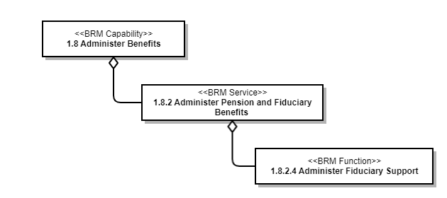

# Use Case View

This section covers the Use Case View of the VBMS Fiduciary (FID) architecture, including capability descriptions, actors, system functions, and the role-based access matrix.

---

## Capability Viewpoint Vision (CV-1)

### Description

The VBMS Fiduciary application (FID) resides on Benefits Integrated Platform as a Service (BIP - #2295) and is under the Veterans Benefits Management System (VBMS - #1728) Product.

The VBMS-Fiduciary application enables the Fiduciary Program to expedite qualifications, appointments of fiduciaries, and release withheld VA funds to beneficiaries.

It provides a more effective means for the VA to meet its mission of oversight and protection of our Veterans and their survivors to provide fiduciary appointments, reduction of accounting disapproval rates, and the ability to manage workload, oversight, and reporting. VBMS-Fiduciary provides increased automation and communication with other applications that are necessary to provide comprehensive functionality to Fiduciary Program customers.

---

## Capability Viewpoint Taxonomy (CV-2)

*The diagram above illustrates the hierarchical capability taxonomy of the VBMS Fiduciary system.*

---

## Use Cases & Main Actors

The following table describes the actors in scope for this architecture. An actor is a user in the scope of this architecture and can be a human user or a "system actor" as appropriate.

| Actor Name | Description |
|---|---|
| **Fiduciary Service Representatives (FSRs)** | FSRs receive qualified training to make formal rating decisions and have authority to finalize the determination. |
| **Program Support Assistants (PSAs)** | PSAs assist with the processing of phone calls and mail, providing needed information, or directing individuals to the appropriate staff members in support of the Fiduciary program. |
| **Legal Administrative Specialists (LASs)** | LASs counsel Veterans, their dependents, and their beneficiaries via telephone and in person regarding the full array of benefits available through the VAEC, as well as non-VA benefits available through other organizations. |
| **Legal Instruments Examiners (LIEs)** | LIEs examine, validate, and ensure legal documents (i.e., court applications, court orders, affidavits) and others are in compliance with the appropriate regulations and policies. |
| **Field Examiners (FEs)** | FEs are responsible for choosing, supervising, and ensuring the compliance of a suitable fiduciary for the beneficiary (Veteran). In order to best assess the needs of the Veteran, the field examiner will visit the Veteran in his/her home. |
| **Fiduciary Quality Review Team (QRT) Specialists** | QRT Specialists perform quality reviews for FSRs, peer reviews of errors, provide mentoring, feedback, and training on quality trends, and perform special reviews as requested. |
| **Fiduciary Hub Managers / Assistant Managers** | Fid Hub Managers have the authority to sign correspondence, such as letters and internal memos relating to fiduciary matters. Authority may be delegated to supervisory personnel, FEs, FSRs, and LIEs. |

### System/Tenant/Application Description

| System Name | Description |
|---|---|
| **VBMS-Fiduciary** | The VBMS-Fiduciary application enables the Fiduciary Program to expedite qualifications, appointments of fiduciaries, and release withheld VA funds to beneficiaries. |

---

## Main User Functions

| System | Function | Description |
|---|---|---|
| VBMS-Fiduciary | Establish Claim | Establish fiduciary claim |
| VBMS-Fiduciary | Create Beneficiary Record | Create a beneficiary record. |
| VBMS-Fiduciary | Edit Beneficiary Record | Edit a beneficiary record. |
| VBMS-Fiduciary | View Beneficiary Record | Access information for a given beneficiary record. |
| VBMS-Fiduciary | Create Fiduciary Record | Create a fiduciary record. |
| VBMS-Fiduciary | Edit Fiduciary Record | Edit a fiduciary record. |
| VBMS-Fiduciary | View Fiduciary Record | Access information for a given fiduciary record. |
| VBMS-Fiduciary | View Field Exam Report | Access information for a given field exam report. |
| VBMS-Fiduciary | Create, Edit, Save Field Exam Report | Create, edit, and save a field exam report. |
| VBMS-Fiduciary | Mark as Complete Field Exam Report | Mark a field exam report as complete. |
| VBMS-Fiduciary | Update Beneficiary Record from the Field Exam Report | Update a beneficiary record from the field exam report. |
| VBMS-Fiduciary | Create Fiduciary Administrative Task | Create a fiduciary administrative task. |
| VBMS-Fiduciary | View Fiduciary Administrative Task | Access information for a given fiduciary administrative task. |
| VBMS-Fiduciary | Edit Fiduciary Administrative Task | Edit a fiduciary administrative task. |
| VBMS-Fiduciary | Assign Fiduciary Administrative Task | Assign a fiduciary administrative task. |
| VBMS-Fiduciary | Cancel Fiduciary Administrative Task | Cancel a fiduciary administrative task. |
| VBMS-Fiduciary | Complete Fiduciary Administrative Task | Complete a fiduciary administrative task. |
| VBMS-Fiduciary | Set an Activity on EP590 Initial Appointment Field Exam Claim | Set an activity on an EP590 Initial Appointment Field Exam claim. |
| VBMS-Fiduciary | Close an Activity on EP590 Initial Appointment Field Exam Claim | Close an activity on an EP590 Initial Appointment Field Exam claim. |
| VBMS-Fiduciary | Set the Status of an Activity on EP590 Initial Appointment Field Exam Claim | Set the status of an activity on an EP590 Initial Appointment Field Exam claim. |
| VBMS-Fiduciary | Manage Zip Code Association Based on Fiduciary Hub Jurisdiction | Manage zip code association based on Fiduciary Hub jurisdiction. |
| VBMS-Fiduciary | View Fiduciary Audit History | Access fiduciary audit history information. |
| VBMS-Fiduciary | View Fiduciary Misuse Record | Access information on a given fiduciary misuse record. |
| VBMS-Fiduciary | Edit Fiduciary Misuse Record | Edit a fiduciary misuse record. |
| VBMS-Fiduciary | Delete Fiduciary Misuse Record | Delete a fiduciary misuse record. |
| VBMS-Fiduciary | Indicate Fiduciary Misuse Determination Memo Concurred | Indicate a fiduciary Misuse Determination Memo concurred. |
| VBMS-Fiduciary | Indicate Fiduciary Misuse Determination Memo Reconsideration Concurred | Indicate fiduciary Misuse Determination Memo reconsideration concurred. |
| VBMS-Fiduciary | Create, Edit, Save, and Generate Non-Fiduciary Program Field Exam Report | Create, edit, save, and generate a non-fiduciary program field exam report. |
| VBMS-Fiduciary | Upload to eFolder a Non-Fiduciary Program Field Exam Report | Upload a non-fiduciary program field exam report to VBMS eFolder. |
| VBMS-Fiduciary | Discard a Non-Fiduciary Program Field Exam Report | Discard a non-fiduciary program field exam report. |
| VBMS-Fiduciary | View Accounting Audit Tool | Access information for a given accounting audit tool. |
| VBMS-Fiduciary | Create an Accounting Audit Tool | Create an accounting audit tool. |
| VBMS-Fiduciary | Edit, Save, Approve, or Disapprove Accounting Audit Tool | Edit, save, approve, or disapprove an accounting audit tool. |
| VBMS-Fiduciary | Update Beneficiary Information from the Accounting Audit Tool | Updating beneficiary information from an accounting audit tool. |
| VBMS-Fiduciary | Inactivate an Accounting Audit Tool that has been Approved or Disapproved | Inactivate an accounting audit tool that has been approved or disapproved. |
| VBMS-Fiduciary | Inactivate an Accounting Audit Tool Prior to it being Approved or Disapproved | Inactivate an accounting audit tool prior to it being approved or disapproved. |
| VBMS-Fiduciary | Log Accounting Receipt from Fiduciary | Indicate that an accounting was received from the Fiduciary. |
| VBMS-Fiduciary | Validate Accounting from Fiduciary | User can approve or disapprove a received accounting from the Fiduciary. |
| VBMS-Fiduciary | Request In-Person Assistance from Fiduciary | User can indicate that the Fiduciary requires in-person assistance with an Accounting. |
| VBMS-Fiduciary | Propose Accounting Waiver for Fiduciary | User can indicate that an accounting can be waived for the Fiduciary. |
| VBMS-Fiduciary | Request Accounting Waiver Correction for Fiduciary | User can return the EP to the user who proposed accounting waiver for correction for the Fiduciary. |
| VBMS-Fiduciary | Validate Accounting Waiver for Fiduciary | User can approve or disapprove a proposed accounting waiver for the Fiduciary. |
| VBMS-Fiduciary | View Fiduciary System Generated Task | Access information for a given fiduciary system generated task. |
| VBMS-Fiduciary | Edit Fiduciary System Generated Task | Edit a fiduciary system generated task. |
| VBMS-Fiduciary | Assign Fiduciary System Generated Task | Assign a fiduciary system generated task. |
| VBMS-Fiduciary | Cancel Fiduciary System Generated Task | Cancel a fiduciary system generated task. |
| VBMS-Fiduciary | Complete Fiduciary System Generated Task | Complete a fiduciary system generated task. |
| VBMS-Fiduciary | Log Bank Statement Receipt on EP290 Fund Usage Review | User can indicate that bank statements were received from the Fiduciary. |
| VBMS-Fiduciary | Add Development Activities on EP290 Fund Usage Review | Add development activities on an EP290 Fund Usage Review. |
| VBMS-Fiduciary | Complete Development Activities on EP290 Fund Usage Review | Complete development activities on an EP290 Fund Usage Review. |
| VBMS-Fiduciary | Remove Development Activities on EP290 Fund Usage Review | Remove development activities from an EP290 Fund Usage Review. |
| VBMS-Fiduciary | Complete Review on EP290 Fund Usage Review | User can indicate that Bank Statements have been reviewed. |

---

## Fiduciary Use Case Matrix

The matrix below shows which CSS functions are available to each user role.  
**X** = Access Granted, blank = No Access.

| CSS Function | PSA | LAS | LIE | FSR | FE | QRT Specialist | Hub Manager |
|---|:---:|:---:|:---:|:---:|:---:|:---:|:---:|
| Create Beneficiary Record | X | X | X | X | X | X | X |
| Edit Beneficiary Record | X | X | X | X | X | X | X |
| View Beneficiary Record | X | X | X | X | X | X | X |
| Create Fiduciary Record | X | X | X | X | X | X | X |
| Edit Fiduciary Record | X | X | X | X | X | X | X |
| View Fiduciary Record | X | X | X | X | X | X | X |
| View Field Exam Report | X | X | X | X | X | X | X |
| Create, Edit, Save Field Exam Report | | | X | X | X | X | X |
| Mark as Complete Field Exam Report | | | X | X | X | X | X |
| Update Beneficiary Record Information from Field Exam Report | | | X | X | X | X | X |
| Create, Edit, Save, and Generate Non-Fiduciary Program Field Exam Report | | | | | X | X | |
| Upload to eFolder a Non-Fiduciary Program Field Exam Report | X | X | X | X | X | X | X |
| Discard a Non-Fiduciary Program Field Exam Report | | | | | X | X | |
| Create Fiduciary Administrative Task | X | X | X | X | X | X | X |
| View Fiduciary Administrative Task | X | X | X | X | X | X | X |
| Edit Fiduciary Administrative Task | X | X | X | X | X | X | X |
| Assign Fiduciary Administrative Task to Self | | | | | | | X |
| Cancel Fiduciary Administrative Task | X | X | X | X | X | X | X |
| Complete Fiduciary Administrative Task | X | X | X | X | X | X | X |
| Set an Activity on EP590 Initial Appointment Field Exam Claim | X | X | X | X | X | X | X |
| Close an Activity on EP590 Initial Appointment Field Exam Claim | | | X | X | X | X | X |
| Set the Status of an Activity on EP590 Initial Appointment Field Exam Claim | | | X | X | X | X | X |
| Manage Zip Code Association Based on Fiduciary Hub Jurisdiction | | | | | | | X |
| View Fiduciary Audit History | X | X | X | X | X | X | X |
| Edit Fiduciary Misuse Record | X | X | X | X | X | X | X |
| View Fiduciary Misuse Record | X | X | X | X | X | X | X |
| Delete Fiduciary Misuse Record | | | | | | | X |
| Indicate Fiduciary Misuse Determination Memo Concurred | | | | | | | X |
| Indicate Fiduciary Misuse Determination Reconsideration Memo Concurred | | | | | | | X |
| View Accounting Audit Tool | X | X | X | X | X | X | X |
| Create an Accounting Audit Tool | | | X | X | | X | X |
| Edit, Save, Approve, Disapprove Accounting Audit Tool | | | X | X | | X | X |
| Update Beneficiary Information from the Accounting Audit Tool | | | X | X | | X | X |
| Inactivate an Accounting Audit Tool that has been Approved or Disapproved | | | | | | | X |
| Inactivate an Accounting Audit Tool Prior to it being Approved or Disapproved | | | X | X | | X | X |
| Log Accounting Receipt from Fiduciary | X | X | X | X | X | X | X |
| Validate Accounting from Fiduciary | | | X | X | | X | |
| Request In-Person Assistance from Fiduciary | X | X | X | X | X | X | X |
| Proposed Accounting Waiver for Fiduciary | | | X | X | | | |
| Request Accounting Waiver Correction for Fiduciary | | | | | | X | X |
| Validate Accounting Waiver for Fiduciary | | | | | | | X |
| View Fiduciary System Generated Task | X | X | X | X | X | X | X |
| Edit Fiduciary System Generated Task | X | X | X | X | X | X | X |
| Assign Fiduciary System Generated Task | X | X | X | X | X | X | X |
| Cancel Fiduciary System Generated Task | X | X | X | X | X | X | X |
| Complete Fiduciary System Generated Task | X | X | X | X | X | X | X |
| Log Bank Statement Receipt on EP290 Fund Usage Review | X | X | X | X | X | X | X |
| Add Development Activities on EP290 Fund Usage Review | X | X | X | X | X | X | X |
| Complete Development Activities on EP290 Fund Usage Review | X | X | X | X | X | X | X |
| Remove Development Activities on EP290 Fund Usage Review | X | X | X | X | X | X | X |
| Complete Review on EP290 Fund Usage Review | X | X | X | X | X | X | X |

**Role Abbreviations:**
- **PSA** = Program Support Assistant
- **LAS** = Legal Administrative Specialist
- **LIE** = Legal Instruments Examiner
- **FSR** = Fiduciary Service Representative
- **FE** = Field Examiner
- **QRT Specialist** = Fiduciary Quality Review Team Specialist
- **Hub Manager** = Fiduciary Hub Manager / Assistant Manager

---

*[← Back to README](./README.md)*
