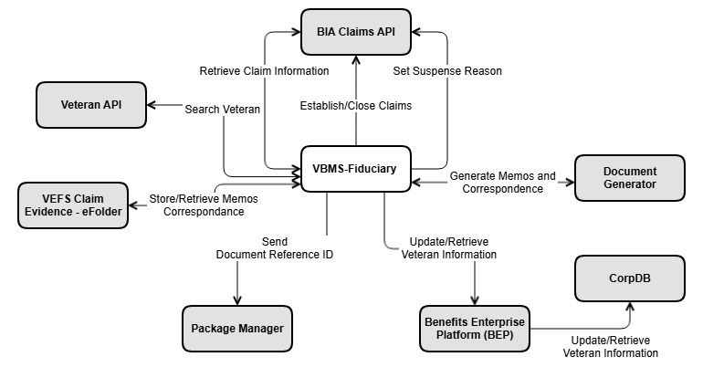
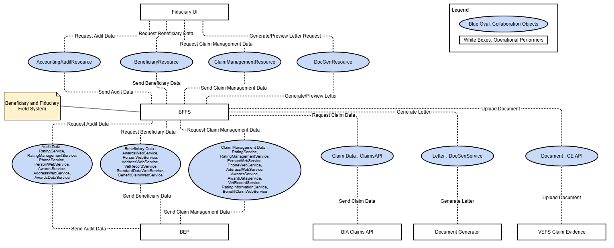

# Operational View

This section covers the Operational View of the VBMS Fiduciary (FID) architecture, including the primary systems high-level diagram and the operational resource flow.

---

## OV-1: Primary Systems High Level Operational Viewpoint

### Legend
- **Gray Rectangle** = External resource to the resource being documented
- **White Rectangle** = Internal resource to the resource being documented

### OV-1 Diagram

*The diagram above shows the high-level operational relationships between VBMS Fiduciary and the primary external and internal systems it interacts with.*

### Primary Systems Description Table

| System (VASI) | Description |
|---|---|
| **Benefits Integration Services (BIS)** | This area facilitates integration with BIS. BIS provides web services that return data not housed in VBMS-Fiduciary, including Veteran data, claim data, etc. This includes: coordination on service changes, outages, and issues/defects; providing VBMS-Fiduciary developers clarification of services' proper and intended functionality; tracking and reporting service outages; and assisting with test scenarios requiring legacy application modification of data. BIS Services are used throughout the application and code, for which the team maintains test suites. |
| **Claims API** | Allows users to have service access to the claim's functionality. VBMS-Fiduciary uses Claims API to establish claims, retrieve claim information, set suspense reasons, and close/cancel claims. |
| **DocGen** | DocGen provides services to generate documents in PDF format. Documents can be dynamically generated or can consist of static content (typically enclosures) or any combination thereof. DocGen can also mark the generated documents with a USI barcode or Quick Response (QR) Code and store document metadata for retrieval later. VBMS-Fiduciary uses DocGen via VBMS-Core to generate Fiduciary correspondence. |
| **VEFS Claim Evidence** | Claim Evidence provides document management capabilities for Veteran-relative information within the VA VBMS. Traditionally developed as a "data center" based application backed by IBM FileNet, the VA has identified cost saving opportunities by transitioning VBMS eFolder as cloud-centric and backed by Amazon AWS services. VBMS-Fiduciary uses Claim Evidence for generated finalized documents and correspondence. |
| **Package Manager** | Package Manager notifies CPS of the need to print a Document. This is accomplished in two ways: the automated central print at finalization process and the manual eFolder central print process. The automated system level access to the central print process by the VBMS applications will occur when a user is finalizing a letter or letters in VBMS-Core or Awards. During the finalization process, the system will provide the user with an option to centrally print the letter or letters in question. User access to the CPS functionality is provided via the Package Manager GUI. VBMS users can manually select any letter from the eFolder, and optionally, additional Documents to be bundled as attachments for centralized printing. The only exception to this rule is in the case of documents containing FTI, which is currently prohibited from being centrally printed. VBMS-Fiduciary sends Package Manager the document reference ID and the recipient information for the printing process. |

### Primary Systems Interaction Table

| System A and VASI ID | System B and VASI ID | Interaction Description |
|---|---|---|
| VBMS-Fiduciary - VASI ID 3026 | Benefits Integration Services (BIS) - VASI ID 5073 | Retrieves information about veteran as well as updates information based on user input |
| VBMS-Fiduciary - VASI ID 3026 | Claims API | Retrieves claim information, establishes claims, closes claims and sets reason why claim is suspended |
| VBMS-Fiduciary - VASI ID 3026 | DocGen - VASI ID 3000 | Generates document correspondence |
| VBMS-Fiduciary - VASI ID 3026 | VEFS Claim Evidence - VASI ID 3023 | Retrieves and stores claim evidence files |
| VBMS-Fiduciary - VASI ID 3026 | Package Manager - VASI ID 2993 | Sends document reference ID |
| VBMS-Fiduciary - VASI ID 3026 | Veteran API | Searches veteran profile |

---

## OV-2: Operational Resource Flow

*The diagram above shows the operational resource flow between VBMS Fiduciary and all integrated systems, including the direction and type of data exchanges.*

---

*[← Back to README](./README.md)*
