# Logical View

This section covers the Logical View of the VBMS Fiduciary (FID) architecture, including main components, primary services, resource flows, and the interface matrix.

---

## SV-1: Main Components Systems Viewpoint

### Legend
- **Gray Rectangle** = External resource to the resource being documented
- **White Rectangle** = Internal resource to the resource being documented

### SV-1 Diagram

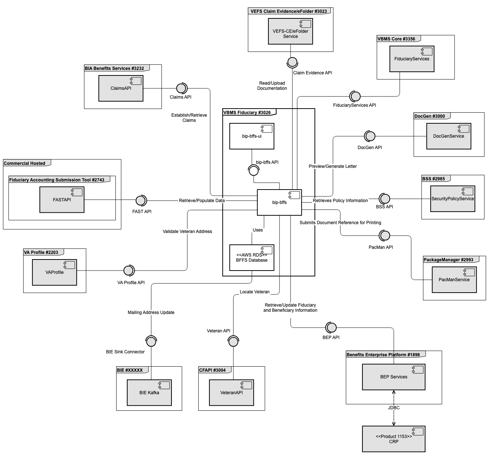

*The diagram above shows the main components of the VBMS Fiduciary system and their relationships to external and internal dependencies.*

### Component References Table

| Name | Description | Ports | Protocols |
|---|---|---|---|
| **VEFS Claim Evidence #3023** | Veteran Enterprise File Storage Claim Evidence service extracts the logical elements of the legacy service and restructures them as a standalone application for use both in updated VBMS capabilities as well as new capabilities requiring access to files providing evidence for claims. VEFS is a replacement for the legacy eFolder Web Service and user interface (UI) originally built inside of VBMS Core, supporting uploads, edits, and reads of files. | 443 | REST |
| **VBMS Core - eFolder #3356** | While the BFFS application has been migrated to use Claim Evidence API, there is still dependency on eFolder SOAP service behind the respective feature flag. | 443 | SOAP |
| **VA Profile - VAPRO #2203** | VA Profile, formerly called Vet360, builds the foundation for an enterprise MDM platform which will support the synchronization of contact information, as well as other Veteran information domains among VA systems. | 443 | REST |
| **BIA Claims API #3237** | The Claims API provides functionality supporting Compensation and Pension's (C&P) Benefit Claim process. This API provides simple and concise mechanisms to create and view claim information. The API's functionality falls within two primary areas: Claim and Contention. With regard to Claim, the API provides the ability to create, list and view a summary of a Veterans claim. With regard to Contention, the API provides the ability to create, delete and view contentions on a Veterans claim. The Claims API aims to avoid the one-call-does-everything pattern that has proven to reduce reusability of services and to stovepipe functionality for individual use case. This API exists within the Benefits Integration Platform (BIP) service paradigm, and is considered a Process API, designed to encapsulate the specific domain actions around claims. This API is hosted on BIP which is a Kubernetes Container Platform hosted in VA Enterprise Cloud (VAEC) Amazon Web Services (AWS). | 443 | REST |
| **Package Manager - PacMan #2993** | Package Manager notifies CPS of the need to print a Document. This is accomplished in two ways: the automated central print at finalization process and the manual eFolder central print process. The automated system level access to the central print process by the VBMS applications will occur when a user is finalizing a letter or letters in VBMS-Core or Awards. User access to the CPS functionality is provided via the Package Manager GUI. VBMS users can manually select any letter from the eFolder, and optionally, additional Documents to be bundled as attachments for centralized printing. The only exception to this rule is in the case of documents containing FTI, which is currently prohibited from being centrally printed. VBMS-Fiduciary sends Package Manager the document reference ID and the recipient information for the printing process. | 443 | REST |
| **BEP BIS #1898** | Benefits Integration Services (BIS), formerly known as Benefits Gateway Services (BGS), provides secure integration web services to VBA Corporate Database providing access to Veteran, Claims, Ratings, and Awards data. BIS acts as an advisor during conceptual design of new projects and enhancements to the existing systems. BIS ensures maximum reuse of services and components among and between new development initiatives and current systems in operations/sustainment. | 443 | SOAP |
| **CFAPI - Veteran API #3006** | The Veteran API is intended to provide to tenants on the BIP platform, a simplified mechanism to receive Veteran data and do so in a manner consistent with required VA data integrations. This API ensures that appropriate systems of record are sourced for data and then simplifies the use of the data. | 443 | REST |
| **Fiduciary Accounting Submission Tool - SF-FAST #2743** | The Fiduciary Accounting Submission Tool (FAST) is a SalesForce application that provides Fiduciary a portal to submit accounting details for the Beneficiaries they are assigned. FAST also allows for LIEs to review these accountings. The VBMS-Fiduciary application is used by the LIEs to complete the accounting review process. | 443 | REST |
| **Benefits Security Services - BSS #2985** | The Benefits Security Services (BSS) resides on Benefits Integrated Platform as a Service (BIP) and provides a central login and Single Sign-on (SSO) for VBA applications on the BIP Platform through signed tokens from Identity Access Management (IAM). These services correspond to the VA Mandate that all applications utilize Identity Access Management (IAM) for authentication. BSS provides the ability for VBA users to authenticate to IAM SSOi via Personal Identification Verification (PIV) card and log in to BSS by selecting their current station, then continue to utilize BIP services without logging in to each individual application. Additionally, external VA business partner users can authenticate to IAM SSOe via Common Access Card (CAC) and log in to BSS in the same way with a station number. All applications connected to BSS can utilize cross-service communication with signed tokens from IAM. This provides a secure way for internal and external VBA users to efficiently access multiple BIP applications with a single secure login without having to login to each application for each instance. | 443 | REST |
| **Document Generator - DocGen Service #3000** | DocGen provides services to generate documents in PDF format. Documents can be dynamically generated or can consist of static content (typically enclosures) or any combination thereof. DocGen can also mark the generated documents with a USI barcode or Quick Response (QR) Code and store document metadata for retrieval later. VBMS-Fiduciary uses DocGen via VBMS-Core to generate Fiduciary correspondence. | 443 | REST |
| **VBMS Core - Fiduciary Services #3356** | Fiduciary Services is a library provided by the VBMS Fiduciary application which is included by the VBMS Core application to provide RESTful services used by BFFS. | 443 | REST |

### SV-1 Component Details (additional diagram)

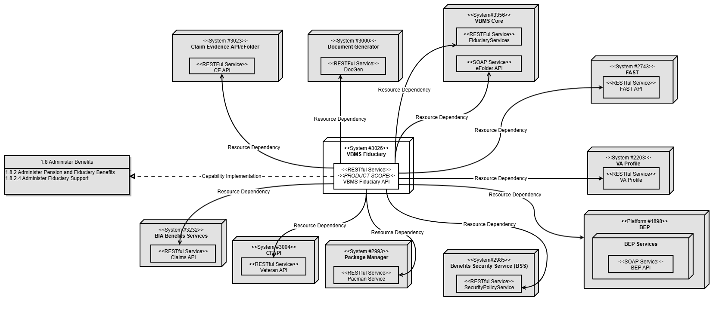

---

## SvcV-1: Description of Primary Services (VASI APIs)

The SvcV-1 describes the interfaces between VBMS-FID services and consuming, or providing, systems.

| Service/API | Operation ID | Description |
|---|---|---|
| **VEFS Claim Evidence** | CE API | Provides services to retrieve and upload documents |
| **Document Generator** | DocGen API | DocGen API allows to review and generate letters |
| **Package Manager** | PacMan API | These services are used to submit documents for printing |
| **Benefits Enterprise Platform** | BIS API | Provide services to retrieve and update fiduciary and beneficiary information |
| **Common Functional APIs** | Veteran API | Veteran API allows FID to locate veteran information |
| **VA Profile** | VA Profile API | Validates Veteran address |
| **Fiduciary Accounting Submission Tool** | FAST API | FAST API allows to submit and retrieve fiduciary accounting data |
| **BIA Claims** | Claims API | Provides services to establish and retrieve claims |

---

## SvcV-2: Resource Flow of Primary Services

The following diagrams show the resource flow for each primary service exposed by the VBMS Fiduciary system.

### FID API to BGS

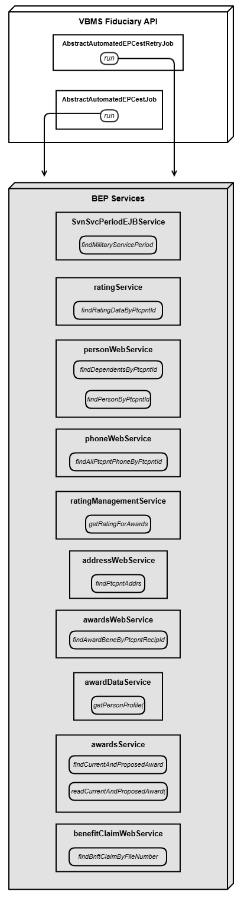

*FID API to BGS resource flow — Part 1. Shows the API endpoints and data flow from FID to the Benefits Gateway Services (BGS/BIS).*

*FID API to BGS resource flow — Part 2. Continuation of the BGS endpoint mapping.*

### Accounting Audit Resource

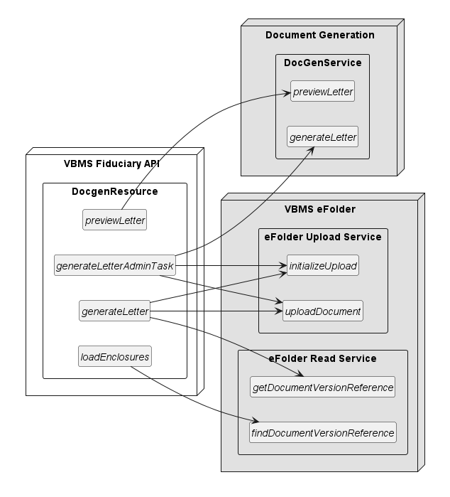

*Accounting Audit Resource flow diagram showing endpoints and operations for the accounting audit functionality.*

### Beneficiary Resources

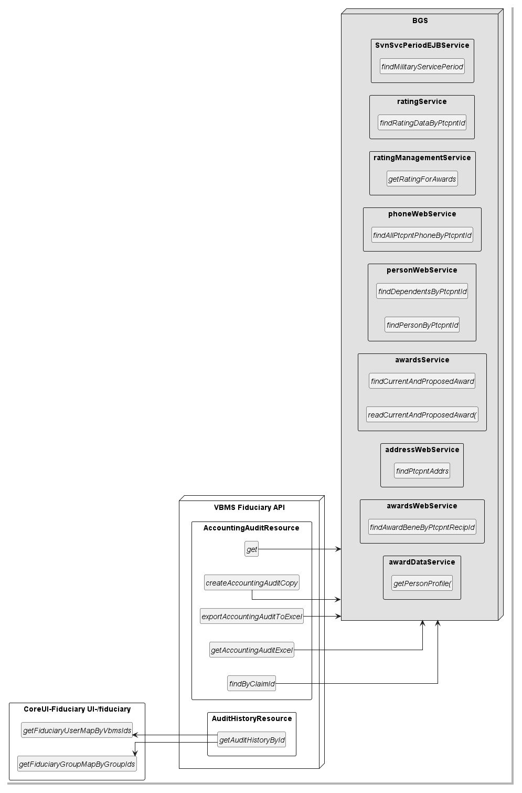

*Beneficiary Resource flow diagram — Part 1. Shows the API endpoints for creating, reading, updating, and managing beneficiary data.*

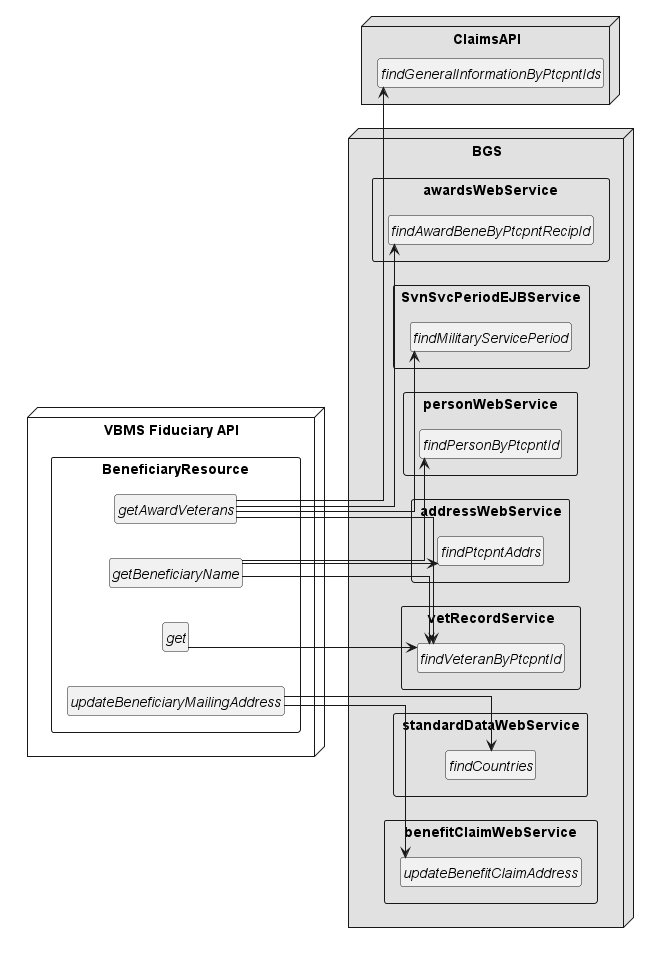

*Beneficiary Resource flow diagram — Part 2. Additional beneficiary API endpoints.*

### Claim Management and Summary Resource

*Claim Management and Summary resource flow — Part 1. Shows the claim management API endpoints.*

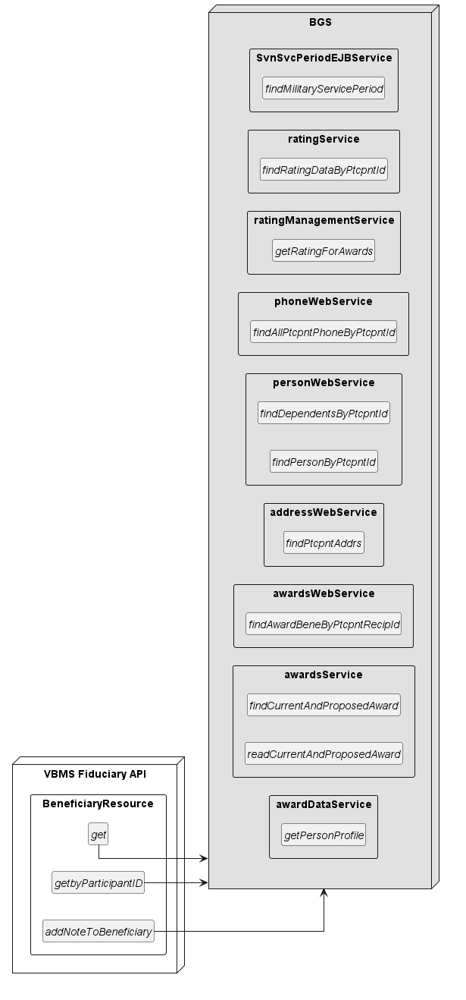

*Claim Management and Summary resource flow — Part 2. Additional claim management endpoints.*

### DocGen Resources

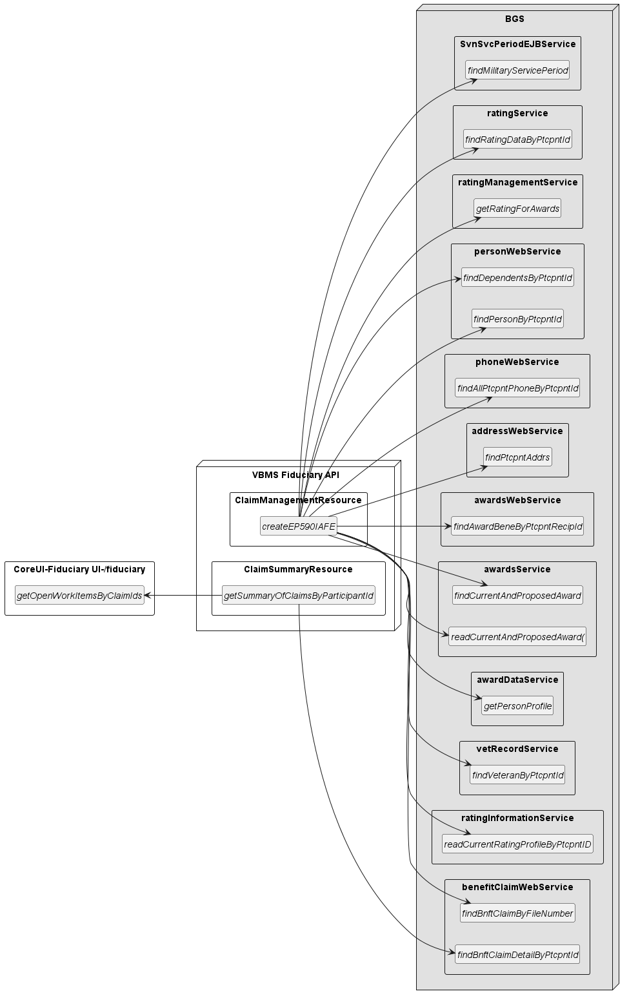

*DocGen resource flow — Part 1. Shows the document generation API endpoints and their operations.*

*DocGen resource flow — Part 2. Additional document generation endpoints.*

### EP and Misuse Resources

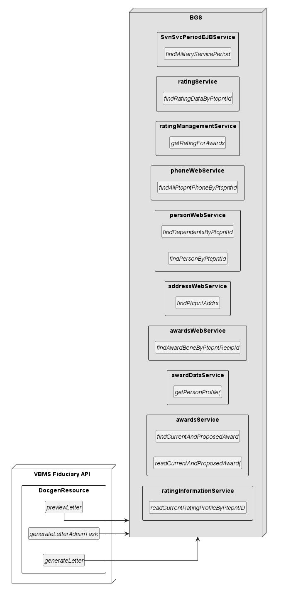

*EP and Misuse resource flow diagram showing API endpoints for End Product (EP) and fiduciary misuse management.*

*Additional EP and Misuse resource flow details.*

### Event Processing Resource

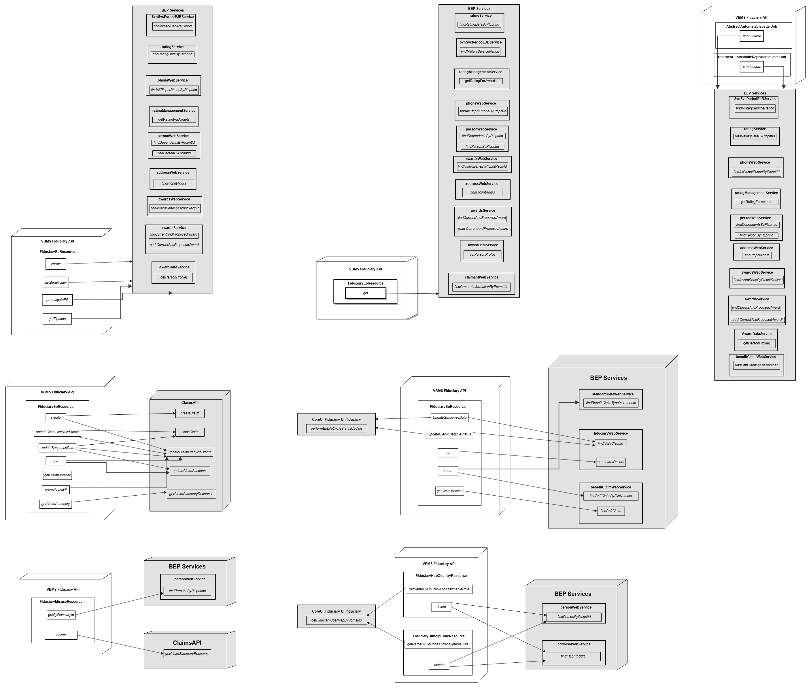

*Event Processing resource flow diagram showing how events are processed and routed through the system.*

### EP590 and EP290 Jobs

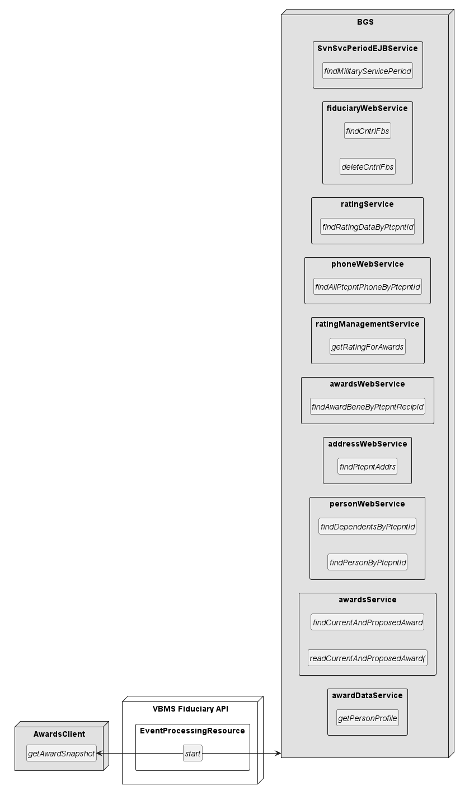

*EP590 and EP290 batch jobs diagram. Shows the job definitions and their scheduling/trigger configurations.*

### Participant Lookup and Veteran Resources

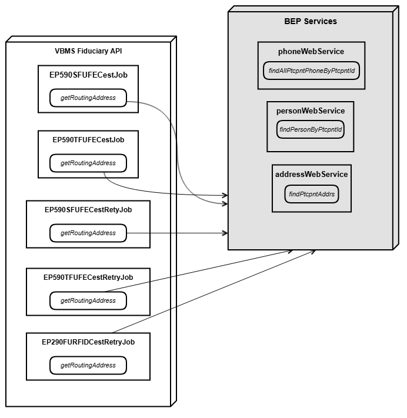

*Participant Lookup and Veteran resource flow showing how veteran/participant information is retrieved and managed.*

---

## SV-3/SvcV-3: Internal and External Systems-Systems Matrix (VASI Interfaces)

### Interface Matrix Diagram

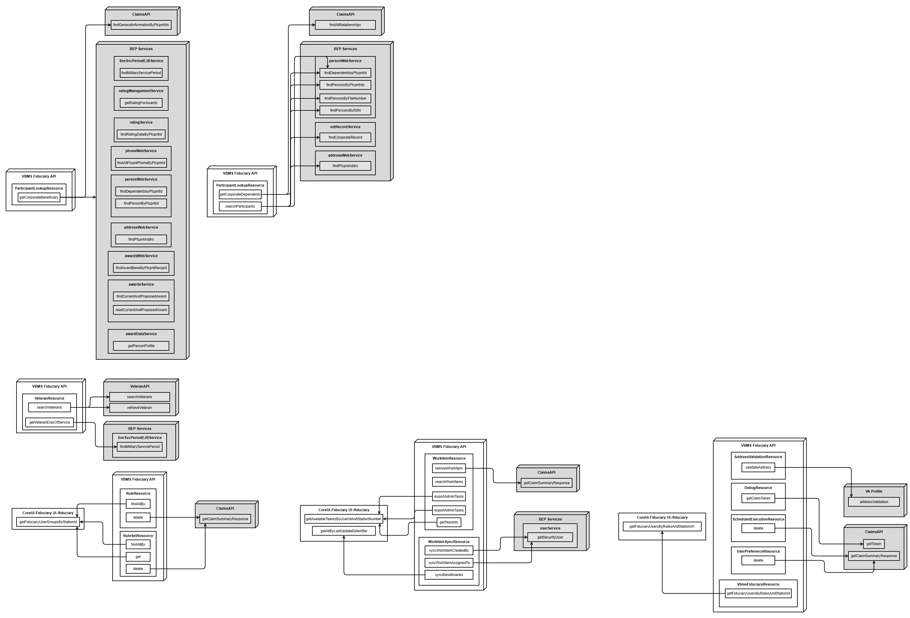

*The diagram above shows the complete interface matrix between VBMS Fiduciary and all internal and external systems.*

### Interface Matrix Table

| System/Service A | System/Service B | Internal or External | Consumer or Dependency (relative to System A) |
|---|---|---|---|
| Document Generator #3000 | VBMS Fiduciary | Internal VBMS | Dependency |
| Package Manager #2993 | VBMS Fiduciary | Internal VBMS | Dependency |
| Benefits Security Service #2985 | VBMS Fiduciary | Internal VA | Dependency |
| Common Functional APIs #3004 | VBMS Fiduciary | Internal VBMS | Dependency |
| VEFS Claim Evidence #3023 | VBMS Fiduciary | Internal VBMS | Dependency |
| VBMS Core - eFolder #3356 | VBMS Fiduciary | Internal VBMS | Dependency |
| Benefits Integration Services (BIS) #5073 | VBMS Fiduciary | Internal VA | Dependency |
| Fiduciary Accounting Submission Tool - FAST #2743 | VBMS Fiduciary | External | Dependency |
| VA Profile Service #2203 | VBMS Fiduciary | Internal VA | Dependency |
| BIA Claims API #3237 | VBMS Fiduciary | Internal VA | Dependency |

---

*[← Back to README](./README.md)*
