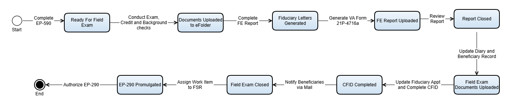

# State Transitions (OV-6b)

This section covers the state transitions of the VBMS Fiduciary (FID) system, documenting the lifecycle states and transitions for key entities.

---

## OV-6b: State Transitions Diagram

*The diagram above shows the state transitions (OV-6b) for key entities within the VBMS Fiduciary system. It illustrates the valid states an entity can be in and the transitions that move it from one state to another.*

---

*[← Back to README](./README.md)*
