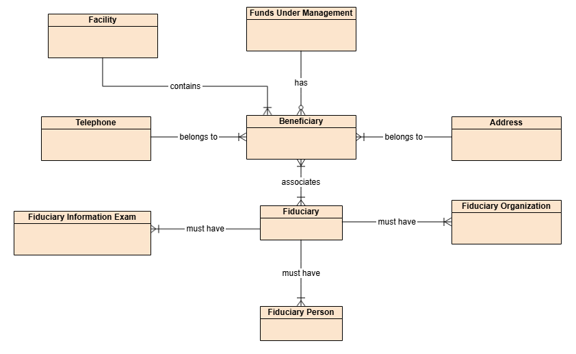
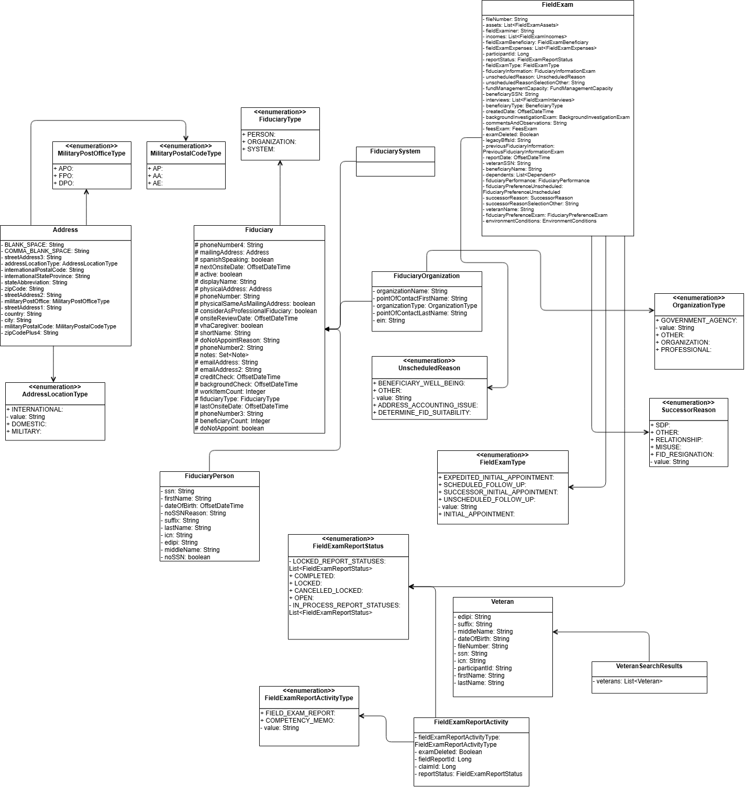
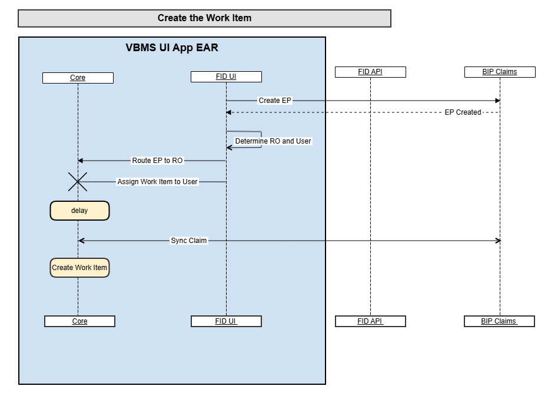

# Data View

This section covers the Data Viewpoint of the VBMS Fiduciary (FID) architecture, including the conceptual, logical, and physical data models.

---

## DIV-1: Conceptual Data Viewpoint Model

The Conceptual Data Viewpoint Model provides a high-level overview of the main FID data concepts and their relationships to each other.

### Conceptual Data Model Diagram

*The diagram above shows the high-level conceptual data model for the VBMS Fiduciary system, illustrating the key data entities and their relationships.*

### Conceptual Data Entity Relationships

| Data Entity 1 | Data Entity 2 | Relationship |
|---|---|---|
| **Beneficiary** | **Fiduciary** | Each beneficiary can have one or more fiduciary who represents them, just as each fiduciary may represent one or more beneficiaries. |
| **Beneficiary** | **Facility** | A beneficiary belongs to a facility. Each facility may have one or more beneficiaries. |
| **Beneficiary** | **Funds Under Management** | Funds under management may have 0 or more beneficiaries associated with it. |
| **Beneficiary** | **Address** | One or more beneficiaries may belong to a specific address. |
| **Beneficiary** | **Telephone** | Telephone for the beneficiary. |
| **Fiduciary** | **Fiduciary Organization** | Must belong to one or more organizations. |
| **Fiduciary** | **Fiduciary Person** | This relationship represents person(s) behind the fiduciary. |
| **Fiduciary** | **Information Exam** | Fiduciary must have one or more interview exam entries. |

### Conceptual Data Attribute Details

The table below shows attributes, data types, and multiplicity used in joining the data entities.

| Attribute Name | Data Type | Multiplicity | Constraints | Description |
|---|---|---|---|---|
| **FIDUCIARY.FIDUCIARI_ID** | Numeric | one-to-many, many-to-many | 38 | FIDUCIARY is the main entity to contain fiduciaries. It relates to Person, Organization and Information Exam entities through FIDUCIARY_ID. It also has many-to-many relationship with BENEFICIARY table. |
| **FIDUCIARY_ORGANIZATION.FIDUCIARI_ID** | Numeric | many-to-one | 38 | Fiduciary may belong to one or more organization which are contained in the FIDUCIARY_ORGANIZATION table. |
| **FIDUCIARY_PERSON.FIDUCIARY_ID** | Numeric | many-to-one | 38 | FIDUCIARY_PERSON contains data for a person behind the fiduciary. |
| **FIDUCIARY_INFORMATION_EXAM.FIDUCIARY_ID** | Numeric | many-to-one | 38 | FIDUCIARY_INFORMATION_EXAM contains interview examination information and is linked with the beneficiary through FIDUCIARY_ID. |
| **BENEFICIARY.BENEFICIARY_ID** | Numeric | many-to-one, many-to-many | 38 | BENEFICIARY table contains beneficiary data and is linked to fiduciaries through BENEFICIARY_ID/FIDUCIARY_ID many-to-many relationship. It is also linked with personal information in ADDRESS and TELEPHONE entities, as well as FACILITY and FUNDS_UNDER_MANAGEMENT tables via FIDUCIARY_ID as many-to-one relationship. |
| **FACILITY.BENEFICIARY_ID** | Numeric | one-to-many | 38 | Contains information about facility which beneficiary belongs to. |
| **FUNDS_UNDER_MANAGEMENT.BENEFICIARY_ID** | Numeric | one-to-many | 38 | Contains information about funds managed for the beneficiary. |
| **ADDRESS.BENEFICIARY_ID** | Numeric | one-to-many | 38 | Address of the beneficiary. |
| **TELEPHONE.BENEFICIARY_ID** | Numeric | one-to-many | 38 | Telephone for the beneficiary. |

---

## DIV-2: Logical Data Viewpoint Model

*The diagram above shows the logical data model for the VBMS Fiduciary system. The logical data model expands on the conceptual model by defining the detailed entity attributes, relationships, and keys used within the application's data layer.*

---

## DIV-3: Physical Data Viewpoint Model

*The diagram above shows the physical data model for the VBMS Fiduciary system. The physical data model maps the logical model to actual database tables and columns as implemented in the CorpDB Oracle database.*

> **Note:** All data is persisted and retrieved from CorpDB. Data is accessed and updated directly into Oracle using JDBC (Java Database Connectivity).

---

*[← Back to README](./README.md)*
