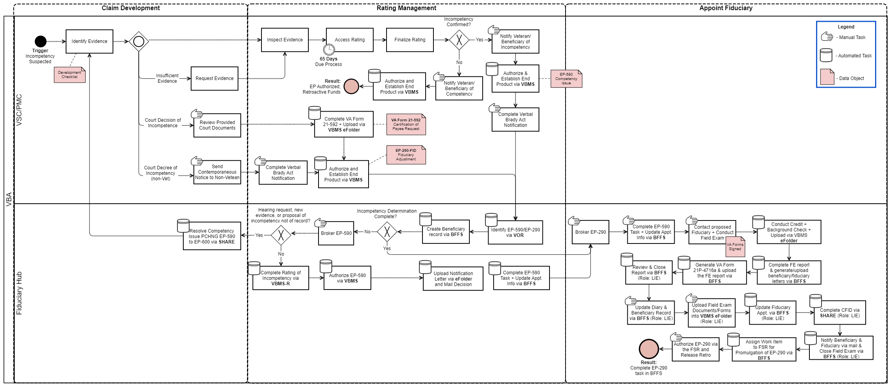
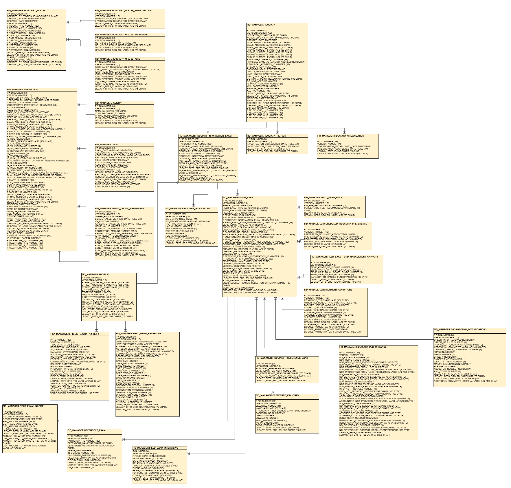
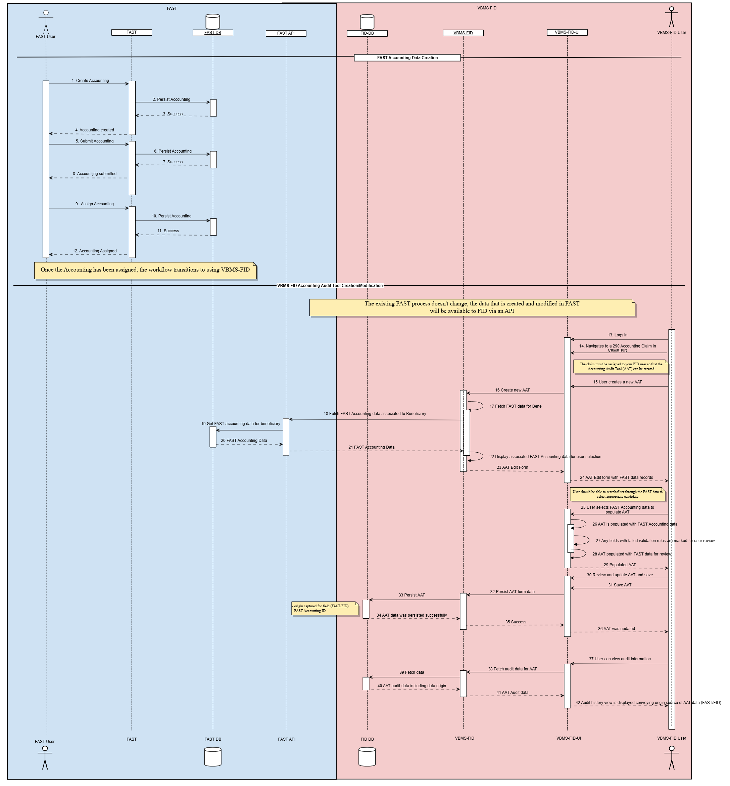

# Process View (Business Process Model)

The Process View describes the behavior of the systems, the sequence of events, and how various tasks combine to the functionality described in the Use-Case View. It decomposes the systems into lightweight processes (single threads of control) and heavyweight processes (groupings of lightweight processes). The Process View describes how systems interact, detailing the timing of messages or events.

---

## OV-6d: Main Business Process Model

*The diagram above provides an overview of the main business process model (OV-6d) for the VBMS Fiduciary system.*

*The diagram above shows the full detailed business process model (OV-6d), illustrating the complete process flow including all activities, decisions, and swimlanes for each actor and system involved.*

---

## SV-10c: Process Sequence - Systems Event-Trace Description

*The diagram above shows the Systems Event-Trace Description (SV-10c), which provides a sequence/timing diagram of how the various VBMS Fiduciary components and external systems interact to fulfill key use cases. It details the order of messages, events, and responses exchanged during system operations.*

---

*[← Back to README](./README.md)*
