# Fiduciary Manager

From the Fiduciary link, available from the menu bar at the top of any page, authorized users can access the Fiduciary Manager home page.

You can use the tabs in the Search section to search for beneficiaries, fiduciaries, countries, and ZIP codes.

From the Admin Task section, you can select different tabs to show Tasks Queues, My Work Queue Exports, and Assignment Configuration views.

From the Home section, you can select tabs to view Accounting Audit Tools and Field Exam Reports. Users with permissions can also select the Benefits Threshold tab.

The current page name is shown in the navigation bar of all Fiduciary Manager pages, along with breadcrumb links to the home page and any intermediate pages.

For pages with a left pane, you can open or close the pane by selecting an icon. To open the pane, select the menu icon, shown as three stacked horizontal lines in the upper left of the page.

To close the pane, select the collapse icon, shown as a double left arrow next to the first section header.

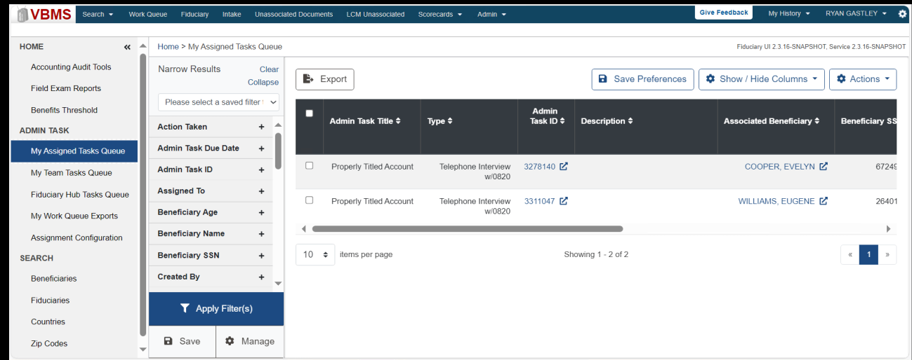
*Screenshot — page 5, figure 1 of 2 (1299×514 px)*

<details>
<summary>Screenshot text content (visible UI elements, labels, and data)</summary>

```
jVBMS
HOME 4 4) Home > My Assigned Tasks Queue Frc UI23 16 SNAPSHOT, Senice 23 16SNAPSHOT
‘Accounting Audit Tools Narrow Results Clear) ———1 —/  __ ____
cotepse | [ Br Export Bi Save Preferences |{ Show / Hide Columns ~ l[ Actions
Field Exam Reports eee ae————CE—EIEO—es er eerELULee
Please select a saved filer v
Benefits Threshold s Admin
an Admin Task Tile $ Type Task ID Description ¢ ‘Associated Beneficiary Beneficiary SS
ADMIN TASK ‘Action Taken +
Property Tiled Account Telephone Interview 3278140 COOPER, EVELYN e724
‘Admin Task ID +
My Team Tasks Queue ee
‘Assigned To +
Fiduciary Hub Tasks Queue
wv Property Titled Account Telephone Interview 3311047 & WILLIAMS, EUGENE &% 26401
My Work Queue Exports. Cee c w820
Ne _ »
‘Assignment Configuration Eocecr Tao e
SEARCH Beneficiary SSN + 10 = tems per page Showing 1 -2.0f2 « + |
Beneficiaries Created By +)
Fiduciaries
Y Apply Filter(s)
Countries
Zip Codes B Save | & Manage
```

</details>

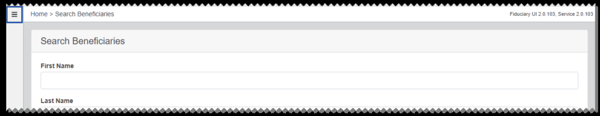
*Screenshot — page 5, figure 2 of 2 (1299×253 px)*

<details>
<summary>Screenshot text content (visible UI elements, labels, and data)</summary>

```
J = |Home > search Beneficiaries Fiduciary UI 20.103, Service 20.103
Search Beneficiaries
First Name
Last Name
```

</details>

### Tasks Queue Views

My Assigned Tasks Queue, My Team Tasks Queue, and Fiduciary Hub Tasks Queue are different tasks queue views available to help you manage your tasks. Tasks queue views are filtered to show only In Progress and Open status tasks, by default.

From the tasks queue views, you can open the Admin Task page from the link in the Admin Task ID column. Other links may also be available depending on the task type, such as links to Associated Beneficiary or Associated Fiduciary.

You can also use the Export option to send the current filtered view to My Work Queue Exports. See My Work Queue Exports and Customizing Tasks Queue Views for more information.

#### My Assigned Tasks Queue

From My Assigned Tasks Queue, you can view admin tasks assigned to you.

#### My Team Tasks Queue

From My Team Tasks Queue, you can view admin tasks assigned to members of your team.

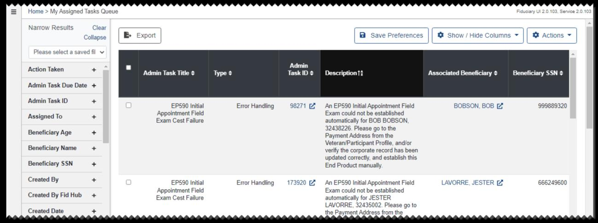
*Screenshot — page 6, figure 1 of 2 (1299×487 px)*

<details>
<summary>Screenshot text content (visible UI elements, labels, and data)</summary>

```
= | Home > My Assigned Tasks Queue Fidvcary U'20.103, Service 20.108
Narrow Results Clear ———st (“x4 —me—
Collapse | | Be Export | | @ Save Preferences || @& Show/Hide Columns ~ || € Actions ~ |
Please select a saved fl v
, . Admin
‘Action Taken 5 - . . " a . — ; -
Admin Task Title Type ¢ Task ID — Description? Associated Beneficiary Beneficiary SSN ¢
Admin Task Due Date +
Admin Task ID + RN
EP590 initial Error Handling 98271 7 __ An EP590 Initial Appointment Field BOBSON, BOB 999889320
: Appointment Field Exam could not be established
Rsegeed to = Exam Cest Failure automatically for BOB BOBSON,
Res 32438226. Please go to the
Beneficiary Age + Payment Address fs the
ee Veteran/Participant Profile, and/or
Beneficiary Name + verify the corporate record has been
‘ updated correctly, and establish this
Beneficiary SSN + End Product manually
Created By + EPS590 Initial Error Handling 173920 Z An EP590 Initial Appointment Field LAVORRE, JESTER & 666249600
Appointment Field Exam could not be established
enh finhhansll 362 Exam Cest Failure automatically for JESTER
LAVORRE, 32435002. Please go to
Created Date + the Payment Address from the
```

</details>

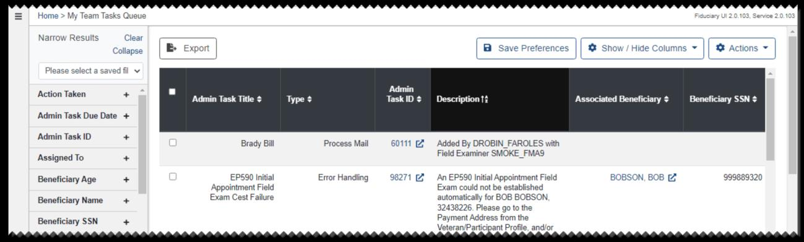
*Screenshot — page 6, figure 2 of 2 (1299×391 px)*

<details>
<summary>Screenshot text content (visible UI elements, labels, and data)</summary>

```
= | Home > My Team Tasks Queue Fidveary Ut 2. service 2
Narrow Results Clear |_ —___— i: NL UCN
Colla B+ Export | | @ Save Preferences || @ snow/Hide Coumns ~ || € Actions ~ |
Please solect a saved
Action Taken + LJ a : ¢ — : fiption Tt ie Jiary ¢ i :
Admin Task Title ¢ Type ¢ TaskID Description? Associated Beneficiary Beneficiary SSN ¢
Admin Task Due Date +
Admin Task ID +
Brady Bill Process Mail 60111 ( Added By DROBIN_FAROLES with
Regead Te mm Field Examiner SMOKE_FMAS
Beneficiary Age + EP590 Initial Error Handling 271 An EP590 Initial Appointment Field BOBSON, B08 7 999889320
Appointment Field Exam could not be established
Beneficiary Name + Exam Cest Failure automatically for BOB BOBSON,
32438226. Please go to the
ic Payment Address fom the
Benefi SSN 9
sees - Veteran/Participant Profile, and/or
```

</details>

#### Fiduciary Hub Tasks Queue

From Fiduciary Hub Tasks Queue, you can view admin tasks assigned to users in your Fiduciary Hub.

#### Customizing Tasks Queue Views

Tasks queue views include a Narrow Results pane that allows you to choose which columns are shown in your task list.

To choose columns, select Show / Hide Columns. Select the check box for each column you want to add, and clear the check box for each column you want to remove. Your task list is updated as you make selections.

To save your column choices, select Save Preferences. Select Show / Hide Columns again to close the column list.

You can also use the Narrow Results pane to filter the tasks shown in your view. Tasks queue views are filtered to show In Progress and Open status tasks, by default.

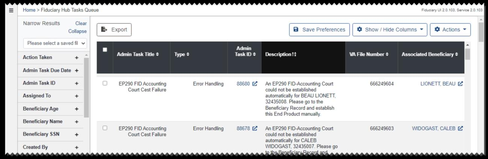
*Screenshot — page 7, figure 1 of 2 (1299×425 px)*

<details>
<summary>Screenshot text content (visible UI elements, labels, and data)</summary>

```
= | Home > Fiduciary Hub Tasks Queve Feucary U 20.103, Service 2
Narrow Results Clear a ee | ee | re
Collapse | | B+ Export | | Save Preterences || @ Show/Hide Columns ~ || ® Actions ~ |
Please select a saved fl v =
. ‘Admin
ee ir Admin Task Title ¢ Type TaskID ¢ Description? VAFile Number Associated Beneficiary
Admin Task Due Date +
Admin Task ID + EP290 FID Accounting Error Handling 88680 % An EP290 FID-Accounting Court 666249604 LIONETT, BEAU &
Court Cest Failure could not be established
Assigned To + automatically for BEAU LIONETT,
32435008. Please go to the
Beneficiary Age + Beneficiary Record and establish
this End Product manually
Beneficiary Name +
EP290 FID Accounting Error Handling 88678 An EP290 FID-Accounting Court 666249603 MIDOGAST, CALEB &
Beneficiary SSN + Court Cest Failure could not be established
automatically for CALEB
Created By + WIDOGAST, 32435007. Please go
```

</details>

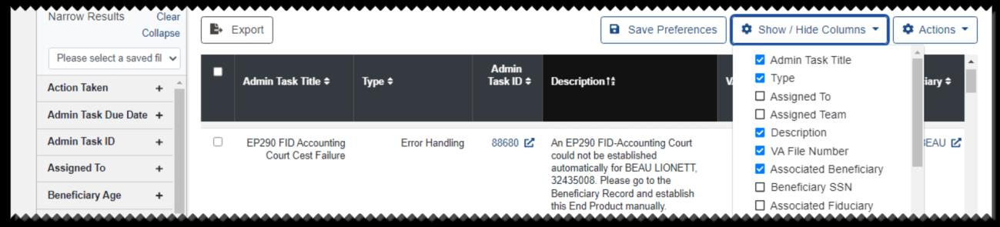
*Screenshot — page 7, figure 2 of 2 (1299×295 px)*

<details>
<summary>Screenshot text content (visible UI elements, labels, and data)</summary>

```
Narrow Results ees ; .
pse | | Be Export | fe Pi = se Couns = ][ ® Actions ~ |
Hipeseieonoctc saved a Admin Task Title A
. Admin H
ie ae : ‘Admin Task Title Type TaskID Description? ype
D assigned To
‘Admin Task Due Date + D1 Assigned Team
Description
‘Admin Task ID + EP290 FID Accounting Error Handling 88680 E+ An EP290 FID-Accounting Court ee EAU
Court Cest Failure could not be established VA File Number
Assigned To a automatically for BEAU LIONETT, Associated Beneficiary
32435008. Please go to the :
9 Beneficiary SS
Beneficiary Age = + Beneficiary Record and establish 0 Beneficiary SSN
this End Product manually D Associated Fiduciary
```

</details>

You can select the Clear link to clear all filters and reload the view. When you clear all filters, your view will reset to show only In Progress and Open tasks. If any filters are expanded, you can select the Collapse link to close them all at once.

To add filters to your view, choose a saved filter from the list, or enter filter criteria as needed, and select Apply Filters.

To save the current filter selections, select Save. Then enter a name for the filter in the dialog and select Save. To edit filter names or delete previously saved filters, select

#### Manage.

Some filters have additional tools that you can use to filter the tasks shown in your view.

For filters with the Check to show negative results check box, you can select the check box to show a message if your filter criteria did not return any results.

With the Keyword filter, you can search the Description column for one or more keywords. Type each keyword and press Enter, adding as many keywords as you wish. To remove a keyword, select the red remove icon [X]. When you are ready to search, choose AND to show the tasks that match all of the keywords you have entered, or choose OR to show the tasks that match one or more of the keywords you have entered.

### Admin Task Actions

From the tasks queue views, users with permissions can select one or more admin tasks and perform the following actions: transfer to another Fiduciary Hub, reassign to another team and user within their Fiduciary Hub, unassign, or update the priority. All completed actions are shown on the Audit History page for the admin task.

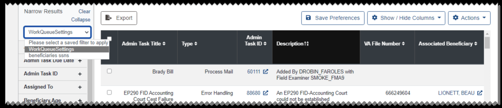
*Screenshot — page 8, figure 1 of 2 (1299×281 px)*

<details>
<summary>Screenshot text content (visible UI elements, labels, and data)</summary>

```
Narrow Results ——_
| Be export | a 2 ~ || o .
WorkQueueSetings
Admin
Please select a saved filter to apply Admin Task Title > Type > Task ID > Description t? VA File Number + Associated Beneficiary +
Deneficiaries ssn
‘womin task vue vate +
‘Admin Task ID o Brady Bill Process Mail @ Added By DROBIN_FAROLES with
Field Examiner SMOKE_FMA9
Assigned To +
EP290 FID Accounting Error Handling %Z AnEP290 FID-Accounting Court 666249604 Z
Beneficiary Age Court Cest Failure could not be established
```

</details>

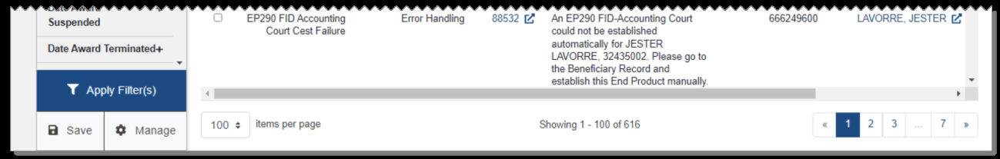
*Screenshot — page 8, figure 2 of 2 (1299×207 px)*

<details>
<summary>Screenshot text content (visible UI elements, labels, and data)</summary>

```
ccc EP290 FID Accounting Error Handing 88532 (© An EP290 FID-Accounting Court 1666249600 LAVORRE, JESTER
Court Cest Failure could not be established
; automatically for JESTER
ee emcee . LAVORRE, 32435002. Please go to
the Beneficiary Record and
eye establish this End Product manually .
pply Filter(s) C
@ save | @ uanoge | | 100 * toe perrm Shon 106 ee
```

</details>

#### Transferring Admin Tasks

Select the check box for each admin task you wish to transfer, then select Fid Hub

#### Transfer from the Actions list.

From the dialog, select the Fiduciary Hub where the admin tasks will be transferred. If needed, select Remove to remove a task from the list before transferring.

Select Save. A success dialog opens, showing a green check mark for each completed action.

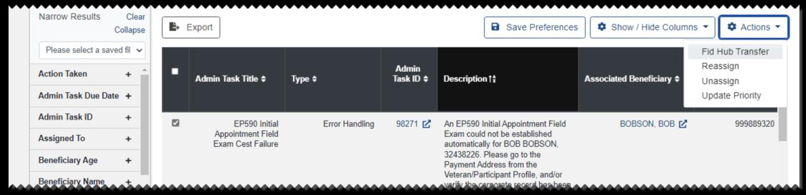
*Screenshot — page 9, figure 1 of 2 (1299×315 px)*

<details>
<summary>Screenshot text content (visible UI elements, labels, and data)</summary>

```
Narrow Results ———
Colle | Be Export | | @ Save Preterer | @ sn Hide Cotumns > 11 %@ Actions =
Please select a saved fl v Fid Hub Transfer
a pene Reassign
a hd Admin Task Title $ Type ¢ TaskID $ Description? Associated Beneficiary > REESE
Admin Task Due Date + Update Priority
‘Admin Task ID + 9
a EP590 Initial Error Handling 271 An EPS90 Initial Appointment Field BSON, BOB 999889320
, Appointment Field Exam could not be established
pared (0 * Exam Cest Failure automatically for BOB BOBSON
; 32438226. Please go to the
BeneficiayAge + Payment Address from the
: Veteran/Participant Profile, andlor
```

</details>

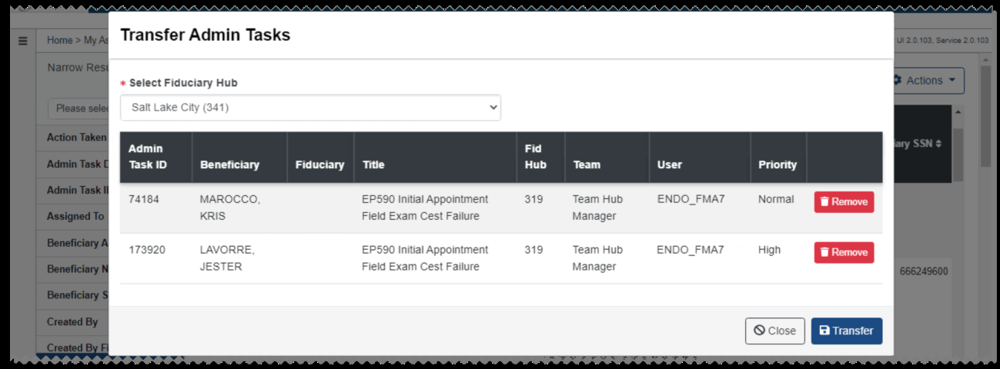
*Screenshot — page 9, figure 2 of 2 (1299×480 px)*

<details>
<summary>Screenshot text content (visible UI elements, labels, and data)</summary>

```
Transfer Admin Tasks
Select Fiduciary Hub
Salt Lake City (341) v
Admin Fid
Task ID Beneficiary Fiduciary Title Hub Team User Priority
74184 MAROCCO. EP590 Initial Appointment 319 Team Hub ENDO_FMA7 Normal
KRIS Field Exam Cest Failure Manager
173920 LAVORRE. EPS590 Initial Appointment 319 TeamHub = ENDO_FMA7 —Hiigh
JESTER Field Exam Cest Failure Manager
```

</details>

#### Reassigning Admin Tasks

Select the check box for each admin task you wish to reassign, then select Reassign from the Actions list.

From the dialog, select the team you wish to assign the admin tasks to. You can also select a specific user and update the priority of the tasks. If needed, select Remove to remove a task from the list before reassigning.

Select Save. A success dialog opens, showing a green check mark for each completed action.

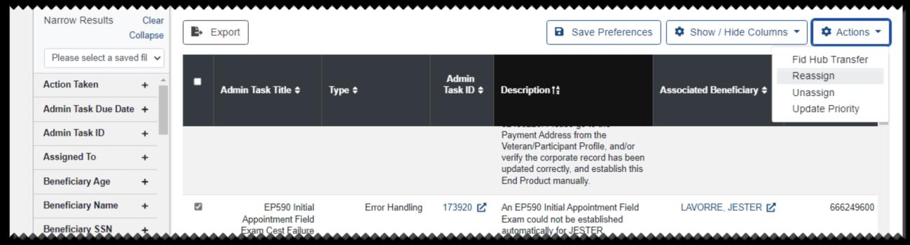
*Screenshot — page 10, figure 1 of 2 (1299×352 px)*

<details>
<summary>Screenshot text content (visible UI elements, labels, and data)</summary>

```
Narrow Results Clear | ~————— —— i — a
as [ B export | [ @ save Preferences |[ % show / Hide uinns ~ ]{ @ Actons ~ |
Plea tasaved fil v Fid Hub Transfer
ae = Admin Reassign
rota we Admin Task Title Type + TaskID ¢ Description Associated Beneficiary + Unassign
‘Admin Task Due Date + Update Priority
‘Admin Task ID + Payment Address from the
\Veteran/Participant Profile, andlor
Assigned To + verify the corporate record has been
updated correctly, and establish this
Beneficiary Age + End Product manually
Beneficiary Name + EP590 Initial Error Handling 920 (F _ An EPS590 initial Appointment Field lav ERE 666249600
Appointment Field Exam could not be established
Beneficiary SSN arp Cost Failure aytomptically fon JESTER
```

</details>

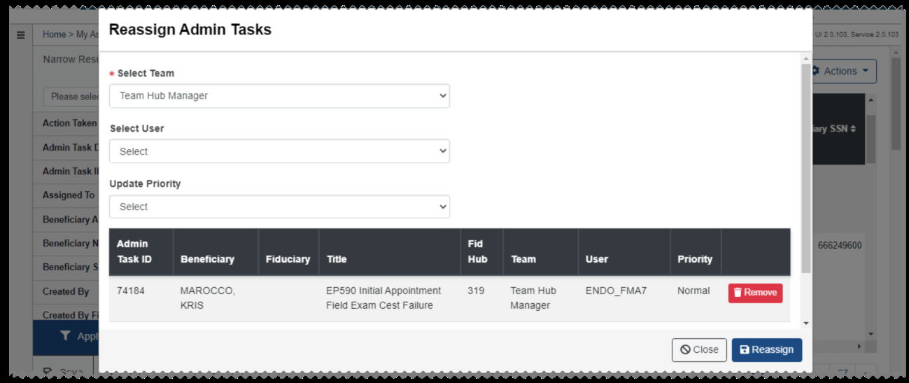
*Screenshot — page 10, figure 2 of 2 (1299×547 px)*

<details>
<summary>Screenshot text content (visible UI elements, labels, and data)</summary>

```
Reassign Admin Tasks
Select Team
Team Hub Manager v
Select User
Select v
Update Priority
Select v
Admin Fid
Task ID Beneficiary Fiduciary Title Hub Team User Priority
74184 MAROCCO, EP590 Initial Appointment 319 Team Hub ENDO_FMA7 Normal
KRIS Field Exam Cest Failure Manager
```

</details>

#### Unassigning Admin Tasks

Select the check box for each admin task you wish to unassign, then select Unassign from the Actions list.

The Unassign Admin Tasks dialog opens, indicating that the user will be unassigned. If the Unassign Team check box is selected, the team will also be unassigned. You can also update the priority of the tasks. If needed, select Remove to remove a task from the list before unassigning.

Select Save. A success dialog opens, showing a green check mark for each completed action.

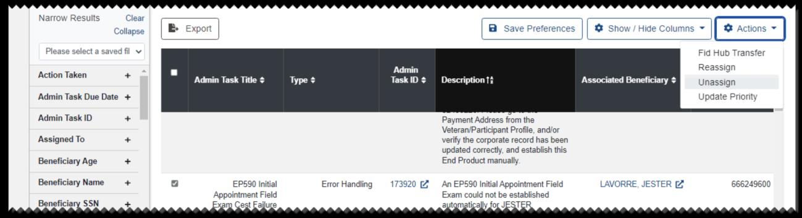
*Screenshot — page 11, figure 1 of 2 (1299×354 px)*

<details>
<summary>Screenshot text content (visible UI elements, labels, and data)</summary>

```
Narrow Results Clear | —_———— $$
lapse | | B+ Export | [save Preter ['@ snow Hise Cowumns = |[  actons ~ |
Please ta saved fil v Fid Hub Transfer
Action Take . Admin Reassign
ee ba ‘Admin Task Title Type ¢ TaskID $ Description? Associated Beneficiary ¢ Unassign
Admin Task Due Date + Update Priority
‘Admin Task ID + Payment Address from the
Veteran/Participant Profile, and/or
Assigned To + verify the corporate record has been
updated correctly, and establish this
Beneficiary Age + End Product manually
BeneficiaryName + a EPS590 Initial Error Handling 173920 (An EP590 Initial Appointment Field vc ERG 666249600
Appointment Field Exam could not be established
Beneficiary SSN + xan Cost Failure automatically fog JESTE!
```

</details>

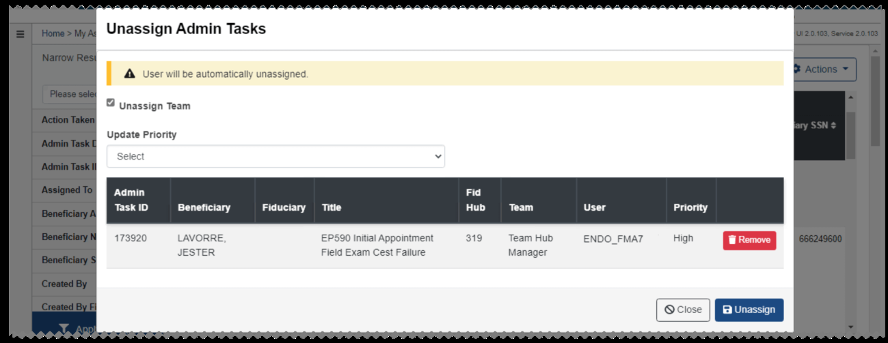
*Screenshot — page 11, figure 2 of 2 (1299×503 px)*

<details>
<summary>Screenshot text content (visible UI elements, labels, and data)</summary>

```
Unassign Admin Tasks
A User will be automatically unassigned.
Unassign Team
Update Priority
Select v
Admin Fid
Task ID Beneficiary Fiduciary Title Hub Team User Priority
173920 LAVORRE EP590 Initial Appointment 319 Team Hub ENDO_FMA7 High
JESTER Field Exam Cest Failure Manager
```

</details>

#### Updating Admin Task Priority

Select the check box for each admin task you wish to update, then select Update Priority from the Actions list.

From the dialog, select a priority from the Update Priority list. If needed, select Remove to remove a task from the list before updating the priority.

Select Save. A success dialog opens, showing a green check mark for each completed action.

### My Work Queue Exports

From My Work Queue Exports, you can view the status of the exports you sent from your tasks queue views.

When you select Export from a tasks queue view, the tasks in the current view with all filters applied will be processed for download. Once the export has finished processing, the export will show Complete status.

To filter the export list, enter a term in the Filter Results box.

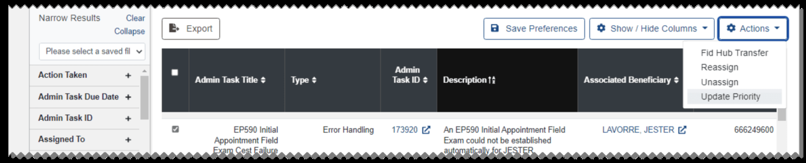
*Screenshot — page 12, figure 1 of 2 (1299×264 px)*

<details>
<summary>Screenshot text content (visible UI elements, labels, and data)</summary>

```
Narrow Results ———
| B+ Export a & ~ || o -|
Please select a saved flv Fid Hub Transfer
Py Admin Reassign
oa o Admin Task Title Type Task ID ¢ Description? ‘Associated Beneficiary ¢ JNEPReEEN
‘Admin Task Due Date + Update Priority
Admin Task ID +
EP590 Initial Error Handling Z An EP590 intial Appointment Field z 666249600
Assigned To & Appointment Field Exam could not be established
arp Cost Ealuse automaticaly for JESTER
```

</details>

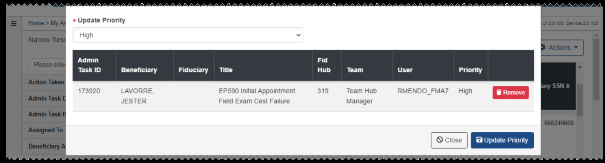
*Screenshot — page 12, figure 2 of 2 (1299×350 px)*

<details>
<summary>Screenshot text content (visible UI elements, labels, and data)</summary>

```
Update Priority
High v
Admin Fid
Task ID Beneficiary Fiduciary Title Hub = Team User Priority
173920 LAVORRE, EP590 Initial Appointment 319 Team Hub RMENDO_FMA7 High
JESTER Field Exam Cest Failure Manager
(oom | EEE
```

</details>

You can select Download to download a CSV file of an export in Complete status. You can also select Delete to delete an export.

### Accounting Audit Tools

From Accounting Audit Tools, you can view a list of all accounting audit tools. To filter the list, enter a term in the Filter Results box.

You can select View to view an accounting audit tool. See Accounting Audit Tools for more information.

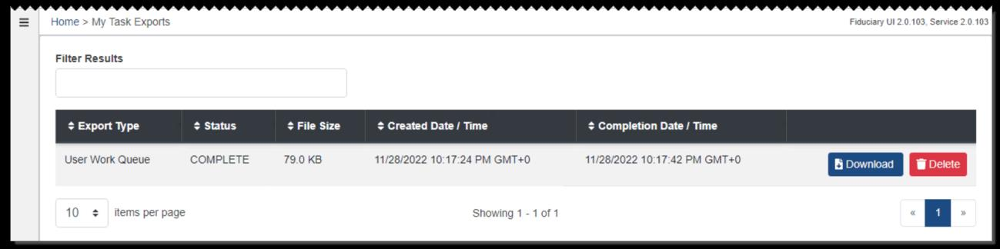
*Screenshot — page 13, figure 1 of 2 (1299×324 px)*

<details>
<summary>Screenshot text content (visible UI elements, labels, and data)</summary>

```
= | Home > My Task Exports Fiduciary UI2.0.103, Service 20.103
Filter Results
¢ Export Type $ Status File Size $ Created Date / Time Completion Date / Time
User Work Queue COMPLETE 79.0 KB 11/28/2022 10:17:24 PM GMT+0 11/28/2022 10:17:42 PM GMT+0
10 | tems per page Showing 1-1 of 1
```

</details>

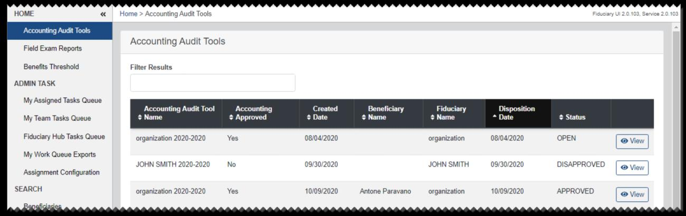
*Screenshot — page 13, figure 2 of 2 (1299×411 px)*

<details>
<summary>Screenshot text content (visible UI elements, labels, and data)</summary>

```
HOME 4 | Home > Accounting Audit Tools Fuca Ui20.102, Seren 20:1
‘Accounting Audit Tools
Accounting Audit Tools
Field Exam Reports
Benefits Threshold Filter Results
‘ADMIN TASK
My Assigned Tasks Queue
‘Accounting Audit Too! Accounting Created Beneficiary Fiduciary Disposition
My Team Tasks Queue Name $ Approved $ Date Name Name * Date ¢ Status
Fiduciary Hub Tasks Queve organization 2020-2020 Yes 08/04/2020 organization 08/04/2020 OPEN [oview]
My Work Queue Exports
JOHN SMITH 2020-2020 No 09/30/2020 JOHN SMITH 09/30/2020 DISAPPROVED [ view]
Assignment Configuration :
SEARCH organization 2020-2020 Yes 10/09/2020 Antone Paravano organization 10/09/2020 APPROVED [eview]
```

</details>

### Field Exam Reports

From Field Exam Reports, you can view a list of field exam reports for all beneficiaries.

You can select View to view a field exam report. See Field Exams for more information. If you select View for a field exam report created in the legacy BFFS system, the Legacy Field Exam page opens, showing a read-only view of the report. From this page, you can select Download to save a PDF of the report.

To show only Field Exam Reports assigned to you, select the Show my Field Exam Reports check box. To filter the list, enter criteria in one or more fields and select Apply Filters.

### Benefits Threshold

From Benefits Threshold, you can manage benefits threshold amounts and effective dates, and view the Benefits Threshold History.

To add a future benefits threshold, select Add Future Threshold.

From the dialog, enter the amount and effective date and select OK.

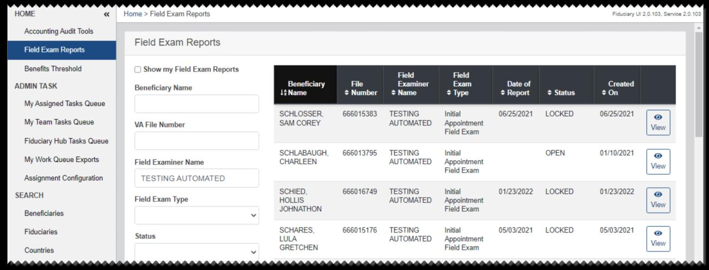
*Screenshot — page 14, figure 1 of 2 (1299×495 px)*

<details>
<summary>Screenshot text content (visible UI elements, labels, and data)</summary>

```
HOME «| Home > Field Exam Reports Fidvoary U'20.103, Servee 2
Accounting Audit Tools
Field Exam Reports
Fiold Exam Reports
Benefits Threshold Show my Field Exam Reports
Field Field
‘ADMIN TASK Beneficiary Name Beneficiary File Examiner Exam Date of Created
1tName Number Name + Type Report —_ Status On
My Assigned Tasks Queue
SCHLOSSER, 666015383 TESTING Initial 06/25/2021 LOCKED 062572021 [> )
My Team Tasks Queue VA File Number SAM COREY AUTOMATED Appointment ae
Field Exam wis
Fiduciary Hub Tasks Queue
SCHLABAUGH, 666013795 TESTING Initial OPEN o1t02021 [@
My Work Queue Exports Field Examiner Name CHARLEEN AUTOMATED — Appointment | Vie
Field Exam _
Assignment Configuration TESTING AUTOMATED
SCHIED, 666016749 TESTING Initial 01/23/2022 LOCKED 01232022 [@ |
SEARCH Field Exam Type HOLLIS AUTOMATED Appointment | Vie |
Beneficiaries = JOHNATHON Field Exam [view |
Fiduciaries SCHARES 666015176 TESTING Initial 05/03/2021 LOCKED 0503/2021 [> |
Salis LULA AUTOMATED Appointment | is
Cotcaies 7 GRETCHEN Field Exam .
```

</details>

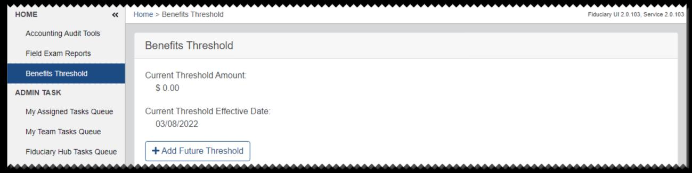
*Screenshot — page 14, figure 2 of 2 (1299×326 px)*

<details>
<summary>Screenshot text content (visible UI elements, labels, and data)</summary>

```
HOME «| Home > Benefits Threshold Fiduciary U12 0.103, Senice 20.103
Accounting Audit Tools
Benefits Threshold
Field Exam Reports
Benefits Threshold Current Threshold Amount
ADMIN TASK $0.00
My Assigned Tasks Queue Current Threshold Effective Date:
03/08/2022
My Team Tasks Queue
Fiduciary Hub Tasks Queue +Add Future Threshold |
```

</details>

To edit the future benefits threshold, select Edit Future Threshold.

Then from the dialog, edit the amount and effective date as needed and select OK.

To view details about a change to the benefits threshold history, select View Audit

#### History in the row for the change.

A new page opens, showing details about the change.

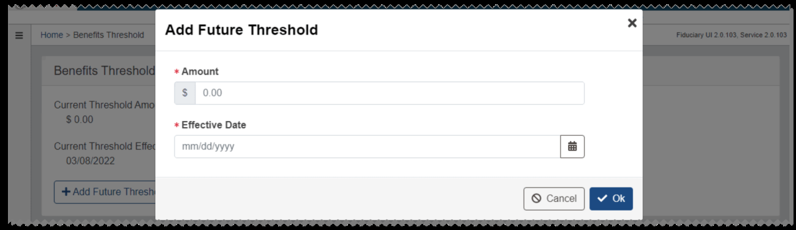
*Screenshot — page 15, figure 1 of 3 (1299×378 px)*

<details>
<summary>Screenshot text content (visible UI elements, labels, and data)</summary>

```
Add Future Threshold *
* Amount
$ 0.00
+ Effective Date
mmidd/yyyy
```

</details>

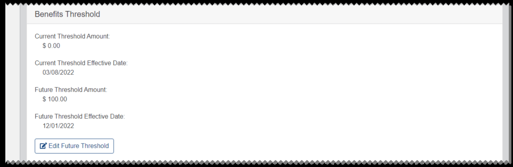
*Screenshot — page 15, figure 2 of 3 (1299×425 px)*

<details>
<summary>Screenshot text content (visible UI elements, labels, and data)</summary>

```
Benefits Threshold
Current Threshold Amount
$0.00
Current Threshold Effective Date
03/08/2022
Future Threshold Amount
$ 100.00
Future Threshold Effective Date
12/01/2022
@ Edit Future Threshold
```

</details>

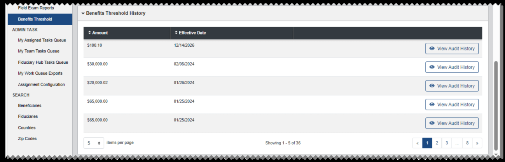
*Screenshot — page 15, figure 3 of 3 (1299×417 px)*

<details>
<summary>Screenshot text content (visible UI elements, labels, and data)</summary>

```
Feld Exam Reports
¥ Benefits Threshold History
Benefits Threshold
‘ADMIN TASK oS # Effective Date
My Assigned Tasks Queue
$100.10 1271472026 Sy
My Team Tasks Queue View Audit History
Fiduciary Hub Tasks Queue $30,000.00 cayns.2028
© View Audit History
My Work Queve Exports
Assignment Configuration s2nooo.se ouzs2024 © View Audit History
SEARCH
00.00 or2s202s
Beneficiaries “ " © View Audit History
Fiduciaies
172572024
5,000.00 o12s202: © View Audit History
Countries
Zp Codes
5 ¢ tems per page Showing 1-5 0f 36 | + | 2|3 8 >
```

</details>

### Fiduciary Manager Search Features

The Search section of the Fiduciary Manager home page includes tabs to search for Beneficiaries, Fiduciaries, Countries, and Zip Codes.

#### Beneficiaries

From the Beneficiaries tab, you can search by entering a first and last name and one of the following:

• Middle name

• Date of birth

You can also search by SSN, File Number, Participant ID, Tax ID, Home Loan Number, Insurance File Number, Service Number, ICN, or EDIPI.

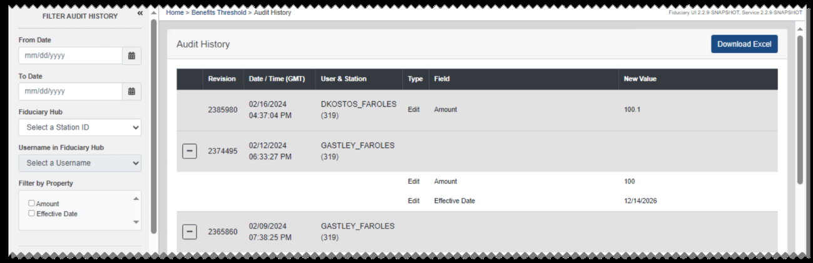
*Screenshot — page 16, figure 1 of 2 (1299×422 px)*

<details>
<summary>Screenshot text content (visible UI elements, labels, and data)</summary>

```
FLTERAUDTT STORY & =| Home> Benet Treshod> Aut istry 4 or
Pree Oe Audit History Download Excel
o2i62024 DKOSTOS_FAROLES
J nt 1001
a 2385980 437:04PM (319) fat Ane "
Select a Station ID ¥
Username in Fiduciary Hu =) zsragos 02/12/2024 GASTLEY_FAROLES
() 237485 o63927 ew G19)
Select a Username .
Fitter by Property Est Amount 100
— - Est Efectve Date ranaanes
fective Date
\ o2y091z024 GASTLEY_FAROLES
[=] 2395999 Grease im)
```

</details>

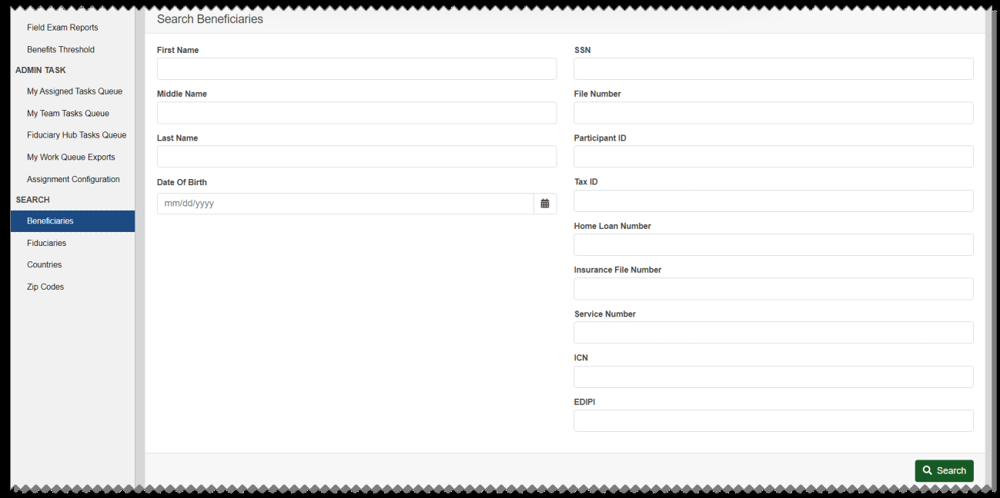
*Screenshot — page 16, figure 2 of 2 (1299×648 px)*

<details>
<summary>Screenshot text content (visible UI elements, labels, and data)</summary>

```
GSES Search Beneficiaries
Benefits Threshold First Name SSN
am
My Assigned Tasks Queue ‘Middle Name File Number
Fiduciary Hub Tasks Queue Last Name. Participant ID.
Assignment Configuration Date Of Birth TD
‘SEARCH mmidd/yyyy Lad
```

</details>

From the beneficiary search results, you can select View to view an existing profile. If the search returns an eligible person or Veteran record without a beneficiary record, you can select Create to create a new beneficiary profile, or Create Insurance Profile to create a profile for a non-Veteran, non-dependent beneficiary entitled to an insurance benefit. See Beneficiary Profile for more information.

If the person or Veteran record is not shown in the search results, you must add their profile through VBMS Advanced Search before creating the beneficiary profile. See Adding Veteran Profiles and Adding Person Profiles for more information.

#### Fiduciaries

From the Fiduciaries tab, you can select Person or Organization and enter search terms.

For a Person search, Last Name is required.

For an Organization search, Organization Name is required.

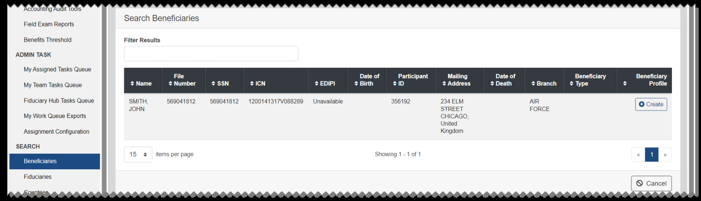
*Screenshot — page 17, figure 1 of 2 (1299×373 px)*

<details>
<summary>Screenshot text content (visible UI elements, labels, and data)</summary>

```
Rctodning ust Tots
Search Beneficiaries
vse
Fiduciary Hub Tasks Queue ‘SMITH, 969041812 569041812 1200141317V088289 Unavailable 386192 234 ELM AR [create
a za,
15 © items per page Showing 1-1 1
© cance! |
```

</details>

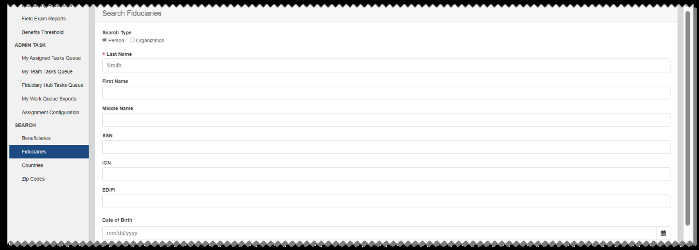
*Screenshot — page 17, figure 2 of 2 (1299×466 px)*

<details>
<summary>Screenshot text content (visible UI elements, labels, and data)</summary>

```
Search Fiduciaries
Feld Exam Reports
BenettsThreshole Search Type
My Assigned Tasks Queve setName
Smith
My Team Tasks Queue
Fiduciary Hub Tasks Queue ‘est Name
My Work Queue Exports
Assignment Connguraton teste Name
SEARCH
Benencianes ssn
counties ren
Zp codes
```

</details>

From the fiduciary search results, you can select View Profile to view an existing profile. If the search returns no results, or does not show the profile you are looking for, you can select Create Fiduciary to create a new profile. See Fiduciary Profile for more information.

#### Countries

From the Countries tab, you can search for a country and manage team and user assignments. Users with permissions can also add or delete countries.

The Country Information page shows the Fiduciary Hub, team, and user assignments for the country. If needed, you can manually edit this information.

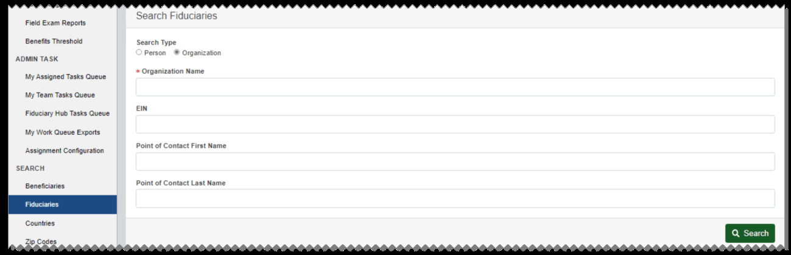
*Screenshot — page 18, figure 1 of 3 (1299×420 px)*

<details>
<summary>Screenshot text content (visible UI elements, labels, and data)</summary>

```
Search Fiduciaries
Field Exam Reports
Benefits Threshold Search Type
Person ® Organization
ADMIN TASK
* Organization Name
My Assigned Tasks Queue
My Team Tasks Queue
en
Fiduciary Hub Tasks Queve
My Work Queue Exports
oint of Contact First Name
Assignment Configuraton Point of Contact First
SEARCH
oe Point of Contact Last Name
Fiducianes
Countries
Zip Codes
```

</details>

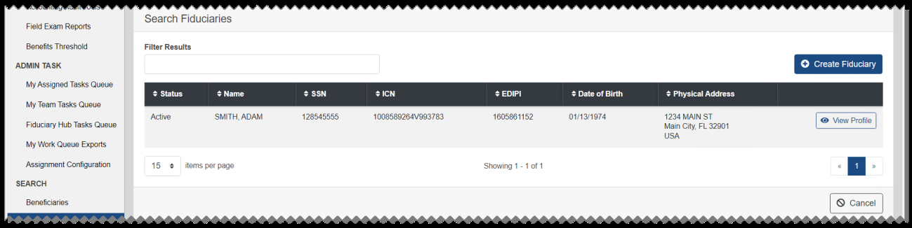
*Screenshot — page 18, figure 2 of 3 (1299×326 px)*

<details>
<summary>Screenshot text content (visible UI elements, labels, and data)</summary>

```
Search Fiduciaries
Field Exam Reports
BoneftsTireshold Filter Resuits
ADMIN TASK © Create Fiduciary
My Assioned Tasks Queue
2 Status # Name 2 88N 21cN SEDI 2 Date of Birth 2 Physical Address
My Team Tasks Quove
Active ‘SMITH, ADAM 12854555, s0095e0264v909763 1605961152 owising7a 1234 MANST [eo View Pte
Feduciry Hub Tasks Queue Wan Gy FL 32901
USA
My Work Queue Exports
Assignment Configuration 15. tomsperpage Showing 1-1 of |: |
SEARCH
Beneficiaries [ © cancet |
```

</details>

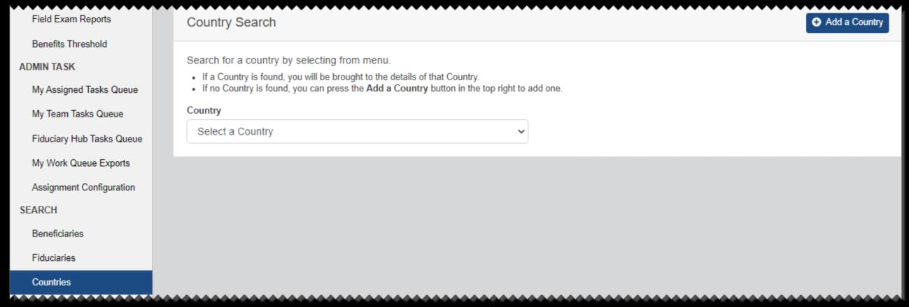
*Screenshot — page 18, figure 3 of 3 (1299×440 px)*

<details>
<summary>Screenshot text content (visible UI elements, labels, and data)</summary>

```
Field Exam Reports Country Search
Benefits Threshold
ADMIN TASK SEARCH IOS COUNRY. oe i igs .
My Assigned Tesks Que $a Cauisy fund you ean prea Oo Adda County bidion hBe  tght aed
My Team Tasks Queue Country
Fiduciary Hub Tasks Queue Selec a Count
My Work Queue Exports
Assignment Configuration
SEARCH
Beneficiaries
Fiduciaries
Countries
revwvvve rrr
```

</details>

To view the history of changes to the country, select View Audit History. See Audit History for more details.

To delete a country, select Delete Country. If one or more beneficiary profile physical addresses include the country, it cannot be deleted until it is removed from all profiles. If the country is deleted, select OK on the message shown, and the Countries tab will open.

To add a country, select Add a Country from the Countries tab. From the Country Information page, you can select the country, select a Fiduciary Hub, and select team and user assignments.

#### ZIP Codes

From the ZIP Codes tab, you can search for a ZIP code and manage team and user assignments. Users with permissions can also add or delete ZIP codes.

The ZIP Code Information page shows the Fiduciary Hub, team, and user assignments for the ZIP code. If needed, you can manually edit this information.

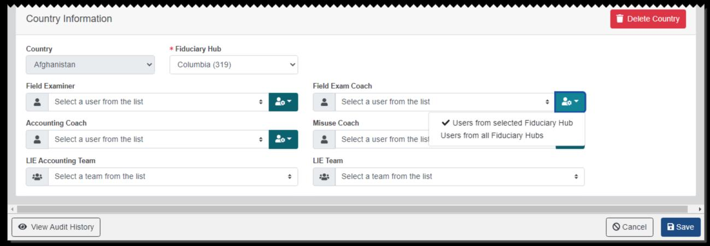
*Screenshot — page 19, figure 1 of 2 (1299×451 px)*

<details>
<summary>Screenshot text content (visible UI elements, labels, and data)</summary>

```
Country Information i Delete Country
Country + Fiduciary Hub
Afghanistan v lumbia (319 v
Field Examiner Field Exam Coach
‘Accounting Coach Misuse Coach Users from selected Fiduciary Hub
BU sesect a user rom the us ‘ Ea @ | select auser from the ist USES from all Fiduciary Hubs
UE Accounting Team UE Team
42: Select a team from the list e 42: Select a team from the list ‘
(ava) Ga)
```

</details>

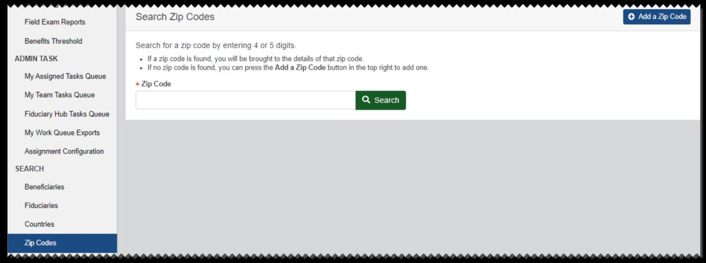
*Screenshot — page 19, figure 2 of 2 (1299×485 px)*

<details>
<summary>Screenshot text content (visible UI elements, labels, and data)</summary>

```
Fever reoae Search Zip Codes © Adda Zip
Benefits Threshold Searciliire Je by entering 4 or 5 digi
ADMIN TASK + If zip code is found, you will be brought to the details of that zip cod
+ Ifo zip code is found, you can press the Add a Zip Code button in the top right to add one.
My Assigned Tasks Queue
+ Zip Code
My Team Tasks Quet
ly Team Tasks Queue
Fiduciary Hub Tasks Queue
My Work Queue Exports
Assignment Configuration
SEARCH
Beneficiaries
Fiduciaries
Countries
Zip Codes
```

</details>

To view the history of changes to the ZIP code, select View Audit History. See Audit History for more details.

To delete a ZIP code, select Delete ZIP Code. If one or more beneficiary profile physical addresses include the ZIP code, it cannot be deleted until it is removed from all profiles. If the ZIP code is deleted, select OK on the message shown, and the ZIP Codes tab will open.

To add a ZIP code, select Add a ZIP Code from the ZIP Codes tab. From the ZIP Code Information page, you can enter the ZIP code, select a Fiduciary Hub, and select team and user assignments.

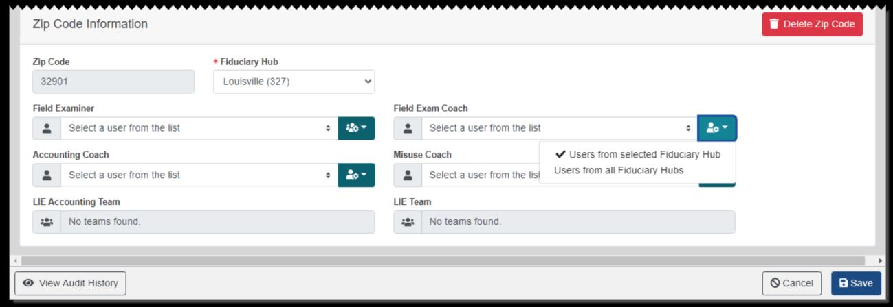
*Screenshot — page 20 (1299×448 px)*

<details>
<summary>Screenshot text content (visible UI elements, labels, and data)</summary>

```
Zip Code Information 8 Delete Zip Code
Zip Code * Fiduciary Hub
Field Examiner Field Exam Coach
Accounting Coach Misuse Coach Users from selected Fiduciary Hub
El! seiect a user trom the ist ‘ Ea & | Selecta user rom the tis) USFS from all Fiduciary Hubs
UE Accounting Team UE Team
42: No teams found 48: No teams found
(En [cance |
```

</details>

---

*[← Back to README](./README.md)*