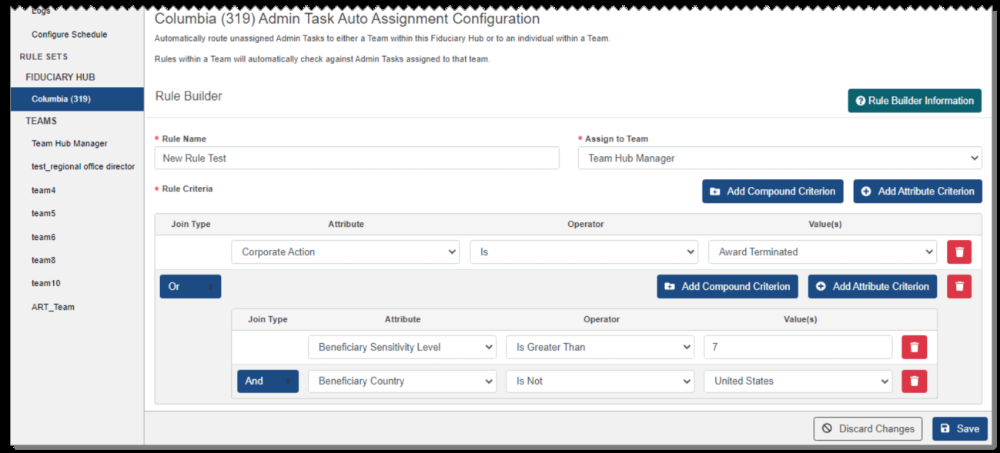
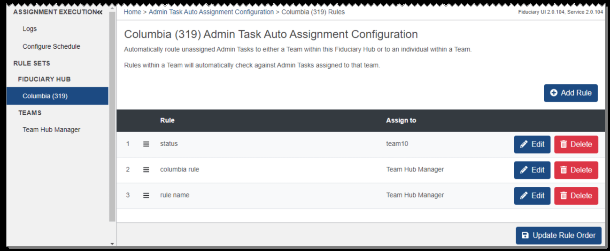
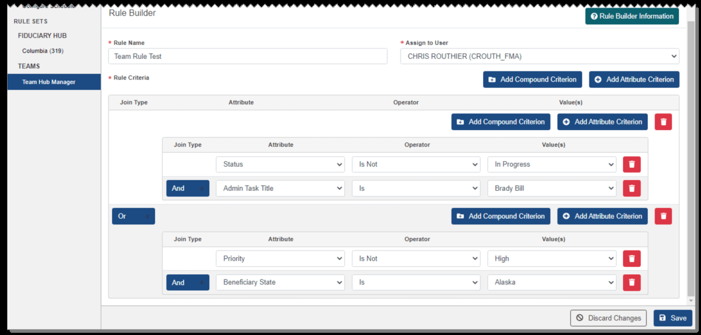
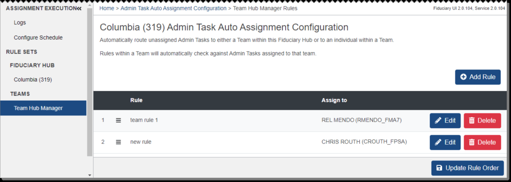
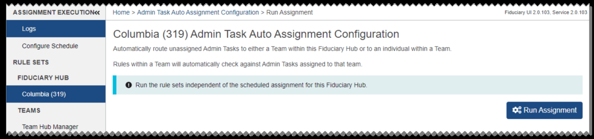
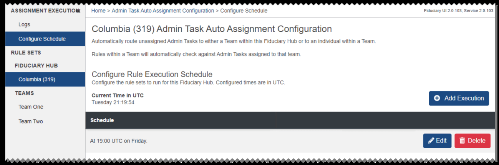
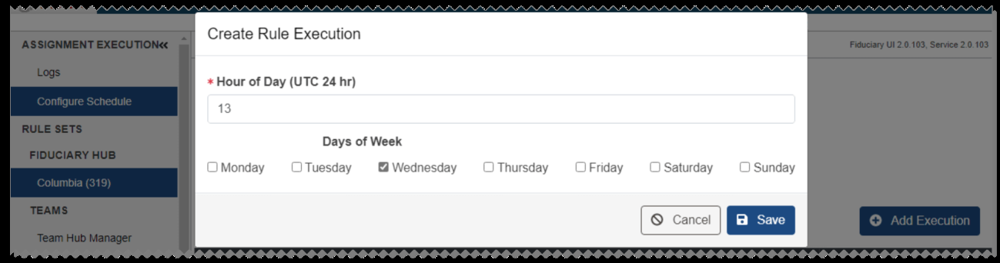

# Admin Task Assignment Configuration

From the Admin Task Assignment Configuration page, you can run or schedule admin task auto assignment, as well as configure rules to assign tasks to teams and users within a Fiduciary Hub. To access this page, select Assignment Configuration from the Admin Tasks section in the left pane of the Fiduciary Manager home page. The Rule Set for the Fiduciary Hub opens at first.

Rules sort admin tasks based on task details, called criteria, and then direct where tasks that match those rules should be assigned. Criteria are combinations of attributes, operators, and values. Operators and values vary based on the attribute you select, and may include Is, Is Not, Is None, Is In, and Is Not In. Attributes with numerical values may include additional operators such as Is Between, Is Greater Than, and Is Less Than.

Within a rule, multiple criteria may be joined by And, Or, And Not, or Or Not. At each level in the rule, you can also add a joined group of criteria called a compound criterion with the same Join Type options.

Fiduciary Hub rules determine how unassigned tasks in the Fiduciary Hub are assigned to teams, and team rules determine how a team's tasks are assigned to team members. Rules are applied one at a time starting with the rule ranked number one.


*Screenshot — page 21 (1299×536 px)*

<details>
<summary>Screenshot text content (visible UI elements, labels, and data)</summary>

```
ASSIGNMENT EXECUTION& Home > Admin Task Auto Assignment Configuration > Columbia (319) Rules Fiduciary Ul 20.104, Service 20.104
Logs . . . . .
Columbia (319) Admin Task Auto Assignment Configuration
Configure Schedule Automatically route unassigned Admin Tasks to either a Team within this Fiduciary Hub or to an individual within a Team.
RULE SETS Rules within a Team will automatically check against Admin Tasks assigned to that team.
FIDUCIARY HUB
Columbia (319) © Add Rule
TEAMS
Rule Assign to
Team Hub Manager
1 = status teamt0 # Edit | Hi Delete
2 = columbia rule ‘Team Hub Manager # Edit | BH Delete
3 = rulename ‘Team Hub Manager # Edit | B Delete
@ Update Rule Order
```

</details>

### Configuring Fiduciary Hub Rules

1. Select a Fiduciary Hub from the list in the Rule Sets section, if needed. 2. To add a new rule from the Fiduciary Hub Rules page, select Add Rule. 3. From the Rule Builder page, enter a Rule Name and select a team for assignment.

4. Select Add Attribute Criterion. Select an attribute, operator, and value for the criterion. 5. If needed, add another attribute criterion and select a Join Type. 6. To add a nested group of criteria, select Add Compound Criterion. At the group level of the rule, the Add Compound Criterion and Add Attribute Criterion buttons are shown. Continue adding criteria to the group as needed. 7. When you have finished adding criteria to the rule, select Save. The rule is added to the list on the Fiduciary Hub Rules page.

8. To edit a rule, select Edit for the rule. From the Rule Builder page, make changes

as needed and select Save. 9. To delete a rule, select Delete for the rule. From the dialog, select Continue to

confirm.


*Screenshot — page 22, figure 1 of 2 (1299×589 px)*

<details>
<summary>Screenshot text content (visible UI elements, labels, and data)</summary>

```
Columbia (319) Admin Task Auto Assignment Configuration
‘Configure Schedule ‘Aulomaticaty route unassigned Admin Tasks to either a Team within this Fiduciary Hub oto an indvidual within a Team
RULE SETS Rules within a Team will automaticaly check against Admin Tasks assigned to that team
FIDUCIARY HUB
Columbia (319) Rule Builder © Rule Builder Information
TEAMS
ery * Rule Name * Assign to Team
New Rule Test Team Hub Manager
test regional office director
teams + Rute Criteria ‘Add Compound Criterion [J © Add Attribute Criterion
teams
Join Type Attnbute Operator Value(s)
teams
‘cams Corporate Action vl) is | | Award Terminated v | |
toomte @ Add Compound Criterion © Add Attribute Criterion G
ART_Team
Join Type Attribute Operator Value(s)
Beneficiary Sensitivity Level | Is Greater Than vl {7 [|
Bern County vt | Und States -o
© Deca Cape
```

</details>


*Screenshot — page 22, figure 2 of 2 (1299×536 px)*

<details>
<summary>Screenshot text content (visible UI elements, labels, and data)</summary>

```
ASSIGNMENT EXECUTION& Home > Admin Task Auto Assignment Configuration > Columbia (319) Rules Fiduciary Ul 20.104, Service 20.104
Logs . . . . .
Columbia (319) Admin Task Auto Assignment Configuration
Configure Schedule Automatically route unassigned Admin Tasks to either a Team within this Fiduciary Hub or to an individual within a Team.
RULE SETS Rules within a Team will automatically check against Admin Tasks assigned to that team.
FIDUCIARY HUB
Columbia (319) © Add Rule
TEAMS
Rule Assign to
Team Hub Manager
1 = status teamt0 # Edit | Hi Delete
2 = columbia rule ‘Team Hub Manager # Edit | BH Delete
3 = rulename ‘Team Hub Manager # Edit | B Delete
@ Update Rule Order
```

</details>

10. To rank a rule higher or lower in the list, select the menu icon for the rule and drag the rule up or down to the desired position. The priority ranking numbers will change each time you move a rule. 11. When the rules are in order, select Update Rule Order to save your changes.

### Configuring Team Rules

1. Select a team from the list in the Teams section. 2. To add a new rule from the Team Rules page, select Add Rule. 3. From the Rule Builder page, enter a Rule Name and select a user for assignment.

4. Select Add Attribute Criterion. Select an attribute, operator, and value for the criterion. 5. If needed, add another attribute criterion and select a Join Type. 6. To add a nested group of criteria, select Add Compound Criterion. At the group level of the rule, the Add Compound Criterion and Add Attribute Criterion buttons are shown. Continue adding criteria to the group as needed. 7. When you have finished adding criteria to the rule, select Save. The rule is added to the list on the Team Rules page.


*Screenshot — page 23, figure 1 of 2 (1299×623 px)*

<details>
<summary>Screenshot text content (visible UI elements, labels, and data)</summary>

```
Rule Builder Rule Builder Information
RULE SETS © Rule Builder Informa
FIDUCIARY HUB
+ Rule Name + Assign to User
cowmbia (319)
SS Team Rule Test CHRIS ROUTHIER (CROUTH_FMA) ¥
TEAMS
Team ub Manager + Rule Criteria Bs Add Compound Criterion J © Add tribute Criterion
Join Type Attribute Operator Vatue(s)
Add Compound Criterion | © Add Attribute Criterion | |
Join Type Attribute Operator Value(s)
Status v) | Is Not ¥) | In Progress -G
‘Admin Task Tile v's ¥ Brady Bill v o
Ba Add Compound Criterion | © Add Attribute Criterion G
Join Type Attribute Operator Vatue(s)
Priosity ¥ Is Not ¥ | High . [|
Beneficiary State v| | ls v| | Alaska j=}
© Discard Changes
```

</details>


*Screenshot — page 23, figure 2 of 2 (1299×463 px)*

<details>
<summary>Screenshot text content (visible UI elements, labels, and data)</summary>

```
ASSIGNMENT EXECUTION® = Home > Admin Task Auto Assignment Configuration > Team Hub Manager Rules Fiduciary Ul 2.0.104, Service 2.0.104
Logs . . . . .
Columbia (319) Admin Task Auto Assignment Configuration
Configure Schedule Automatically route unassigned Admin Tasks to either a Team within this Fiduciary Hub or to an individual within a Team
RULE SETS Rules within a Team will automatically check against Admin Tasks assigned to that team.
FIDUCIARY HUB
‘Columbia (319) © Add Rule
TEAMS
Rule Assign to
Team Hub Manager
1. = teamrule1 REL MENDO (RMENDO_FMA7) # Edit | Ti Delete
2 = newnle CHRIS ROUTH (CROUTH_FPSA) @ Edit Bi Delete
@ Update Rule Order
```

</details>

8. To edit a rule, select Edit for the rule. From the Rule Builder page, make changes as needed and select Save. 9. To delete a rule, select Delete for the rule. From the dialog, select Continue to confirm. 10. To rank a rule higher or lower in the list, select the menu icon for the rule and drag the rule up or down to the desired position. The priority ranking numbers will change each time you move a rule. 11. When the rules are in order, select Update Rule Order to save your changes.

### Running Admin Task Auto Assignment

1. To run admin task auto assignment for the Fiduciary Hub, select Logs from the Assignment Execution section. 2. From the Run Assignment page, select Run Assignment.

3. From the dialog, select Continue to confirm. This will automatically route unassigned tasks to teams and users within the current Fiduciary Hub.

### Scheduling Admin Task Auto Assignment

1. To set up the schedule for admin task auto assignment to run, select Configure

#### Schedule from the Assignment Execution section. The current rule execution

schedule is shown on the Configure Schedule page.


*Screenshot — page 24, figure 1 of 2 (1299×305 px)*

<details>
<summary>Screenshot text content (visible UI elements, labels, and data)</summary>

```
ASSIGNMENT EXECUTION Home > Admin Task Auto Assignment Configuration > Run Assignment Fiduciary Ul 20.103, Service 2.0.103
Logs . . . . .
Columbia (319) Admin Task Auto Assignment Configuration
Configure Schedule ‘Automatically route unassigned Admin Tasks to either a Team within this Fiduciary Hub or to an individual within a Team,
RULE SETS Rules within a Team will automatically check against Admin Tasks assigned to that team
FIDUCIARY HUB
@ Run the rule sets independent of the scheduled assignment for this Fiduciary Hub.
Columbia (319)
TEAMS 96 Run Assignment
Team Hub Manager
```

</details>


*Screenshot — page 24, figure 2 of 2 (1299×432 px)*

<details>
<summary>Screenshot text content (visible UI elements, labels, and data)</summary>

```
ASSIGNMENT EXECUTION Home > Admin Task Auto Assignment Configuration > Configure Schedule Fielary U12.0103, Sendce 20.103
Logs . . .
Columbia (319) Admin Task Auto Assignment Configuration
Configure Schedule Automatically route unassigned Admin Tasks to either a Team within this Fiduciary Hub or to an individual within a Team.
RULE SETS Rules within a Team will automatically check against Admin Tasks assigned to that team.
FIDUCIARY HUB
ee Configure Rule Execution Schedule
See) Configure the rule sets to run for this Fiduciary Hub. Configured times are in UTC.
TEAMS
Current Time in UTC
ecution
Tuesday 21:19:54 © Add Executio
Team One
Team Two Schedule
At 19:00 UTC on Friday. # Edit | Hi Delete
```

</details>

2. To add a rule execution to the schedule, select Add Execution.

3. From the dialog, enter the hour of day and select the check box for each day of the

week when the auto assignment should run. Then select Save. The rule execution is added to the Schedule section. 4. To edit a rule execution, select Edit. From the dialog, make changes as needed and

select Save. 5. To delete a rule execution, select Delete. From the dialog, select Continue to

confirm.


*Screenshot — page 25 (1299×342 px)*

<details>
<summary>Screenshot text content (visible UI elements, labels, and data)</summary>

```
Create Rule Execution
Hour of Day (UTC 24 hr)
13
Days of Week
Monday (Tuesday  @Wednesday Thursday Friday Saturday © Sunday
```

</details>

---

*[← Back to README](./README.md)*