# Beneficiary Profile

From Beneficiary Search results, when you select View or Create for a person profile, the Beneficiary Profile page opens. You can also access this page by selecting a link in the Active Beneficiaries section of a Fiduciary Profile. From this page you can manage the beneficiary profile information, establish EPs for the beneficiary, and associate the beneficiary with a fiduciary.

The navigation bar above the main area of the page includes the beneficiary name and active or inactive status, along with breadcrumb links to the home page. Inactive profiles can be edited, but they must be activated before being associated with a fiduciary.

The left pane includes links to each section of the profile, with the current section name highlighted as you scroll up or down. To view the history of changes to the beneficiary profile, select View Audit History in the Admin section of the left pane. See Audit History for more details.

The button bar at the bottom of the page includes Cancel and Save Changes buttons, and depending on beneficiary status it may include an Activate or Deactivate button.

When an EP590 Due Process for Incompetency or EP600 Pension Management Center (PMC) claim is authorized and the most recent decision is Incompetent, a beneficiary profile is automatically created if one does not already exist.

### Creating and Updating Beneficiary Profiles

To create a beneficiary profile for an existing person profile, select Create from the beneficiary search results. When creating a beneficiary profile, a minimal set of information, including the beneficiary type and a physical address with ZIP Code, must be

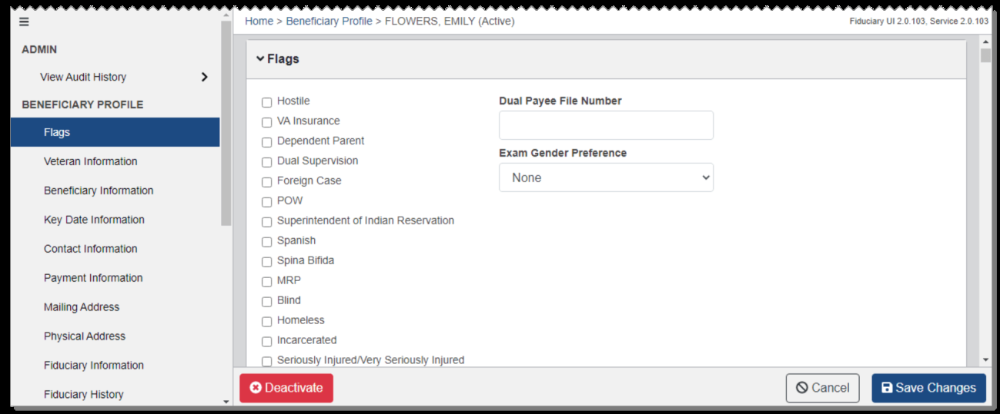
*Screenshot — page 26 (1299×539 px)*

entered before you can save the profile. The View Audit History link, the Establish EP button in the Beneficiary Information section, and the Admin Tasks, Misuse Records, Accounting Audit Tools, and Field Exams sections are shown after the profile is created.

To create a profile for a non-Veteran, non-dependent beneficiary entitled to an insurance benefit payment, select Create Insurance Profile. See Creating Insurance Beneficiary Profiles for more information.

To view or update an existing beneficiary profile, select View.

The Beneficiary Profile page opens to the Flags section at first, and includes the following sections.

#### Flags

This section allows you to select flags for the beneficiary, as well as enter a dual payee file number or select an exam gender preference, if needed. Additional fields are shown if you select the Hostile or Dual Supervision check boxes. For insurance beneficiaries, the VA Insurance flag is automatically checked and cannot be edited.

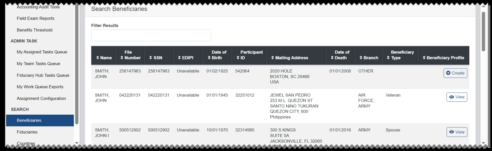
*Screenshot — page 27, figure 1 of 2 (1299×399 px)*

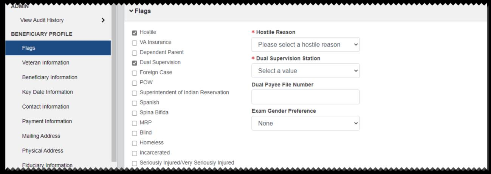
*Screenshot — page 27, figure 2 of 2 (1299×463 px)*

#### Veteran Information

This section shows the Veteran information for the Veteran record associated with the beneficiary.

If the beneficiary does not have any pending FID claims, you can select Edit Veteran

#### Association to change the associated Veteran. From the dialog, choose a Veteran from

the list and select Submit.

#### Beneficiary Information

This section shows the beneficiary information, including a link to their Veteran Profile or Person Profile page. For insurance beneficiaries, the Beneficiary Type is set to Insurance and cannot be changed. You can create an EP for a beneficiary associated with a Veteran record by selecting the Establish EP button. See Establishing EPs for more information.

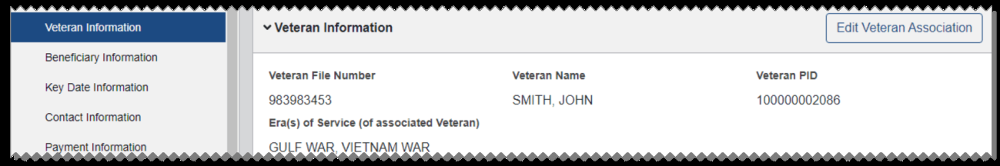
*Screenshot — page 28, figure 1 of 3 (1299×216 px)*

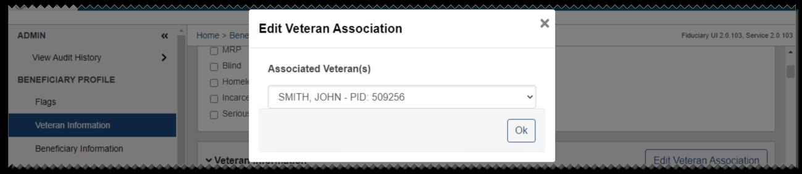
*Screenshot — page 28, figure 2 of 3 (1299×282 px)*

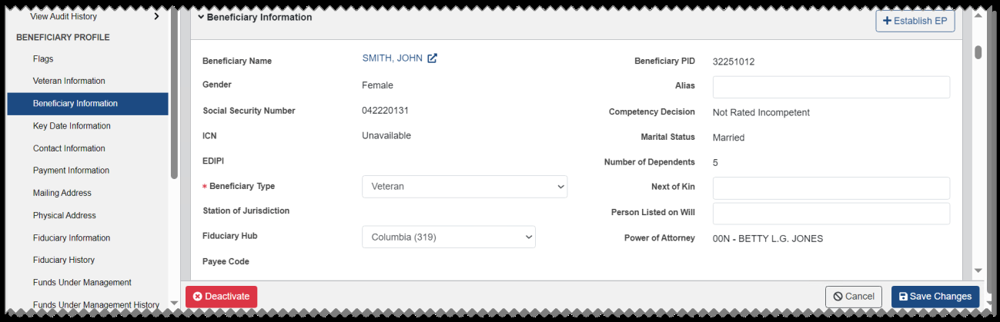
*Screenshot — page 28, figure 3 of 3 (1299×419 px)*

#### Key Date Information

This section shows key dates for the beneficiary. You can enter or change the Date of Incompetency from this section.

#### Contact Information

This section shows contact information for the beneficiary. Some fields may be read-only and populated from the Veteran Profile or Person Profile. You can hover over the lock icon next to these fields to view the reason why they are locked. Users with permissions can edit information in locked fields.

#### Payment Information

This section shows the payment information associated with any awards for the beneficiary.

You can select the link in the Awards Information field to view the beneficiary's current and historical award information in a new browser window. See Award Information for more information.

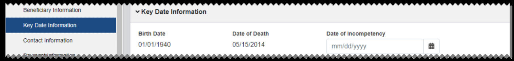
*Screenshot — page 29, figure 1 of 3 (1299×156 px)*

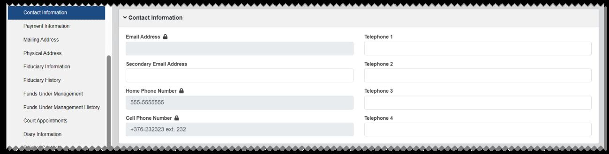
*Screenshot — page 29, figure 2 of 3 (1299×329 px)*

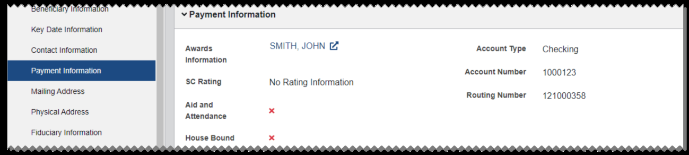
*Screenshot — page 29, figure 3 of 3 (1299×294 px)*

#### Mailing Address

This section shows read-only mailing address information from the Veteran Profile or Person Profile.

For insurance beneficiaries, select Update Mailing Address to add or edit the mailing address.

Enter the required information in the Update Beneficiary Address dialog and select

#### Update.

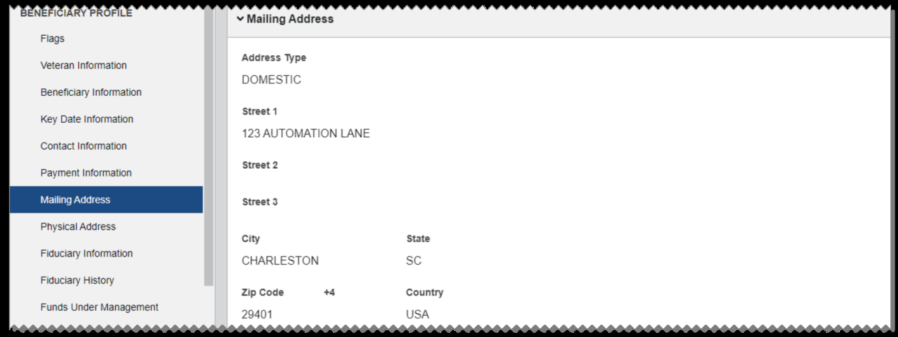
*Screenshot — page 30, figure 1 of 2 (1299×489 px)*

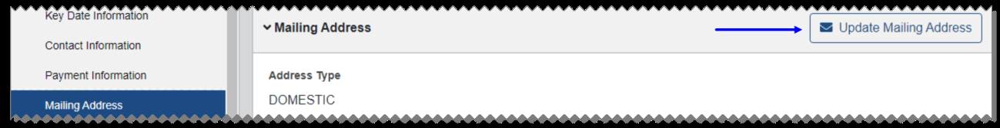
*Screenshot — page 30, figure 2 of 2 (1299×167 px)*

#### Physical Address

This section shows the physical address information. The ZIP code or country in this section is used to determine how work items are routed to Fiduciary Hubs and users. To automatically fill in the same information as the mailing address, select the Same as

#### Mailing Address check box. You can also select the Facility check box to enter facility

information in additional fields.

If the physical address you entered cannot be verified, select Continue from the dialog to use the address as entered, or select Cancel to make changes.

#### Fiduciary Information

This section shows information about the fiduciary associated with the beneficiary, including a link to the fiduciary profile. The fiduciary is shown in Proposed status until a Date Appointed is entered. If any fields have previously entered values that are no longer valid, you will need to correct them before saving changes to the profile.

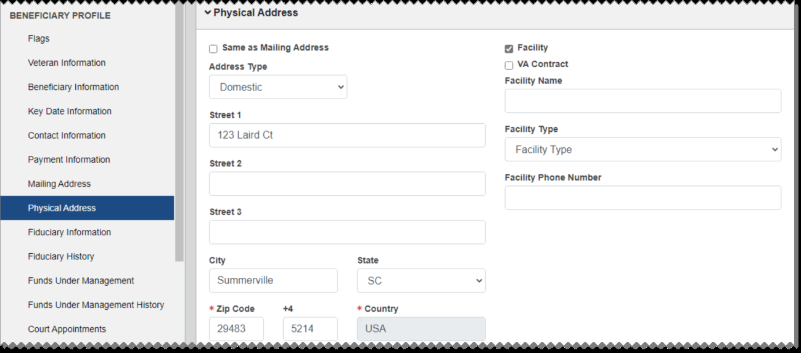
*Screenshot — page 31, figure 1 of 2 (1299×573 px)*

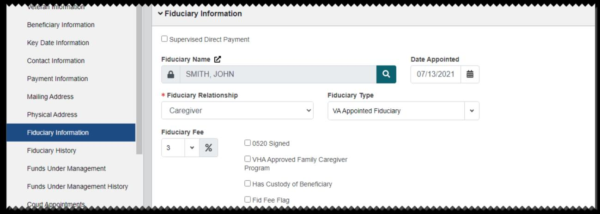
*Screenshot — page 31, figure 2 of 2 (1299×464 px)*

For inactive beneficiaries, a banner indicates that you cannot associate a fiduciary. You must activate the beneficiary first.

For active beneficiaries, you can select the search icon to search for a fiduciary. From the search results, you can choose an active fiduciary and select Accept to associate the fiduciary to the beneficiary.

You can select the Supervised Direct Payment check box to indicate the beneficiary is in the Supervised Direct Payment program. Some fields that do not apply to beneficiaries in Supervised Direct Payment are cleared or disabled.

For insurance beneficiaries, VA Appointed Fiduciary is the only value that can be selected from the Fiduciary Type field. The Fiduciary Fee field cannot be edited. The 0520 Signed and Fid Fee Flag check boxes cannot be selected.

#### Fiduciary History

This section shows the history of fiduciaries appointed to the beneficiary. Records may be manually added or system-generated. Manually added records can be edited and deleted. System-generated records can also be edited.

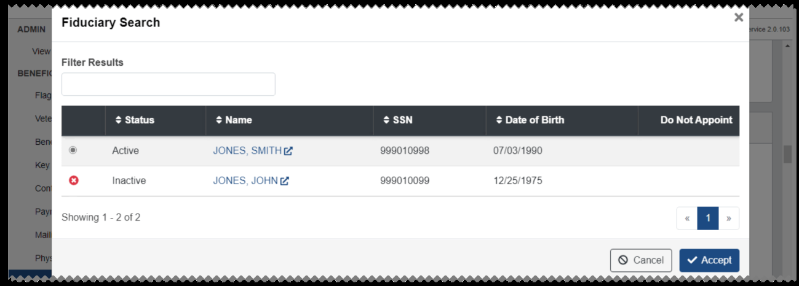
*Screenshot — page 32, figure 1 of 2 (1299×466 px)*

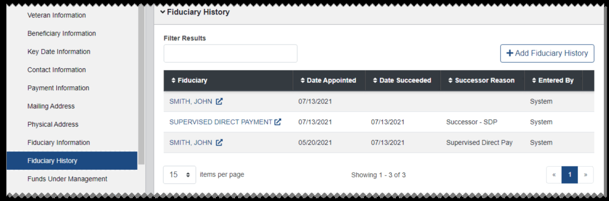
*Screenshot — page 32, figure 2 of 2 (1299×430 px)*

You can manually add a record by selecting Add Fiduciary History. Then from the Fiduciary Search dialog, search for a fiduciary for the new record. From the search results, you can choose an active or inactive fiduciary and select Accept to add the fiduciary to the record.

Then from the Add Fiduciary History dialog, you can enter the Date Appointed and other information, then select OK to create the record. None of the date fields in this section allow future dates.

When Supervised Direct Payment is indicated in the Fiduciary Information section, a new entry is added to Fiduciary History and a Date Succeeded and Successor Reason are entered for the previous fiduciary.

#### Funds Under Management

This section shows the Funds Under Management (FUM) information. If you select the

#### Bond Required check box, additional fields are shown. When an accounting is completed

and approved, the information in this section may be updated based on the accounting information. None of the date fields in this section allow future dates. If any date fields have previously entered future dates, you will need to correct them before saving changes to the profile.

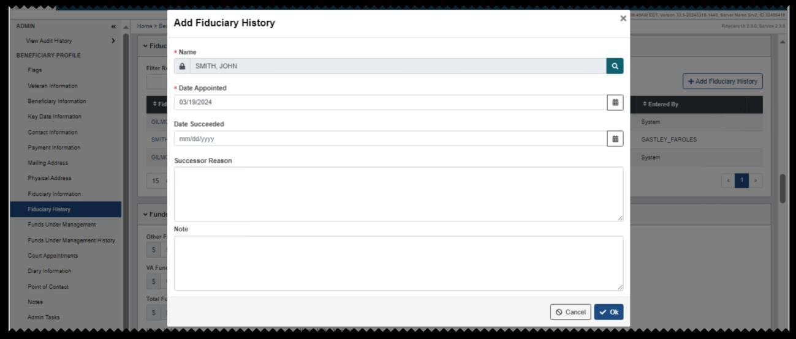
*Screenshot — page 33 (1299×554 px)*

#### Funds Under Management History

This section shows the FUM history information. Records may be manually added or system-generated, and both types may be edited.

You can manually add a record by selecting Add FUM History. From the Add FUM History dialog, you can enter the required FUM history information, then select OK to create the record. None of the date fields in this section allow future dates. If any date fields have previously entered future dates, you will need to correct them before saving changes to the FUM history record.

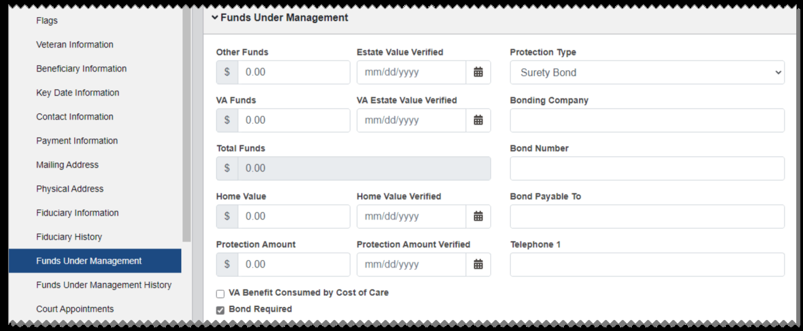
*Screenshot — page 34, figure 1 of 2 (1299×537 px)*

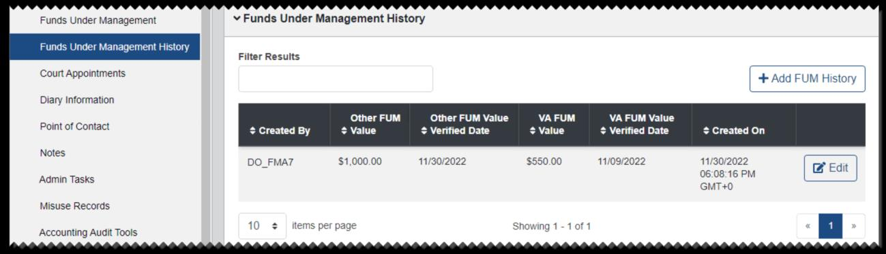
*Screenshot — page 34, figure 2 of 2 (1299×373 px)*

#### Court Appointments

This section shows court appointments for the beneficiary. Records may be manually added or system-generated, and both types may be edited. When a Date Appointed End Date is entered, the record is closed and can no longer be edited.

You can manually add a record by selecting Add Court Appointment. From the Add Court Appointment dialog, enter the court appointment information as needed. You can select the Same as Fiduciary check box to auto-fill the name and address information. If you are manually entering the court appointment information, you can select the Is Court Appointed an Organization check box to show the organization fields.

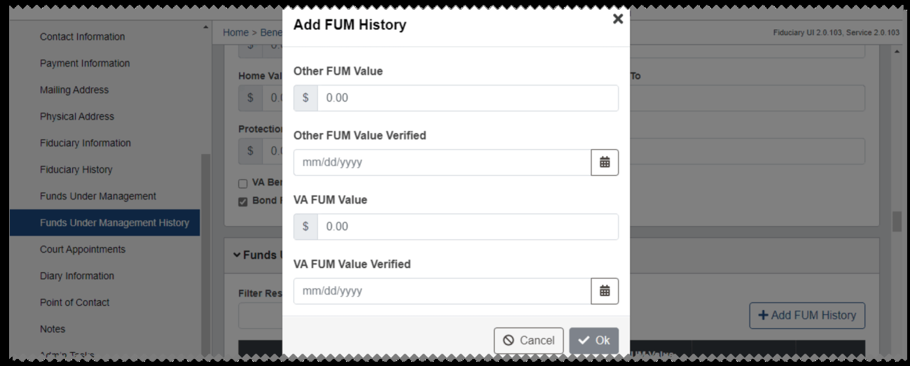
*Screenshot — page 35, figure 1 of 2 (1299×523 px)*

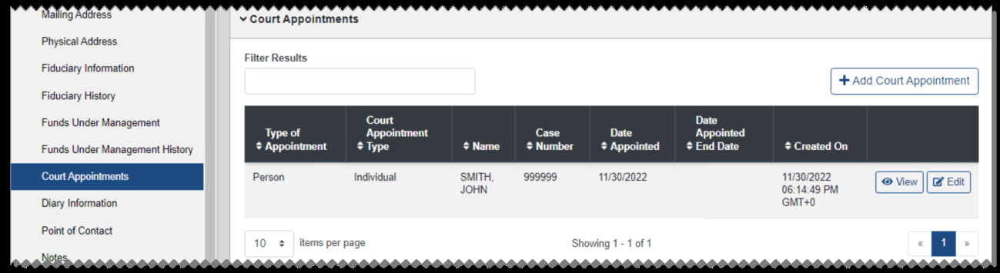
*Screenshot — page 35, figure 2 of 2 (1299×355 px)*

Select OK to create the record.

#### Diary Information

This section shows the diary information for the beneficiary. For active beneficiaries, some selections in this section may trigger other actions, such as automatically generated letters or automatically established claims. See EP Overview for more information on working with Fiduciary Manager EPs and related correspondence. If failures occur during automatic claim establishment or automatic letter upload to eFolder, package creation, or package distribution, an Error Handling admin task is generated after the third failed attempt. See Admin Tasks for more information.

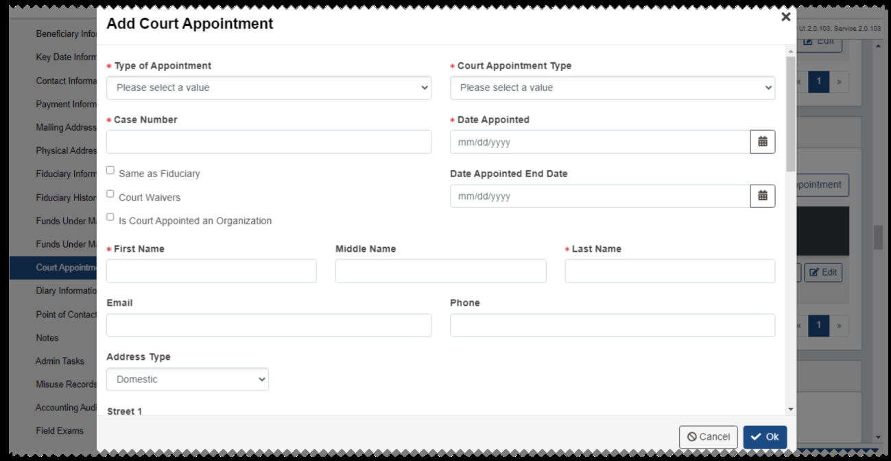
*Screenshot — page 36 (1299×674 px)*

For fields with date restrictions, such as Field Exam Date, if you enter an ineligible date, a warning message is shown to indicate the permissible dates.

#### Exam Type is available for active beneficiaries with a fiduciary. If selected, Annual Letter

Date is also required.

#### Field Exam Date is required for Telephone Contact or Scheduled Follow Up field exams,

and is not available for Written Contact Only field exams.

Field Exam Date automatic actions are as follows:

• On the Telephone Contact Field Exam Date, a 590TFUFE claim is automatically established. This configurable date setting is the original default and may be changed by a system administrator. • 120 days prior to the Scheduled Follow Up Field Exam Date, a 590SFUFE claim is automatically established. This configurable date setting  is the original default and may be changed by a system administrator. • These claims are automatically assigned to a Fiduciary Hub and Field Examiner based on the beneficiary's physical address.

For a Fiduciary Oversight Type of Accounting Court or Accounting Federal, the Accounting Period End Date determines when automatic actions will occur. Accounting Court or Accounting Federal automatic actions are as follows:

• 35 days before the Accounting Period End Date, an Accounting Due or Accounting Call letter is automatically sent to the fiduciary. If the fiduciary is indicated as Spanish Speaking, then a Spanish version of the letter is sent.

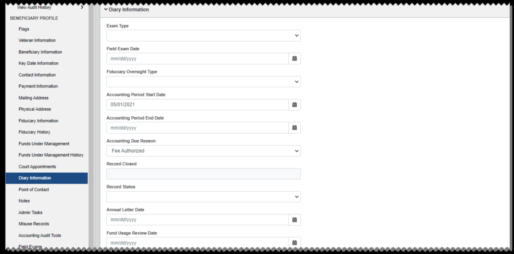
*Screenshot — page 37 (1299×644 px)*

• If you change the Fiduciary Oversight Type less than 35 days before the Accounting Period End Date, a warning message is shown indicating that a different letter may have been sent. • If you enter an Accounting Period End Date within 35 days of the current date and select Save Changes, a warning is shown indicating that the letter will not be automatically sent. You can select Confirm from the dialog and then send the letter manually, or select Go Back to Diary Information to change the date. • On the day after the Accounting Period End Date, a 290AFFID or 290ACFID claim is automatically established and assigned to a Fiduciary Hub and user, if possible, based on the fiduciary's physical address. • If you enter a past date for the Accounting Period End Date, an alert is shown indicating that the claim will not be automatically established.

For a Fiduciary Oversight Type of Fund Usage Review, the Fund Usage Review Date determines when automatic actions will occur. Fund Usage Review automatic actions are as follows:

• 30 days before the Fund Usage Review Date, a Fund Usage Due letter is automatically sent to the fiduciary and a 290FURFID claim is automatically established and assigned to a Fiduciary Hub and user, if possible, based on the fiduciary's physical address. • If you enter a Fund Usage Review Date within 30 days of the current date and select Save Changes, a warning message is shown indicating that the claim will not be established automatically. This configurable date setting is the original default and may be changed by a system administrator. You can select Confirm from the dialog and then send the letter and establish the review manually, or select Go Back to Diary Information to change the date.

#### Annual Letter Date is required when any Exam Type is selected. For actions that

automatically update the Annual Letter Date, the dates below refer to the original default settings and may be changed by a system administrator. Annual Letter Date automatic actions are as follows:

• On the Annual Letter Date, the Annual Written Contact letter is automatically generated, uploaded to the eFolder, and sent via Package Manager. The Receipt Date is the date the letter is generated, and the sent date shown in the letter is the next standard business day. If the beneficiary has a complete physical address that is different from the mailing address, a letter is sent to each address. • When an Error Handling admin task for an Annual Written Contact Letter is completed, the Annual Letter Date is updated to the task completion date plus 1 year. • When a 590IAFE, 590EIAFE, or 590SIAFE claim is authorized, the Annual Letter Date is automatically filled in with the authorization date plus 1 year.

For Minor or Insurance beneficiaries, the Age of Majority field is required. The Age of

#### Majority Date is populated based on your selection and the beneficiary's date of birth.

#### Record Closed is disabled for active beneficiaries, and Record Status can be edited.

When a beneficiary is deactivated, the Record Closed date and Closed Reason will be entered, along with Closed Reason Other text, if applicable. See Activating and Deactivating Beneficiary Profiles for more information.

#### Point of Contact

From this section you can view, add, or edit Point of Contact (POC) information for the beneficiary. To filter the list, enter a term in the Filter Results box.

To add a new POC, select Add Point of Contact.

From the Beneficiary Point of Contact dialog, enter the required information and any additional information, as needed. If you select Other for Relationship, you must enter a description. Select Ok.

To View or Edit POC information, select View/Edit in the row for the POC. From the dialog, view or edit information as needed and select Ok.

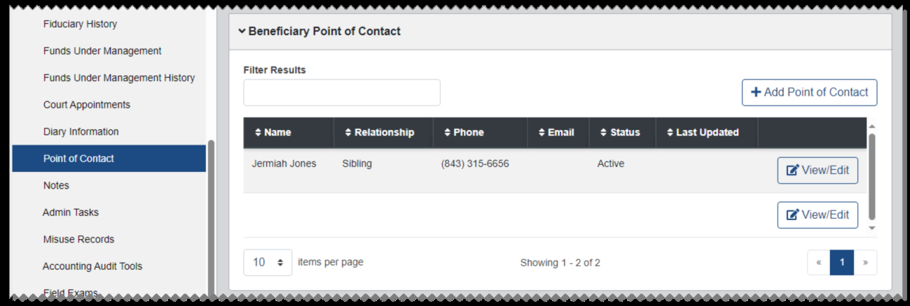
*Screenshot — page 39, figure 1 of 2 (1299×438 px)*

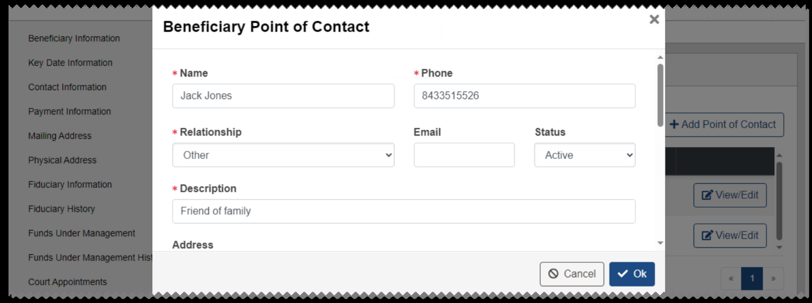
*Screenshot — page 39, figure 2 of 2 (1428×534 px)*

#### Notes

This section lists notes associated with the beneficiary or a claim.

For notes entered on the EP Overview page, the claim ID is shown in the Claim Number column. See Notes for more information.

The user who created the note can edit it by selecting Edit.

To add a new note, select Add Note. Then from the Add Note dialog, enter the note text and select OK.

#### Admin Tasks

This section lists admin tasks associated with the beneficiary. You can create a new admin task by selecting Create Admin Task. The user assigned to a task can edit it by selecting Edit. Admin tasks are also shown in My Assigned Tasks Queue and Fiduciary Hub Tasks Queue of the assigned user and fiduciary hub. See Admin Tasks for more information.

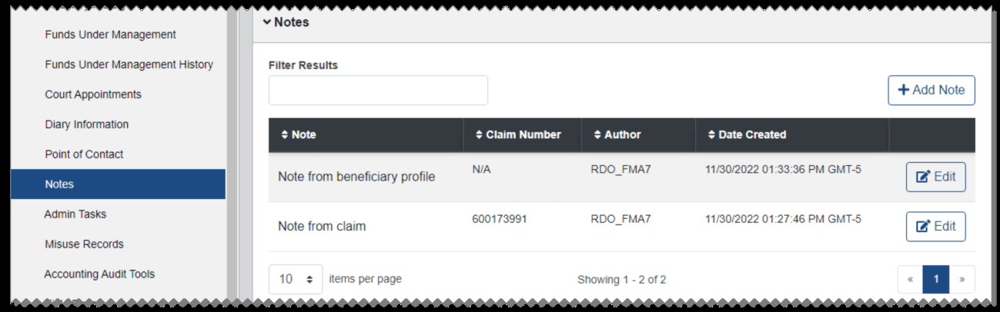
*Screenshot — page 40, figure 1 of 2 (1299×406 px)*

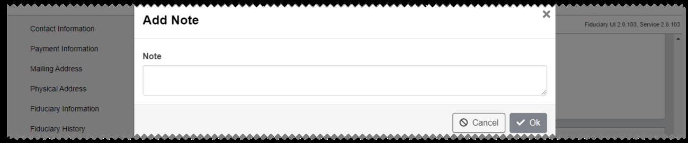
*Screenshot — page 40, figure 2 of 2 (1299×271 px)*

#### Misuse Records

This section lists misuse records for the beneficiary, including the associated fiduciary and the date of allegation. To open the Misuse Records page, select View Record. See Misuse Records for more information.

#### Accounting Audit Tools

This section lists accounting audit tools associated with the beneficiary. To open the Accounting Audit Tools page, select View. See Accounting Audit Tools for more information.

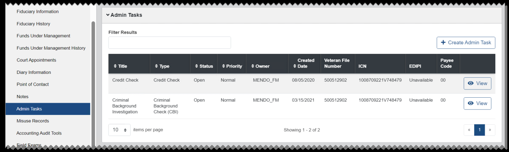
*Screenshot — page 41, figure 1 of 3 (1299×389 px)*

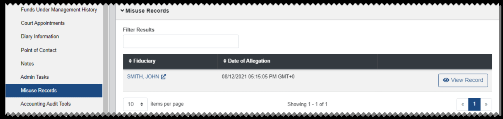
*Screenshot — page 41, figure 2 of 3 (1299×310 px)*

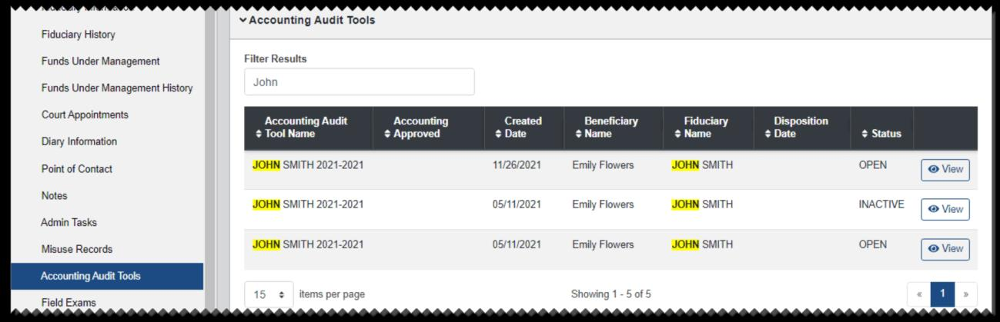
*Screenshot — page 41, figure 3 of 3 (1299×419 px)*

#### Field Exams

This section lists field exam reports associated with the beneficiary. To open the Field Exams page select View. See Field Exams for more information.

#### Claims

This section lists claims associated with the beneficiary. To view closed or cancelled claims, select the Include Inactive check box.

To view a claim, select the link in the Claim ID column. For Fiduciary Manager EPs, the EP Overview page opens. See EP Overview for more information.

For all other EPs, the Claim Details page opens. See Navigating Claims for more information.

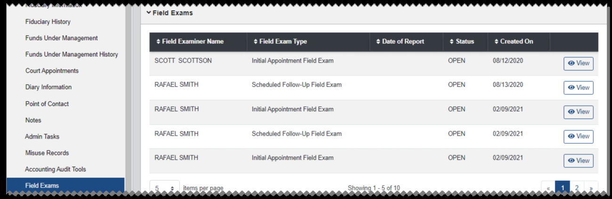
*Screenshot — page 42, figure 1 of 2 (1299×424 px)*

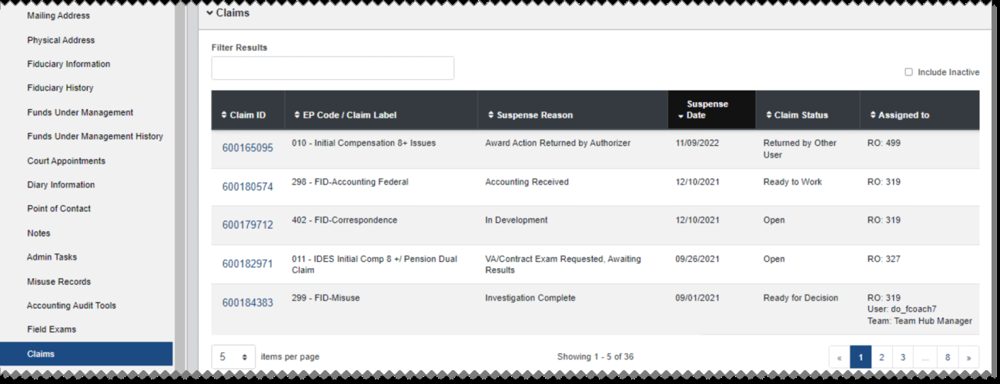
*Screenshot — page 42, figure 2 of 2 (1299×500 px)*

### Creating Insurance Beneficiary Profiles

To create a profile for a non-Veteran, non-dependent beneficiary entitled to an insurance benefit payment, select Create Insurance Profile from the beneficiary search results.

From the Confirm Beneficiary dialog, select Proceed to confirm that the participant requires fiduciary oversight for non-dependent insurance beneficiaries.

From the Veteran Search dialog, enter a file number, first and last name, or Social Security Number, and select Search to search for the Veteran record that should be associated to the beneficiary.

From the Select Veteran dialog, choose a Veteran from the list and choose Select to proceed.

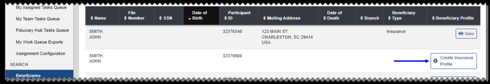
*Screenshot — page 43, figure 1 of 3 (1299×225 px)*

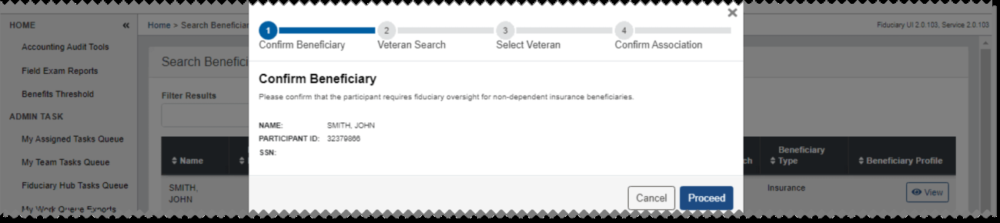
*Screenshot — page 43, figure 2 of 3 (1299×290 px)*

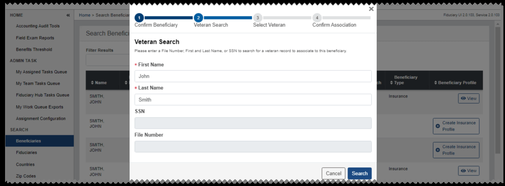
*Screenshot — page 43, figure 3 of 3 (1299×480 px)*

Select Finish from the Confirm Veteran Association dialog to confirm that the selected Veteran should be associated to the beneficiary profile.

### Activating and Deactivating Beneficiary Profiles

Active/inactive status is shown in parentheses next to the beneficiary name on the Beneficiary Profile page. Inactive beneficiaries can be edited, but they cannot be associated with a fiduciary.

To activate a beneficiary, select Activate from the button bar. Then select Yes from the dialog to confirm.

The beneficiary's status changes to active, and the Diary Information Record Closed date is cleared and disabled. Closed Reason and Closed Reason Other, if applicable, will also be cleared and hidden.

To deactivate a beneficiary, select Deactivate from the button bar.

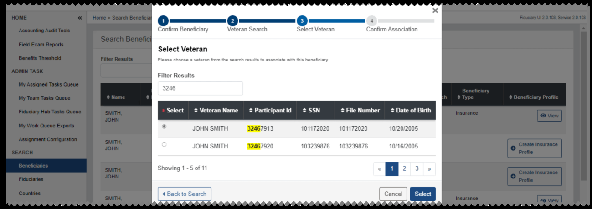
*Screenshot — page 44, figure 1 of 3 (1299×459 px)*

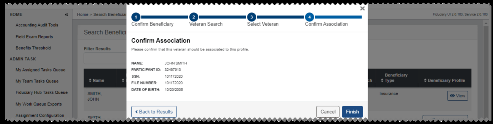
*Screenshot — page 44, figure 2 of 3 (1299×329 px)*

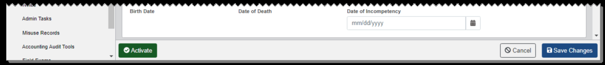
*Screenshot — page 44, figure 3 of 3 (1298×141 px)*

From the Deactivate Beneficiary Dialog, a message is shown if fiduciary claims or admin tasks are pending. Enter a Record Closed date and Closed Reason. If you select Other, enter an explanation for Closed Reason Other. Then select Save Changes.

These fields are added to Diary Information and the beneficiary's status changes to inactive. If a fiduciary was associated with the beneficiary, the fiduciary is removed and a Fiduciary History entry is added. The Fiduciary Information section will include a banner indicating you cannot associate a fiduciary with an inactive beneficiary.

When you deactivate a beneficiary, all other Diary Information fields are cleared and disabled except for Accounting Period Start Date and Accounting Due Reason. If the beneficiary is activated again, the cleared fields will remain empty until they are manually updated or an action such as closing an EP updates them.

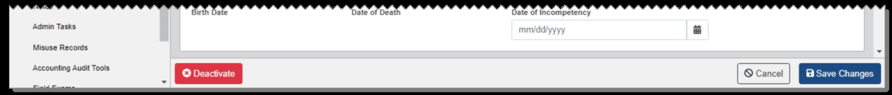
*Screenshot — page 45, figure 1 of 2 (1299×139 px)*

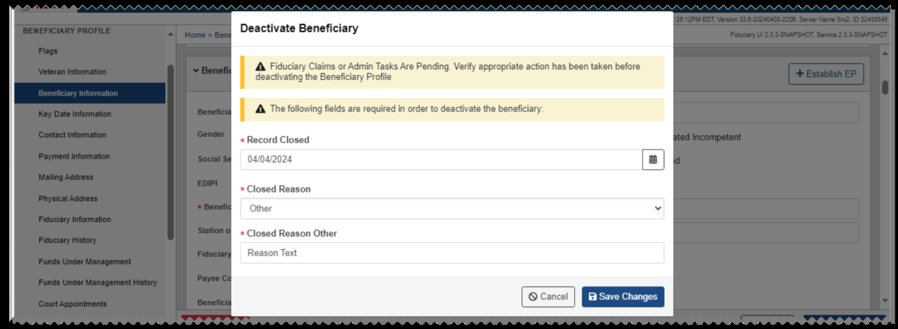
*Screenshot — page 45, figure 2 of 2 (1299×477 px)*

For inactive beneficiaries, you can edit the Record Closed date, Closed Reason, and

#### Closed Reason Other text as needed.

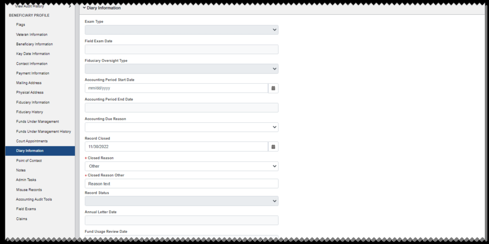
*Screenshot — page 46 (1299×649 px)*

---

*[← Back to README](./README.md)*