# Fiduciary Profile

From Fiduciary Search results, when you select View Profile or Create Fiduciary, the Fiduciary Profile page opens. From this page you can manage the fiduciary profile information, activate or deactivate a fiduciary, and merge fiduciary records.

The navigation bar above the main area of the page includes the fiduciary name and active or inactive status, along with breadcrumb links to the home page. Inactive profiles can be edited, but they must be activated before being associated with a beneficiary.

The left pane includes links to each section of the profile, with the current section name highlighted as you scroll up or down. To view the history of changes to the fiduciary profile, select View Audit History in the Admin section of the left pane. See Audit History for more details.

The button bar at the bottom of the page includes Cancel and Save Changes buttons, and depending on fiduciary status and association to beneficiaries it may include an Activate or Deactivate button and a Merge Fiduciaries button.

### Creating and Updating Fiduciary Profiles

When creating a fiduciary profile for a person or organization, a minimal set of information, including a Physical Address with ZIP Code, must be entered before you can save the profile. The Fiduciary Information required fields may vary based on the Fiduciary Type selection. If you select the check box next to No SSN, you must select a reason.

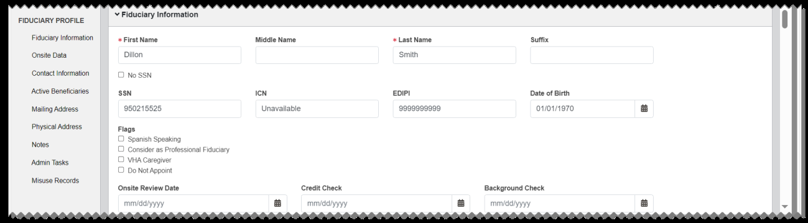
*Screenshot — page 47, figure 1 of 2 (1299×359 px)*

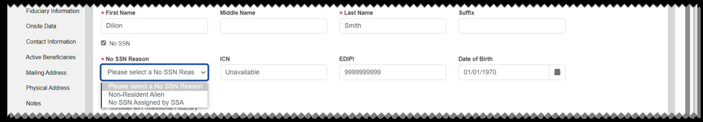
*Screenshot — page 47, figure 2 of 2 (1299×227 px)*

The other profile sections are the same for a person or organization fiduciary. The Admin Tasks and Misuse Records sections are shown after the profile is created. The Fiduciary Profile page opens to the Fiduciary Information section at first, and includes the following sections.

#### Fiduciary Information

This section shows the basic information about the fiduciary. If there is any misuse record associated to the fiduciary where misuse was found, Do Not Appoint is automatically selected in the Flags section, and Misuse Found is shown in the Do Not Appoint Reason free text field.

#### Point of Contact

From this section, you can view, add, or edit point of contact (POC) information for fiduciary organizations. To filter the list, enter a term in the Filter Results box.

To add a new POC, select Add Point of Contact.

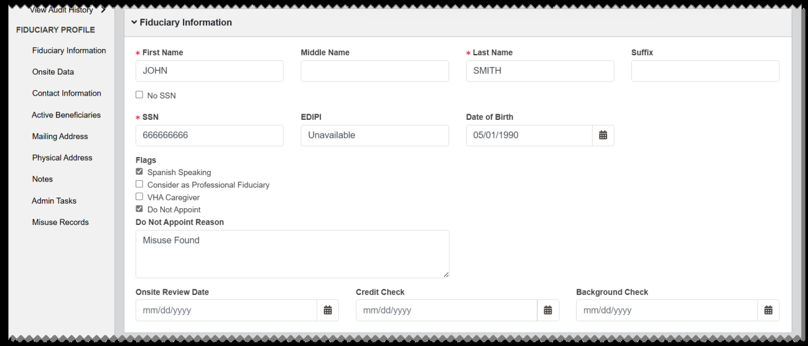
*Screenshot — page 48, figure 1 of 2 (1299×557 px)*

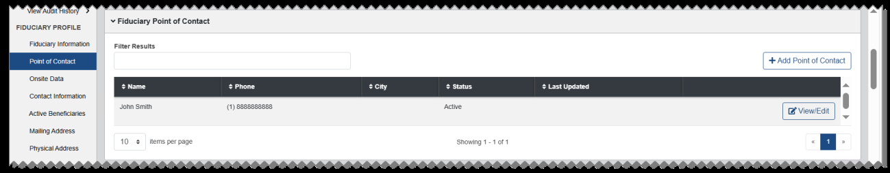
*Screenshot — page 48, figure 2 of 2 (1299×254 px)*

From the Fiduciary Point of Contact dialog, enter the required information and any additional information, as needed. Select Ok.

To View or Edit POC information, select View/Edit in the row for the POC. From the dialog, view or edit information as needed and select Ok.

#### Onsite Data

This section lists the number of beneficiaries associated with the fiduciary, along with Last Onsite Date and Next Onsite Date information.

#### Contact Information

This section shows additional contact information for the fiduciary.

#### Active Beneficiaries

This section lists active beneficiaries for the fiduciary, and includes a link to each beneficiary profile. From the Beneficiary Profile, you can associate a fiduciary to the beneficiary in the Fiduciary Information section.

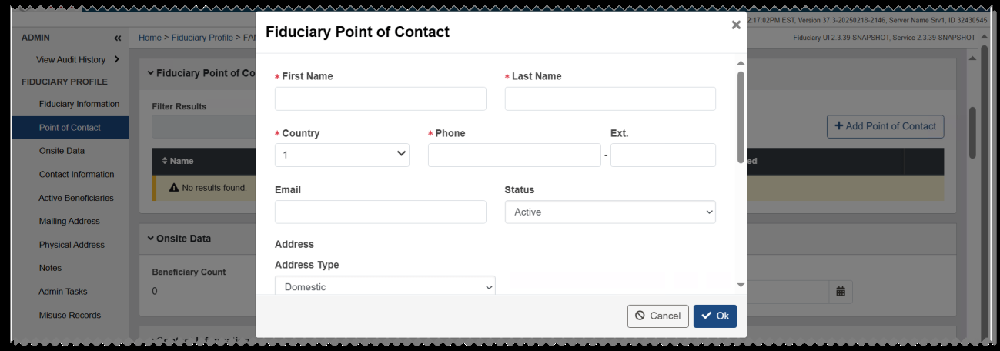
*Screenshot — page 49, figure 1 of 3 (1299×456 px)*

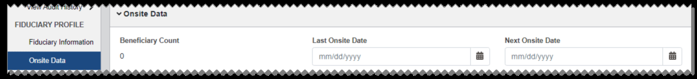
*Screenshot — page 49, figure 2 of 3 (1299×149 px)*

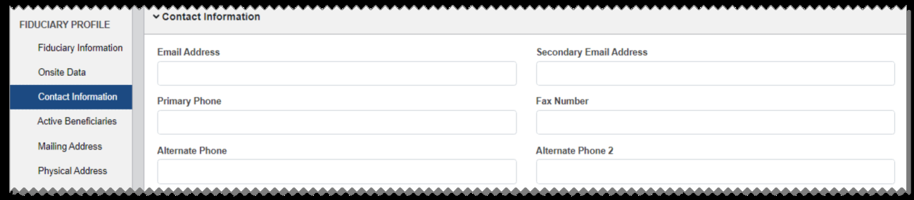
*Screenshot — page 49, figure 3 of 3 (1299×285 px)*

#### Mailing Address

This section shows the mailing address information.

#### Physical Address

This section shows the physical address information. The ZIP code or country in this section is used to determine how work items are routed to Fiduciary Hubs and users. To automatically fill in these fields with the mailing address information, select the Same as

#### Mailing Address check box.

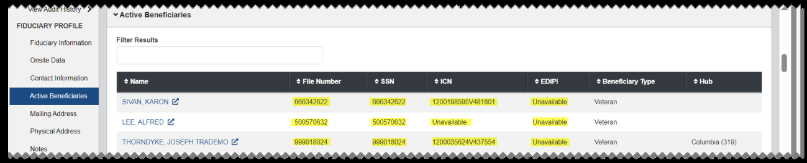
*Screenshot — page 50, figure 1 of 3 (1299×264 px)*

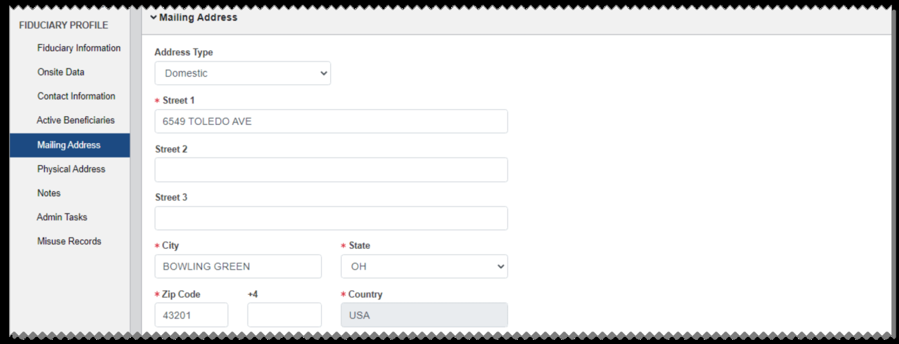
*Screenshot — page 50, figure 2 of 3 (1299×498 px)*

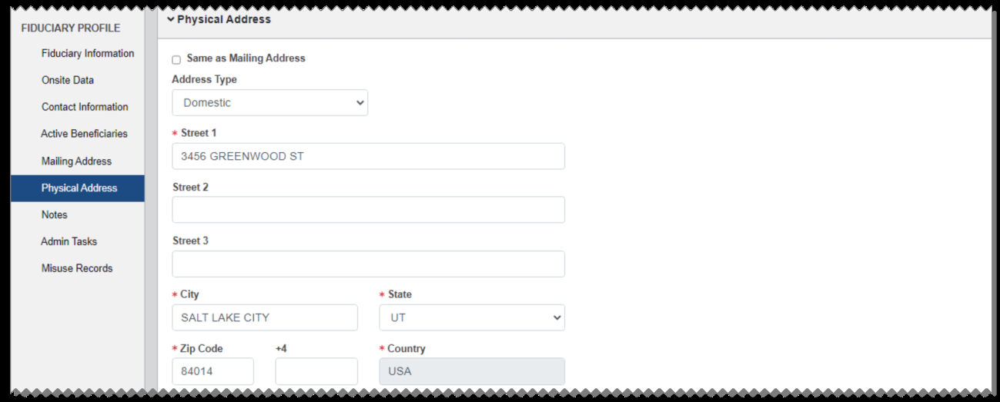
*Screenshot — page 50, figure 3 of 3 (1299×523 px)*

#### Notes

This section lists notes associated with the fiduciary. You can add a new note by selecting

#### Add Note. The user who created the note can edit it by selecting Edit.

#### Admin Tasks

This section lists admin tasks associated with the fiduciary. You can create a new admin task by selecting Create Admin Task. The user assigned to a task can edit it by selecting

#### Edit. Admin tasks are also shown in My Assigned Tasks Queue and Fiduciary Hub Tasks

Queue of the assigned user and fiduciary hub.

See Admin Tasks for more information.

#### Misuse Records

This section lists misuse records for the fiduciary, including the associated beneficiary and the date of allegation. You can select View Record to open the Misuse Records page for the record.

See Misuse Records for more information.

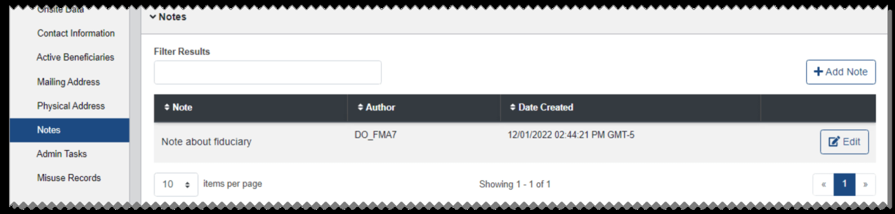
*Screenshot — page 51, figure 1 of 3 (1299×311 px)*

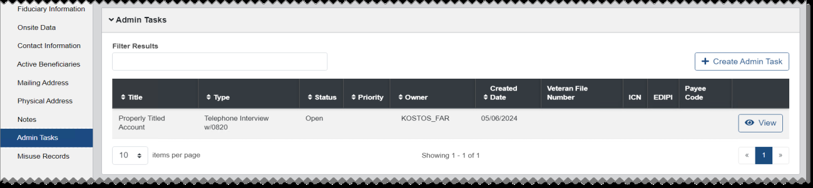
*Screenshot — page 51, figure 2 of 3 (1299×301 px)*

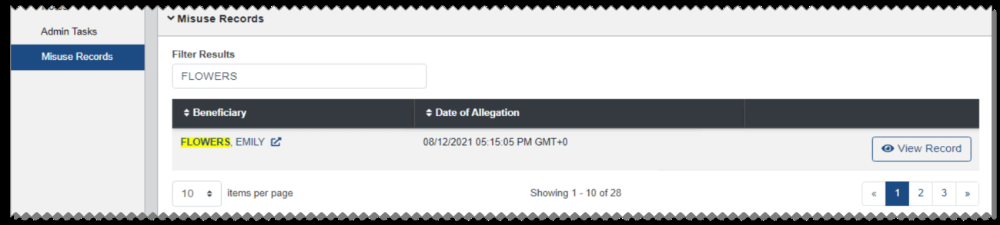
*Screenshot — page 51, figure 3 of 3 (1299×293 px)*

### Activating and Deactivating Fiduciary Profiles

Active/inactive status is shown in parentheses next to the fiduciary name on the Fiduciary Profile page. It is also shown in fiduciary search results. Inactive fiduciaries can be edited, but they cannot be associated with a beneficiary.

To activate a fiduciary, select Activate from the button bar. The fiduciary's status changes to active.

To deactivate a fiduciary with no active beneficiaries, select Deactivate from the button bar. If a fiduciary has active beneficiaries, this button is not shown. The fiduciary's status changes to inactive.

### Merging Fiduciary Profiles

To merge active fiduciaries, start with the Fiduciary Profile that will be used as the primary profile. After merging, the beneficiaries and work items of all selected active fiduciaries will be assigned to the primary fiduciary. The merged secondary fiduciaries will be deactivated.

1. From the button bar at the bottom of the Fiduciary Profile page for the primary fiduciary, select Merge Fiduciaries.

*Screenshot — page 52, figure 1 of 2 (1299×181 px)*

*Screenshot — page 52, figure 2 of 2 (1299×177 px)*

2. From the Fiduciary Merge Overview dialog, select Add Fiduciary.

3. From the Fiduciary Search dialog, search for one or more fiduciaries to merge into the primary fiduciary record. Only active fiduciaries will be shown in the search results. 4. From the search results, select the check box for each active fiduciary that you want to merge into the primary fiduciary record, then select Add Fiduciaries.

5. From the Fiduciary Merge Overview dialog, select Continue.

6. From the warning banner, select Confirm. The selected fiduciaries are merged into the primary fiduciary profile.

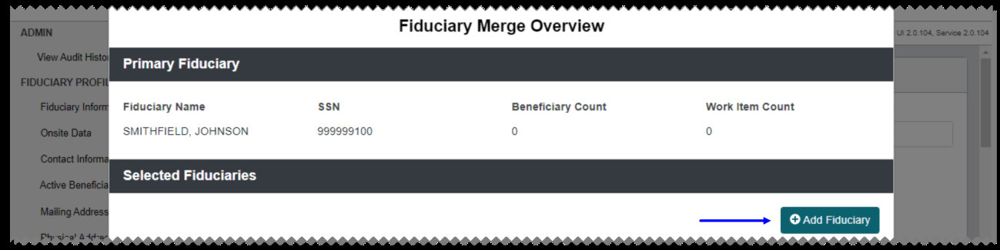
*Screenshot — page 53, figure 1 of 4 (1299×326 px)*

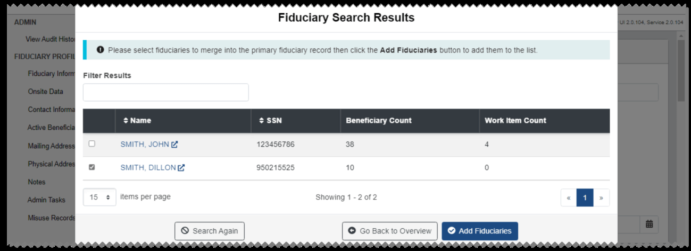
*Screenshot — page 53, figure 2 of 4 (1299×474 px)*

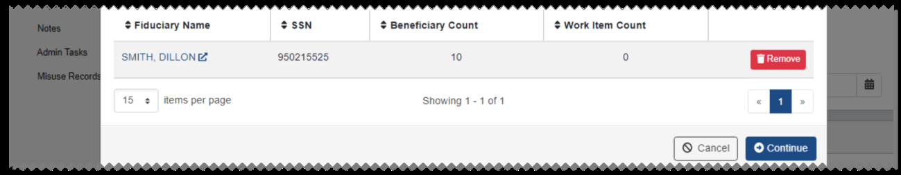
*Screenshot — page 53, figure 3 of 4 (1299×254 px)*

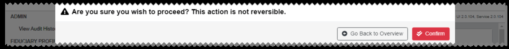
*Screenshot — page 53, figure 4 of 4 (1299×128 px)*

---

*[← Back to README](./README.md)*