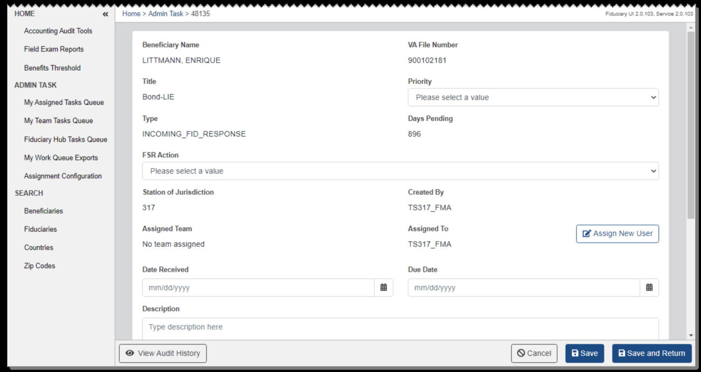
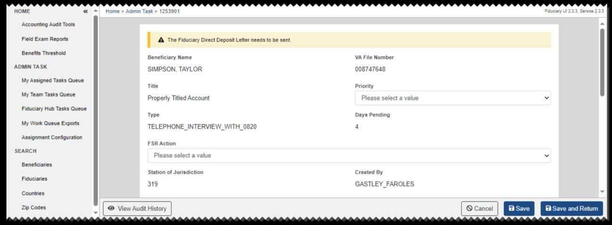
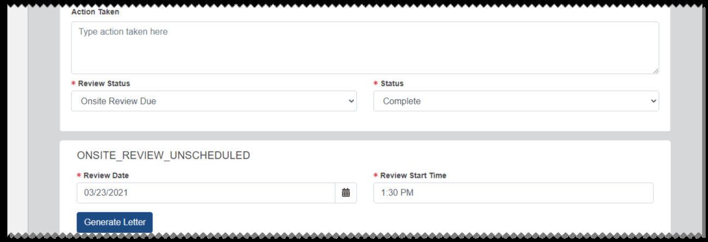
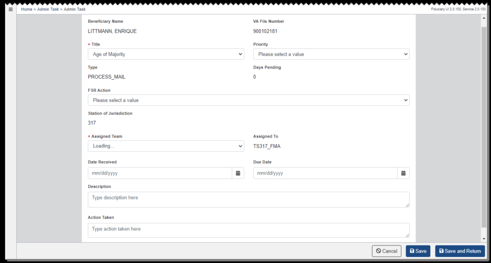

# Admin Tasks

From the Admin Task page, you can create and edit admin tasks. To access this page for a task assigned to you, select Edit from the Admin Tasks section of a beneficiary profile or fiduciary profile. To access an admin task assigned to you or to another user, select the link for the task from My Assigned Tasks Queue, My Team Tasks Queue, or Fiduciary Hub Tasks Queue.

For a Properly Titled Account admin task that is assigned to you, a message is shown if a Fiduciary Direct Deposit letter needs to be sent.

To reassign the task, users with permissions can select Assign New User and choose a different Fiduciary Hub, team, and user.

*Screenshot — page 54, figure 1 of 2 (1299×690 px)*

*Screenshot — page 54, figure 2 of 2 (1299×480 px)*

To update the task and continue editing, select Save, or select Save and Return to update the task and return to the previous page.

To view the history of changes to the admin task, select View Audit History. See Audit History for more details.

Corporate Action admin tasks may be automatically generated and assigned to a Field Exam Coach based on the beneficiary's physical address after certain changes to the corporate record of a beneficiary. Some fields are read-only for this type of task. You can select an FSR action, reassign the task, enter an action taken, and update the status.

Onsite Review Unscheduled and Onsite Review Periodic can be manually created from the Admin Tasks section of a fiduciary profile. Only the user who created an onsite review unscheduled or periodic task can reassign it.

Depending on a fiduciary's Onsite Data information, an Onsite Review Periodic admin task may also be automatically generated and assigned to a Field Exam Coach based on the fiduciary's physical address. The due date is set to 30 days at first. Onsite Review Periodic tasks support triennial reviews of Fiduciaries who reside in the United States, serve 20 or more beneficiaries, and manage recurring VA Benefits exceeding the threshold established in 38 U.S.C. 5508 and 5312.

Onsite Review Unscheduled and Onsite Review Periodic tasks include a Review Status field and an additional section to generate and download an onsite review letter.

For Review Status, Onsite Review Due is selected at first, and the corresponding initial

#### Status is Open. If you select any other review status option, the status is updated to In

Progress. For any review status, you can update the status to Canceled or Complete. If you change the review status selection, the status is updated accordingly as well.

*Screenshot — page 55 (1299×446 px)*

To generate an onsite review letter, enter a review date and start time, then select

#### Generate Letter. From the dialog, select Download. This allows you to save the letter

and distribute it manually.

If failures occur during automatic claim establishment or automatic letter upload to eFolder, package creation, or package distribution, an Error Handling admin task is generated after the third failed attempt. The task will indicate the type of failure and the corrective action that needs to be taken. Upon generation, the tasks are assigned as follows:

•

#### Station of Jurisdiction for beneficiary's mailing address: upload, package, or

send failure for Annual Written Contact letter. • When the admin task is completed, the Annual Letter Date in the Diary Information section of the Beneficiary Profile is updated to the task completion date plus 1 year. This configurable date setting is the original default and may be changed by a system administrator. •

#### Station of Jurisdiction for fiduciary's mailing address: upload, package, or send

failure for Federal Accounting Due letter, Accounting Call Letter (Federal) - Spanish, Court Accounting Due letter, Accounting Call Letter (Court) - Spanish, or Fund Usage Due letter. •

#### User attempting to send the letter: upload, package, or send failure for Locate

Beneficiary letter or Locate Fiduciary Mailing Address Update letter. •

#### Station of Jurisdiction for beneficiary's physical address: automatic claim

establishment failure for 590IAFE, 590TFUFE, or 590SFUFE. •

#### Station of Jurisdiction for fiduciary's physical address: automatic claim

establishment failure for 290FURFID, 290AFFID, or 290ACFID.

### Creating and Editing Admin Tasks

1. From the Admin Tasks section of a beneficiary profile or fiduciary profile, select

#### Create Admin Task.

2. From the Admin Task page, enter the required information for the task.

3. Your Fiduciary Hub will be shown as the Station of Jurisdiction at first, and the task will be assigned to you and your team. If you belong to multiple teams, select a team from the Assigned Team list. 4. Select Save to create the task and continue editing, or select Save and Return to create the task and return to the previous page. 5. The task is added to the admin task work queues for the selected Station of Jurisdiction. After the task is created, you can edit the Status field.

6. To reassign the task, users with permissions can select Assign New User and

choose a different Fiduciary Hub, team, and user. Manually created onsite review unscheduled or periodic tasks can only be reassigned by the user who created the task.

*Screenshot — page 57, figure 1 of 2 (1299×697 px)*

*Screenshot — page 57, figure 2 of 2 (1299×232 px)*

---

*[← Back to README](./README.md)*