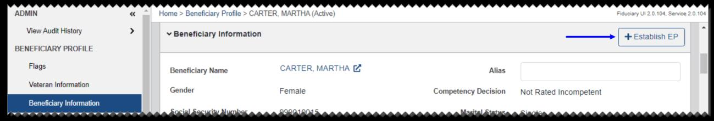
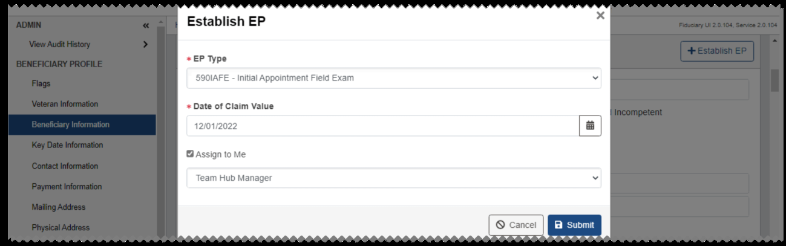
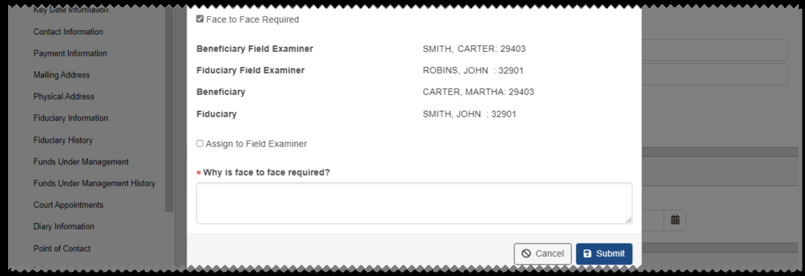
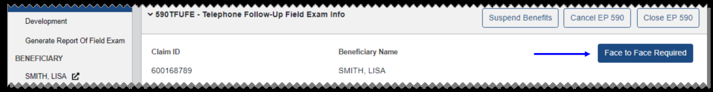
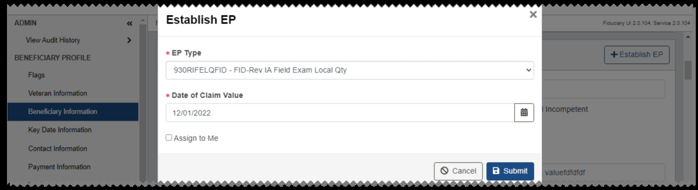
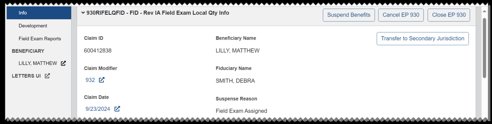
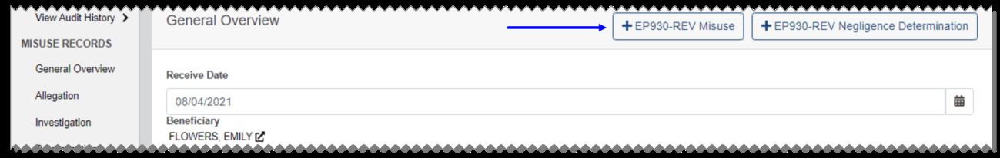

# Establishing EPs

The following types of EPs can be established from Fiduciary Manager:

• 590IAFE - Initial Appointment Field Exam • 590SFUFE - Scheduled Follow-Up Field Exam • 590UFUFE - Unscheduled Follow-Up Field Exam • 590FUFE - Fund Usage Field Exam • 590SIAFE - Successor Initial Appointment Field Exam • 590NFPFE - Non-Fiduciary Program Field Exam • 590EIAFE - Expedited Initial Appointment Field Exam • 590TFUFE - Telephone Follow-Up Field Exam • 400CFID - FID-Correspondence • 290MFID - FID-Misuse • 290FURFID - FID-Fund Usage Review • 290AFFID - FID-Accounting Federal • 290ACFID - FID-Accounting Court

Additionally, 290NDFID - FID-Negligence Determination claims can be established from the EP Overview page for a 290MFID - FID-Misuse claim or from the associated misuse record.

You can also establish EP930 FID-Rev Claims to make corrections related to claims that have been closed or cancelled and can no longer be edited. See Establishing EP930 FID- Rev Claims for more information.

For beneficiaries associated with a Veteran record, you can establish EPs from the Beneficiary Information tab of the beneficiary profile. If you are creating a new beneficiary profile, you must save it before the Establish EP button will be shown.

All 290 or 590 EPs that are manually established from Fiduciary Manager, except for Negligence Determination claims, will be assigned to the station associated with the user establishing the claim. In most cases, users with permissions can select Assign to Me and choose their team from the list. If the claim is not self-assigned, the claim is not assigned to a team or user. After the claim is established, local routing rules are used to manage the movement of work.

For some EP types, the Face to Face Required option is also available during claim establishment or from the EP Overview page for established claims. See Face to Face Required for more information.

1. From the Fiduciary Manager home page, search for a beneficiary record. 2. From the beneficiary search results, select the View button for the beneficiary. You can also create a new beneficiary profile and save it. 3. From the Beneficiary Information tab of the beneficiary profile, select Establish

#### EP.

4. From the Establish EP dialog, select an EP Type.

5. Enter the Date of Claim. Other required fields may vary based on the EP type. 6. If available based on the EP type, select the Face to Face Required check box if needed. You cannot select both Assign to Me and Face to Face Required at the same time. 7. If needed, select the Assign to Me check box to self-assign the claim. You can also choose your team from the list. 8. Select Submit. A success message is shown, indicating the Claim ID of the new EP.

### Face to Face Required

For some EP types including 590UFUFE, 590FUFE, 590NFPFE, 590TFUFE, and 590SIAFE you can select Face to Face Required, view the Field Examiner information, and choose whether to assign the claim to the Field Examiner upon establishment. A Face to Face Required button is also available from the EP Overview page.

When Face to Face Required is indicated, a claim note is added to the Notes section of the EP Overview page and the Beneficiary Profile. The note will include the reason face-to- face interaction is required.

*Screenshot — page 59, figure 1 of 3 (1299×222 px)*

*Screenshot — page 59, figure 2 of 3 (1299×407 px)*

*Screenshot — page 59, figure 3 of 3 (1299×194 px)*

#### Selecting Face to Face Required from EP Establishment

From the Establish EP dialog, select the Face to Face Required check box. If you select this, you cannot also select the Assign to Me check box.

Review the Field Examiner information and select the Assign to Field Examiner check box if needed. Face to Face Required claims will be assigned to user, team, and station based on ZIP Code / Country routing rules.

#### Selecting Face to Face Required from the EP Overview Page

From the Info section of the EP Overview page, select Face to Face Required.

From the Face to Face Required dialog, review the Field Examiner information and select the Assign to Field Examiner check box if needed. Face to Face Required claims will be assigned to user, team, and station based on ZIP Code / Country routing rules. Enter the reason that face-to-face interaction is required, and select Save.

### Establishing EP930 FID-Rev Claims

From the Beneficiary Information tab of the beneficiary profile, you can select Establish

#### EP to establish an EP930 FID-Rev version of an EP290 or EP590 claim. EP930 FID-Rev

claims are used to make corrections related to EP290 or EP590 claims that have been closed or cancelled and can no longer be edited.

You can establish multiple EP930 claims of any type. Before you can establish an EP930 misuse or negligence determination claim, the previous EP290 misuse or negligence determination claim must be closed or canceled.

*Screenshot — page 60, figure 1 of 2 (1299×446 px)*

*Screenshot — page 60, figure 2 of 2 (1299×170 px)*

You can select the Assign to Me check box to assign the claim to yourself, and choose a team from the list. If this check box is not selected, in most cases the claim will be routed in the same way as its corresponding EP290 or EP590.

EP930 FID-Rev Negligence Determination claims are assigned to Station 101-FID. Users assigned to Station 101-FID with the Pen and Fid VACO Staff user role can assign the claim to themselves and choose a team from the list.

You can also establish an EP930 misuse or negligence determination claim from the Misuse Record for a closed or cancelled EP290 FID Misuse claim. Select +EP930-REV

#### Misuse or +EP930-REV Negligence Determination, depending on the type of EP930

claim you want to establish.

Once an EP930 claim is established, it is processed in the same way as its corresponding EP290 or EP590.

*Screenshot — page 61, figure 1 of 3 (1299×354 px)*

*Screenshot — page 61, figure 2 of 3 (1299×329 px)*

*Screenshot — page 61, figure 3 of 3 (1299×206 px)*

---

*[← Back to README](./README.md)*