# EP Overview

After Fiduciary Manager EPs are established, you can process them from the EP Overview page. This page is divided into sections including Info and Notes. Other sections may vary based on the EP and claim label.

For all EP types, the left pane includes a link to the beneficiary profile and the Letters UI. See Establishing EPs for more information on Fiduciary Manager EP types. See Creating Letters in the Letters UI for more information on viewing and generating letters.

EP930 FID-Rev claims are used to make corrections related to EP290 or EP590 claims that have been closed or cancelled and can no longer be edited. Once an EP930 claim is established, it is processed in the same way as its corresponding EP590 or EP290. See Establishing EP930 FID-Rev Claims for more information.

When a First Notice of Death (FNOD) is processed for a beneficiary, all EPs are closed except for EP290s and their corresponding EP930s. If the Veteran has a Potential Attorney Fee flash or a Private Attorney - Fees Payable flash, any non-rating EPs with a status of Ready to Work or Rating Decision Complete will also remain open. No claims will be automatically established for the beneficiary after the FNOD is processed.

### Info

This section shows the EP and claim label, along with basic claim information that may include the claim ID, claim modifier, claim date, claim status, assigned to user, team assigned, beneficiary name, fiduciary name, suspense reason, and suspense date. For most EPs that are not closed or cancelled, you can select Update Suspense Date to manually change the suspense date. Claim Modifier and Claim Date include links to the Claim Details page. For all EP types, you can close or cancel a claim that is assigned to

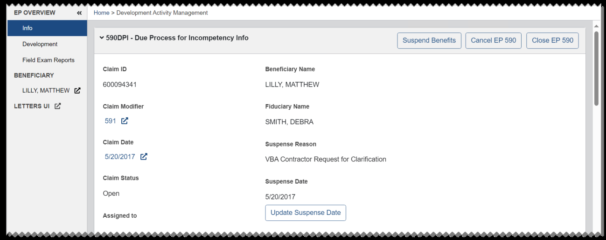
*Screenshot — page 62 (1299×516 px)*

you. See Closing or Canceling EPs for more information. Most buttons and actions are disabled or unavailable after a claim is closed or cancelled.

#### EP590 Info

The available buttons and fields in the Info section may vary based on the EP and claim label.

When an EP590 Due Process for Incompetency or EP600 Pension Management Center (PMC) claim is authorized and the most recent decision is Incompetent, a 590IAFE claim is automatically established.

For some EP types, the Face to Face Required button is available. See Face to Face Required for more information.

When all activities are completed for a claim with the In Development suspense reason, you can select Complete Development. Then from the dialog, select OK to confirm. The suspense reason updates to Typing Field Exam Report. For 590IAFE, 590SIAFE, and 590EIAFE claims in this status, you can add a Supervised Direct Pay Assessment by selecting Generate Letter for a completed field exam report activity. See Field Exam Reports for more information.

To indicate that a claim is ready for validation, select Ready for Validation. The suspense reason updates to Field Exam Validation.

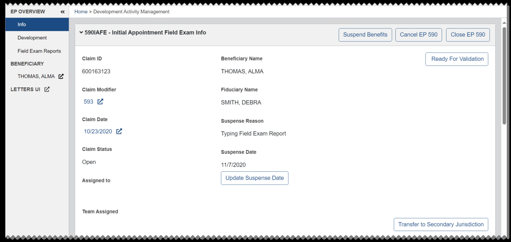
*Screenshot — page 63 (1299×617 px)*

For a claim that is pending field exam validation, you can select Promulgate EP -

#### Generate Award. The suspense reason updates to Promulgate EP - Generate Award and

the claim status updates to Ready to Work.

You can select Incomplete to indicate a field exam report requires corrections when the claim is in any of the following suspense reasons: Promulgate EP - Generate Award, Promulgate EP - Suspend Benefits, Award Action Returned by Authorizer, Award Action Returned by User, Continued at Authorization, Pending Authorization, or Pending Concur.

From the dialog, you can choose the team assignment, edit or accept the default suspense date, enter the reason the field exam report requires corrections, and select OK.

The claim status updates to Open and the suspense reason updates to Returned by Other User. The suspense date is set to 5 days and the Incomplete Reason is shown in the Notes field.

You can select Ready for Validation to indicate corrections were made to an incomplete field exam.

The suspense reason is set to Field Exam Validation and the Incomplete Reason is no longer shown.

To suspend benefits to the beneficiary, select Suspend Benefits. Then select a reason for suspending benefits and select OK. The suspense reason updates to Promulgate EP - Suspend Benefits.

For dual jurisdiction claims where the fiduciary and beneficiary physical addresses are associated with different stations, you can select Transfer to Secondary Jurisdiction to indicate the claim is ready to be transferred. If there is no existing field exam report, you

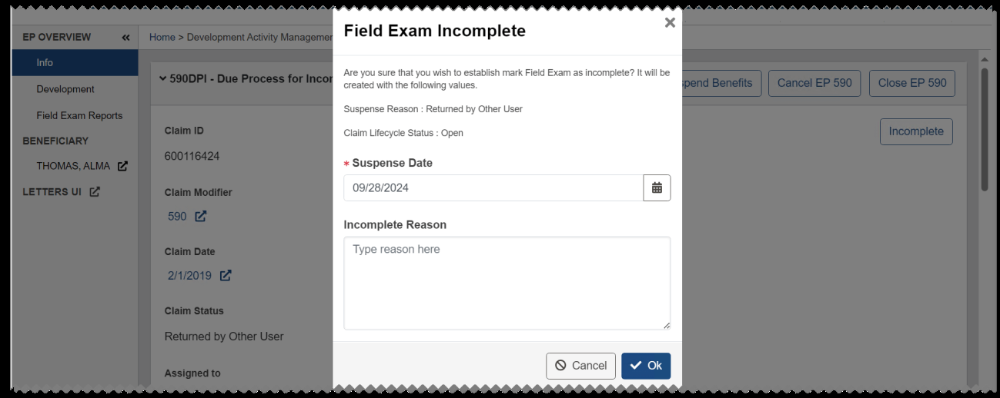
*Screenshot — page 64 (1299×518 px)*

can select Don't Create Field Exam if a report is not needed, or Create New Field Exam if a report is needed, prior to transferring the case.

If the suspense reason is Whereabouts Unknown - 1st Attempt, Whereabouts Unknown - 2nd Attempt, or Fiduciary Whereabouts Unknown when you select Transfer to

#### Secondary Jurisdiction, you can select Yes from the dialog to confirm that you want to

transfer the case.

The suspense reason will update to Field Exam Assigned - Dual Jurisdiction. Any open development activities assigned to the current user will be marked completed.

For any EP590 claim for an initial appointment or follow-up field exam (except for telephone follow-up), if an award with a withholding reason of Surety bond is required is authorized and Continue at Authorization is selected, a Bond Request Letter admin task is automatically generated and assigned to the user who generated the award. The description of the admin task includes information identifying the fiduciary that needs to receive the letter. You can manually generate the Bond Request Letter from the EP Overview page for the claim. See Correspondence for more information.

#### EP400 FID-Correspondence Info

EP400 FID-Correspondence claims are primarily used for generating correspondence. See Correspondence for more information.

An EP400 FID-Correspondence is automatically established when a date of death is entered for the beneficiary and there are no values listed in the Accounting Due Reason or Accounting Period Start Date fields in the Diary Information section of the beneficiary profile. There must also be an EP290 FID-Accounting Federal associated to the beneficiary.

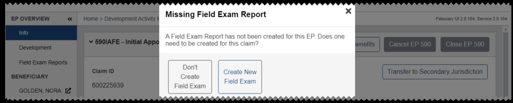
*Screenshot — page 65, figure 1 of 2 (1299×263 px)*

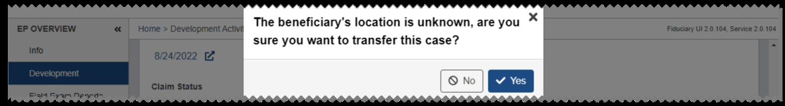
*Screenshot — page 65, figure 2 of 2 (1299×177 px)*

#### EP290 FID-Misuse Info

When an EP290 FID-Misuse claim is established, a misuse record is generated. You can select the Misuse Record link to view the misuse record. See Misuse Records for more information. To delete the misuse record, users with permissions can select the delete icon.

For EP290 FID-Misuse claims, the initial suspense reason is Allegation Received. To indicate a claim action has occurred or a decision has been made about the claim, select

#### Actions. Then from the dialog, choose the action you want to add. The default suspense is

14 days except for Misuse Found, which is 30 days. You can edit the suspense date if needed. If the claim is closed or cancelled, you cannot add any actions.

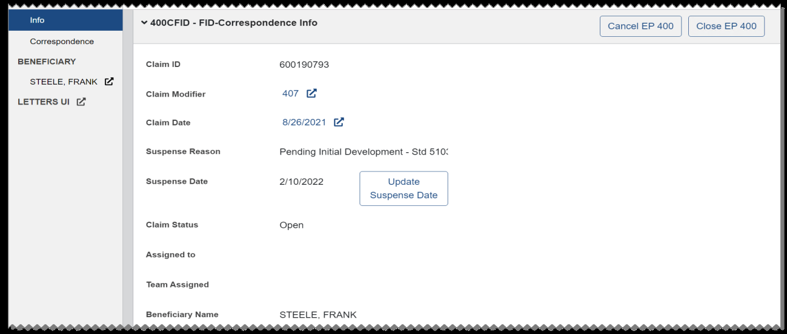
*Screenshot — page 66, figure 1 of 2 (1299×553 px)*

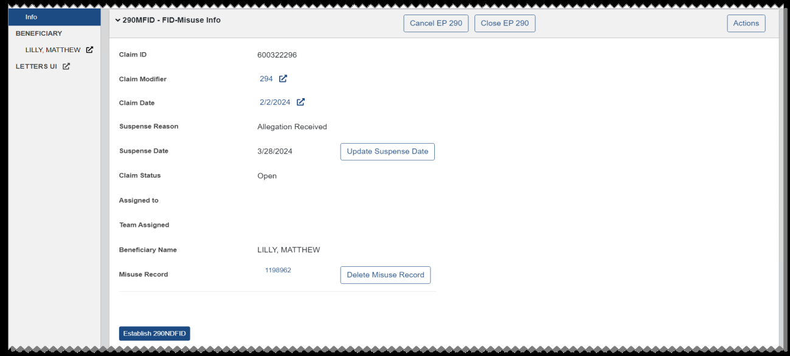
*Screenshot — page 66, figure 2 of 2 (1299×587 px)*

Adding an action may change the suspense reason, suspense date, and claim status. If you add the No Investigation is Warranted, Misuse Not Found, Misuse Not Upheld, or Debt Collection Admin Task has been created action, a dialog is shown indicating the claim will close. Select Confirm. The claim status will update to Closed.

See Misuse Determination and Misuse Allegation Memos for information on managing the Misuse Determination Memo and the Misuse Determination Reconsideration Memo.

#### EP290 FID-Negligence Determination

From the EP Overview page for an EP290 FID-Misuse claim, you can select Establish

#### 290NDFID to establish an EP290 FID-Negligence Determination claim. You can also

establish an EP290 FID-Negligence Determination claim from the VACO section of the Misuse Record page by selecting Yes for Negligence Determ Required. In either case, if the misuse record does not meet all criteria required to establish this type of claim, a message is shown to indicate the reason. To make corrections before proceeding, select the link to the associated Misuse Record page from the EP Overview page for the EP290 FID-Misuse claim or the EP290 FID-Negligence Determination claim. See Misuse Records for more information.

*Screenshot — page 67, figure 1 of 2 (1299×298 px)*

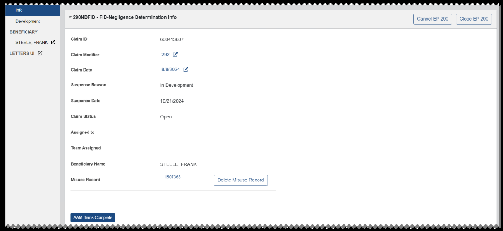
*Screenshot — page 67, figure 2 of 2 (1299×597 px)*

For EP290 FID-Negligence Determination claims, the initial suspense reason is Awaiting Initial Review. For users with permissions, the available buttons to move the claim through the workflow will vary based on the suspense reason. When you select one of these buttons, a dialog opens with information about the resulting suspense reason, user assignment, and suspense date.

You can edit the suspense date for any action, and for some actions you can select a user assignment.

The EP Overview page for EP290 FID-Negligence Determination claims also includes a Correspondence section for generating related correspondence and a Development section where you can add and update development actions.

See Misuse Determination and Misuse Allegation Memos for information on managing the Misuse Determination Memo and the Misuse Determination Reconsideration Memo.

#### EP290 FID-Accounting Federal and FID-Accounting Court Info

From the Diary Information section of the beneficiary profile, if the Fiduciary Oversight Type is Accounting Court or Accounting Federal, an Accounting Due or Accounting Call letter will be automatically sent to the fiduciary 35 days before the Accounting Period End Date. If the fiduciary is indicated as Spanish Speaking, then a Spanish version of the letter is sent.

On the day after the Accounting Period End Date, an EP290 FID-Accounting Court or FID- Accounting Federal is automatically established and assigned to a Fiduciary Hub based on the fiduciary's physical address, then managed by local routing rules.

An EP290 FID-Accounting Federal is also automatically established when a date of death is entered for the beneficiary and there are no values listed in the Next of Kin and Person Listed on Will fields in the Beneficiary Information section of the beneficiary profile. There must also be values listed in at least one of the following fields in the Diary Information section of the beneficiary profile: Accounting Due Reason, Accounting Period Start Date, or Accounting Period End Date.

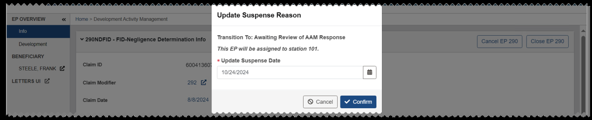
*Screenshot — page 68 (1299×266 px)*

To manually establish this type of claim, select Establish EP from the Beneficiary Information section of the beneficiary profile. See Establishing EPs for more information. Manually established EP290 accounting claims will be assigned to the user establishing the claim.

If the claim is assigned to you, you can create an accounting audit tool by selecting Create

#### Accounting Audit Tool.

To begin from a copy of another accounting audit tool associated with the beneficiary, select the Copy Accounting Audit option from the dialog. Then select an accounting audit tool from the list. For this option, data from the Approval section will not be included in the new copy.

To begin from a completely new accounting audit tool, select the Create Accounting

#### Audit option. Enter the start date, end date, and starting balance. If you enter a negative

starting balance amount, a justification is required.

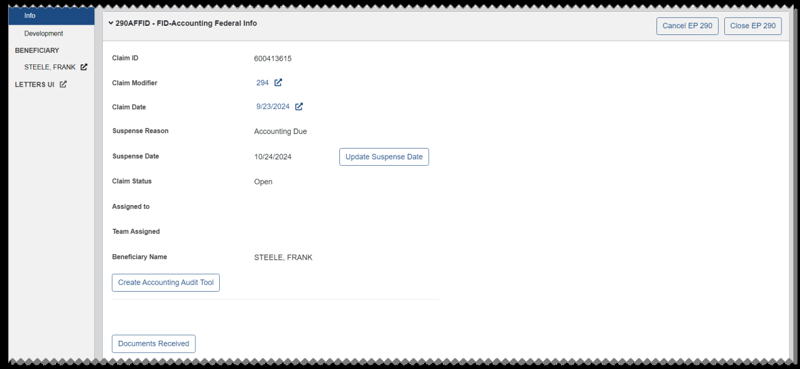
*Screenshot — page 69, figure 1 of 2 (1299×601 px)*

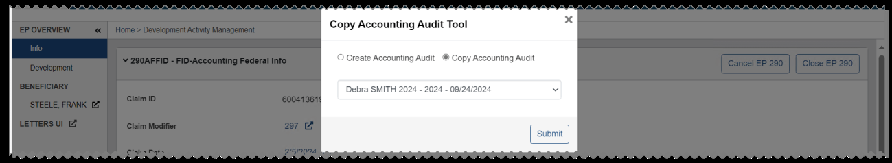
*Screenshot — page 69, figure 2 of 2 (1299×238 px)*

For either option, select Submit. An Accounting Audit Tool link is added to the EP overview and the suspense reason is updated to Accounting Due. See Accounting Audit Tools for more information.

For users with permissions, the available buttons to move the claim through the workflow will vary based on the suspense reason. When you select one of these buttons, a dialog opens with information about the resulting suspense reason and suspense date. You can edit the suspense date or accept the default suspense, then select Confirm.

If you send an Accounting Past Due or Accounting Call Past Due letter, the suspense reason is updated to In Development and the suspense is set to 30 days.

If the suspense reason is Accounting Due, In Development, Accounting Disapproved, or Pending Concur and you select Documents Received, the suspense reason will be updated to Accounting Received.

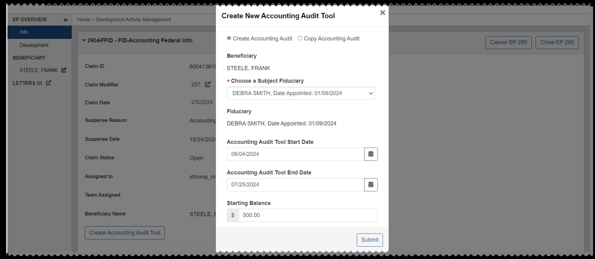
*Screenshot — page 70, figure 1 of 3 (1299×567 px)*

*Screenshot — page 70, figure 2 of 3 (1299×188 px)*

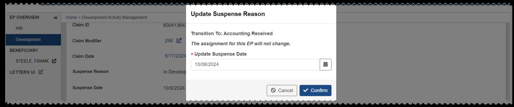
*Screenshot — page 70, figure 3 of 3 (1299×272 px)*

If the suspense reason is Accounting Received and you select Accounting Approved, you can select Confirm from the dialog to close any open development activities and continue. The suspense reason is updated to Accounting Approved and the claim status is updated to Closed.

If the suspense reason is Accounting Due, Accounting Received, In Development, or Pending Concur and you select Accounting Disapproved, the suspense reason is updated to Accounting Disapproved and the default suspense is 14 days. Sending a Disapproved letter or associated follow-up letter will also update the suspense reason in this way.

If the suspense reason is Accounting Disapproved and you select Fiduciary Requires In-

#### person Assistance, the suspense reason is updated to In Development. An EP590

Unscheduled Follow-Up Field Exam should be established to track the in-person assistance. When this is complete, processing of the EP290 Accounting claim can resume.

If the suspense reason is Accounting Disapproved or In Development and you select

#### Request Accounting Waiver, the suspense reason is updated to Pending Concur.

From Pending Concur, if you select Return with Revisions, you can enter an explanation in the Accounting Waiver Correction dialog. The explanation will be shown in the Note field in the Info section.

Selecting Return with Revisions or Waiver Disapproved will update the suspense reason to Accounting Disapproved.

Selecting Waiver Approved will update the suspense reason to Waiver Approved. At this point, the Accounting Waiver Memo Approval can be uploaded to the eFolder and the EP can be closed.

#### EP290 FID-Fund Usage Review

30 days before the Fund Usage Review Date in the Diary Information section of the beneficiary profile, when the Fiduciary Oversight Type is Fund Usage Review, a Fund Usage Due letter is automatically sent to the fiduciary and a 290FURFID claim is automatically established. The initial suspense reason is Awaiting Bank Statements and the suspense is set to 30 days.

To manually establish this type of claim, select Establish EP from the Beneficiary Information section of the beneficiary profile. See Establishing EPs for more information. When manually establishing this type of claim, you can choose to generate the Fund Usage Due letter at the same time, or only establish the claim and then manually generate the letter separately. When you manually generate the Fund Usage Due letter, the

suspense reason is updated to Awaiting Bank Statements and the suspense is set to 30 days.

From the EP Overview page for this type of claim, if you generate a Fund Usage Past Due letter in the Correspondence section or add any development activity in the Development section, the suspense reason is updated to In Development and the suspense is set to 14 days. When generating a Fund Usage Additional Evidence Required Letter, you can enter free text and specify which accounts, checks, or large purchases the additional evidence is required for.

If the suspense reason is Awaiting Bank Statements or In Development, you can select

#### Statements Received.

The suspense reason is updated to Pending Review. If needed, you can select Bank

#### Statements Needed to return the claim to Awaiting Bank Statements. The Update

Suspense Reason dialog indicates the new suspense reason and suspense date. You can edit the suspense date or accept the default suspense, then select Confirm.

If the suspense reason is Pending Review, Awaiting Bank Statements, or In Development you can select Review Complete to open the Complete Review dialog. If there are any open development activities, you will be prompted to close them and continue.

Then from the dialog, you can select Reject or Accept to enter the final status of the review.

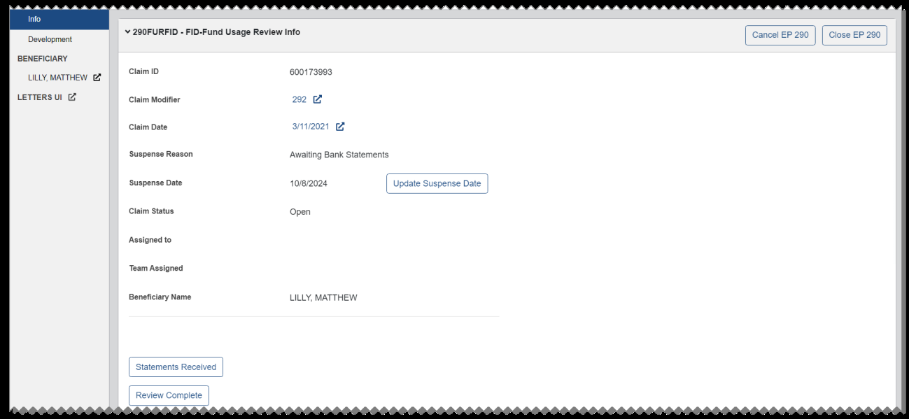
*Screenshot — page 72 (1299×599 px)*

If you select Reject, the Update Suspense Reason dialog indicates the new suspense reason and suspense date. You can edit the suspense date or accept the default suspense, then select Confirm.

In the Correspondence section, you can generate a Fund Usage Review Complete letter after entering a start and end date for the letter.

If you select Accept, the Confirm: Close EP290 dialog is shown. Select Confirm.

The suspense reason is updated to Review Complete and the claim status is updated to Closed.

### Closing or Canceling an EP

The steps for closing and canceling an EP assigned to you are similar for all EP types. Most buttons and actions are disabled or unavailable after a claim is closed or cancelled.

If you are canceling an EP with an open Accounting Audit Tool or Field Exam Report, you can choose to delete the item upon canceling or preserve it in an inactive or locked status. These options are not available for closing an EP.

As an example, these steps show how to cancel an EP.

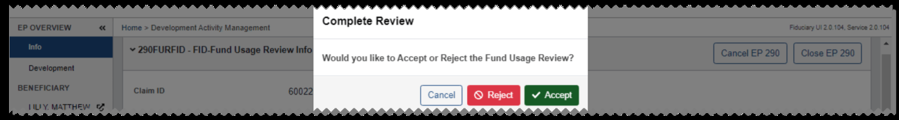
*Screenshot — page 73, figure 1 of 2 (1299×175 px)*

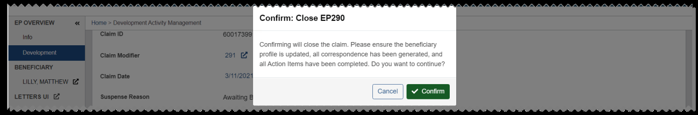
*Screenshot — page 73, figure 2 of 2 (1299×216 px)*

1. From the Info section, select Cancel EP.

2. From the Cancel EP Dialog, select Cancel the EP. 3. If an open Accounting Audit Tool is associated with the EP, you can choose to delete it or preserve it in an inactive status when you cancel the EP. 4. If an open Field Exam Report is associated with the EP, you can choose to delete it or preserve it in a locked status when you cancel the EP. 5. If an open Misuse Determination Memo is associated with an EP, a message is shown indicating the Misuse Determination Memo approval process will end when you cancel the EP. 6. From the Cancel EP dialog, select a Cancel Reason and enter a Cancel Note.

7. Select OK to cancel the EP and update the status to Cancelled.

### Development

This section lists all development activity for EP590 and some EP290 claims. To filter the list, enter a term in the Filter Results box.

For EP590 claims, the section header may include buttons such as Whereabouts

#### Unknown - 1st Attempt and Fiduciary Whereabouts Unknown that you can select to

indicate the beneficiary or fiduciary cannot be located. See Whereabouts Unknown for more information.

When a development activity is added, the suspense reason is set to In Development. For EP590 claims in the Whereabouts Unknown - 1st Attempt, Whereabouts Unknown - 2nd Attempt, or Fiduciary Whereabouts Unknown status, the suspense reason does not change when you add a development activity.

If a claim is closed or canceled, you cannot add, update, edit, or delete a development activity.

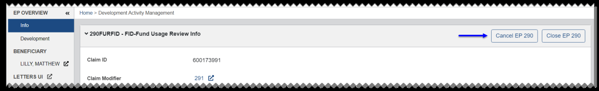
*Screenshot — page 74, figure 1 of 2 (1299×199 px)*

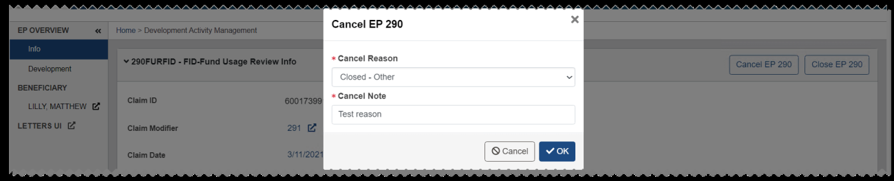
*Screenshot — page 74, figure 2 of 2 (1299×264 px)*

To add an activity, select Add Development Activity. Then from the dialog, select an activity type. Some activity types require additional information or selections.

After you select OK, you can either edit the suspense date or accept the default of 14 days. Select Confirm to add the development activity.

To update an activity, select Update Status in the row for the activity. For all EP290 activities and most EP590 activity types, you can select Yes to mark the activity completed and update the close date to today's date, or No if you do not wish to update the activity.

EP590 activities also include Date of Contact fields that will be added when you click Yes.

If the activity type is Interview - Beneficiary or Interview - Fiduciary, you must enter a date in one Date of Contact field before selecting Yes or No. If you select No, the interview status is set to Attempted.

If you select Yes, the Date of Contact field is updated with the date contact was made in the row for the activity.

For a Criminal Background Investigation (CBI), if there is no open CBI admin task, you can assign the activity to a Legal Instrument Examiner (LIE) by selecting Assign to LIE. Then from the dialog, select a Fiduciary Hub and a user for assignment and select OK.

If there is an open CBI admin task, the Link column will include a link to the admin task and the delete icon will not be enabled. You can select Delete Assignment to LIE from

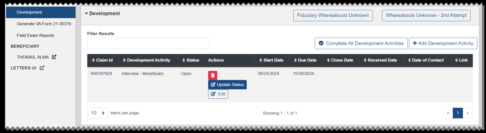
*Screenshot — page 75, figure 1 of 2 (1299×357 px)*

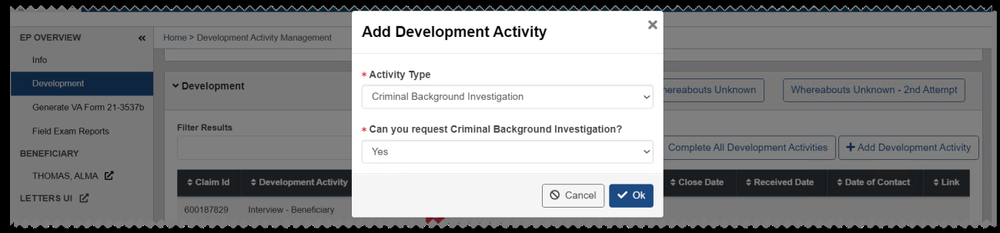
*Screenshot — page 75, figure 2 of 2 (1299×303 px)*

the Update Development Activity dialog, and then you will be able to delete the CBI activity, mark it complete, or assign it to an LIE.

To edit an activity, select Edit in the row for the activity.

From the dialog, you can edit the start date, edit the due date or accept the default due date of 14 days, and enter a received date if the required documentation has been received. If a development activity is complete, you can edit the start date or the received date, but you cannot edit the due date. Select Accept to save your changes.

For EP590 claims, you can select Complete All Development Activities to complete all Open or Attempted development activities.

If you select Yes from the Complete All Development Activities Dialog, the close date will be updated with today's date, and the status will be updated to Complete. For activities that require a date of contact, today's date will also be entered.

Users with permissions can select the delete icon to delete an Open or Attempted activity, unless it has a received date. You can edit an activity to remove the received date so that the activity can be deleted. You cannot delete a CBI activity or mark it completed if there is an open CBI admin task.

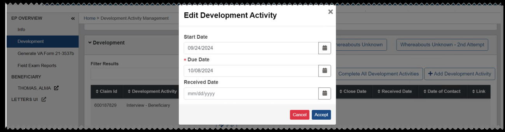
*Screenshot — page 76, figure 1 of 2 (1299×341 px)*

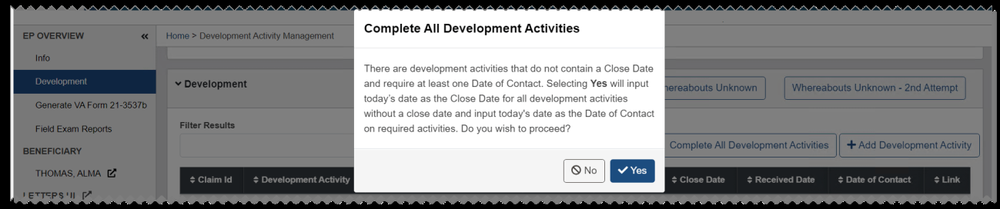
*Screenshot — page 76, figure 2 of 2 (1299×272 px)*

#### Whereabouts Unknown

For all EP590 claims, the Development section includes a Whereabouts Unknown - 1st

#### Attempt button. For 590FUFE, 590SFUFE, and 590UFUFE claims, a Fiduciary

#### Whereabouts Unknown button is also available.

If you select Whereabouts Unknown - 1st Attempt or Fiduciary Whereabouts

#### Unknown, the suspense reason updates to Whereabouts Unknown - 1st Attempt or

Fiduciary Whereabouts Unknown.

When the suspense reason is Fiduciary Whereabouts Unknown, you can selectFiduciary

#### Located to return the claim to the previous suspense reason.

When the suspense reason is Whereabouts Unknown - 1st Attempt, you can select

#### Beneficiary Located to return the claim to the previous suspense reason.

If the suspense date is reached while the claim is in the Whereabouts Unknown - 1st Attempt suspense reason, the Beneficiary Located button is removed and the

#### Whereabouts Unknown - 2nd Attempt button is available. If you select Whereabouts

#### Unknown - 2nd Attempt, the suspense reason is updated accordingly and the

#### Beneficiary Located button is shown again.

### Notes

This section lists notes for the claim, and includes the option to save the notes to the beneficiary profile. To filter the list, enter a term in the Filter Results box. If an EP590 or EP290 claim is closed or cancelled, you cannot add or edit notes, or save notes to the beneficiary profile.

The user who created the note can edit it by selecting Edit.

To add a new note, select Add Note. Then from the Add Note dialog, enter the note text and select OK.

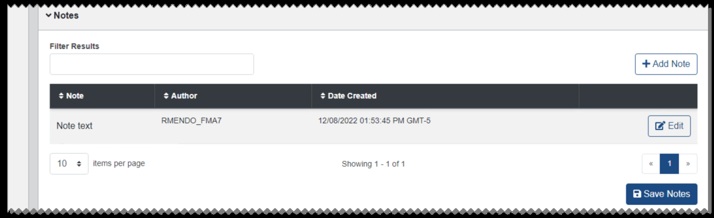
*Screenshot — page 77 (1299×398 px)*

To add the claim notes to the beneficiary profile, select Save Notes. See Notes for more information.

### Field Exam Reports

This section lists all field exam report activities for an EP590 claim, and includes options to export the report. To filter the list, enter a term in the Filter Results box. If a claim is closed or cancelled, you cannot add, delete, export, or go to a field exam.

To add an activity, select Add Field Exam Report Activity. If no locked reports are available for the beneficiary, select OK to create the report.

If a locked report is available for the beneficiary, you can select Begin from an existing

#### report and choose a report to begin from, or select Create brand new report. Then

select OK to create the report.

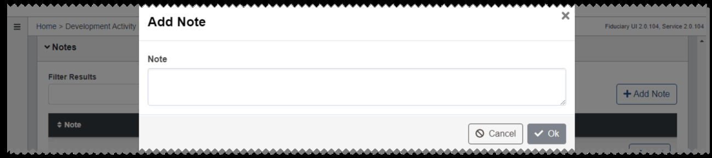
*Screenshot — page 78, figure 1 of 3 (1299×290 px)*

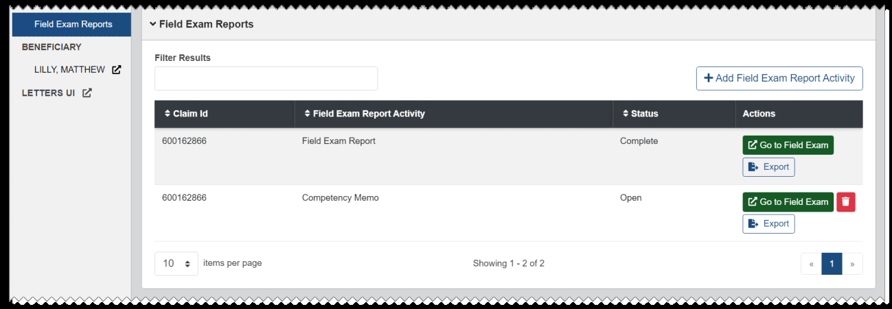
*Screenshot — page 78, figure 2 of 3 (1299×451 px)*

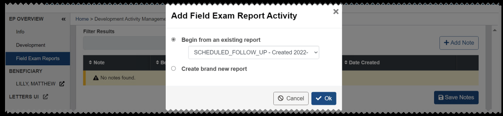
*Screenshot — page 78, figure 3 of 3 (1299×302 px)*

If you create a report for a beneficiary without a Social Security number (SSN), unavailable will be shown for the beneficiary's SSN on the Field Exam Reports page. You can edit the beneficiary's SSN from the associated Veteran Profile.

To view the field exam report, select Go to Field Exam. See Field Exams for more information.

A delete icon is shown for an open activity, but the associated field exam must be deleted before the activity can be deleted. Users with permissions can select Go to Field Exam and select Delete Exam from the Field Exams page. Then from the EP Overview page, the open activity can be deleted. Users with permissions can also delete a complete field exam from the Field Exams page, but the complete activity cannot be deleted from the EP Overview page.

To export a report, select Export.

From the export view, select Download to save a PDF of the report.

### Generate VA Form 21-3537b

For EP types 590FUFE, 590UFUFE, 590TFUFE, 590NFPFE, and any corresponding 930, the left pane includes a link to the Generate VA Form 21-3537b section. From this section, you can generate and manage VA Form 21-3537b - Report of Field Examination.

To generate the VA Form 21-3537b, select Add VA-Form 21-3537b. From the dialog, enter the text you wish to appear in the report in the Purpose field, and select Save VA-

#### Form 21-3537b.

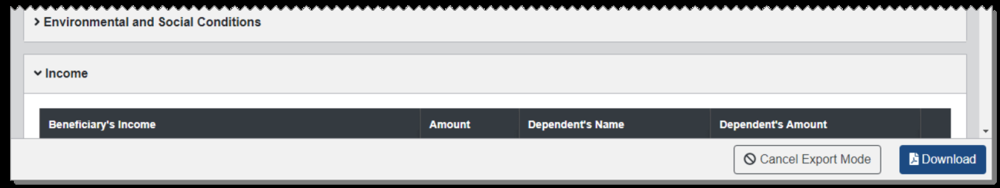
*Screenshot — page 79, figure 1 of 2 (1299×245 px)*

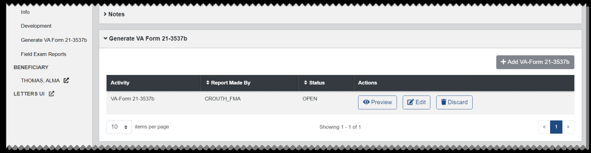
*Screenshot — page 79, figure 2 of 2 (1299×337 px)*

Once you have generated the report, the form is listed in the table. The Add VA-Form 21- 3537b button becomes inactive because only one form can be in an open status at a time.

You can select the column header in the Report Made By or the Status column to sort the list.

The Actions column includes buttons to Preview, Edit, and Discard the form. These buttons are only available to the user assigned to the EP who generated the report.

To delete the report, select Discard. From the dialog, select Discard. The report is removed from the table. To edit the report, select Edit. From the dialog, edit the Purpose field and select Save VA-Form 21-3537b.

To preview and finalize the report, select Preview. From the dialog, you can review the report and select Generate Letter. The report is placed in a Completed status. To view the report, select View.

### Correspondence

From the Correspondence section, you can generate the following correspondence for certain EP290 and EP400 FID claims that are not closed or cancelled:

• Misuse Consideration Memo • Misuse Determination Memo • Misuse Allegation Memo • Debt Memo to Support Service Division (SSD) • Request Station Debt Information to SSD Memo

Choose a letter from the list in the Correspondence section. For some letters, you will need to enter additional information.

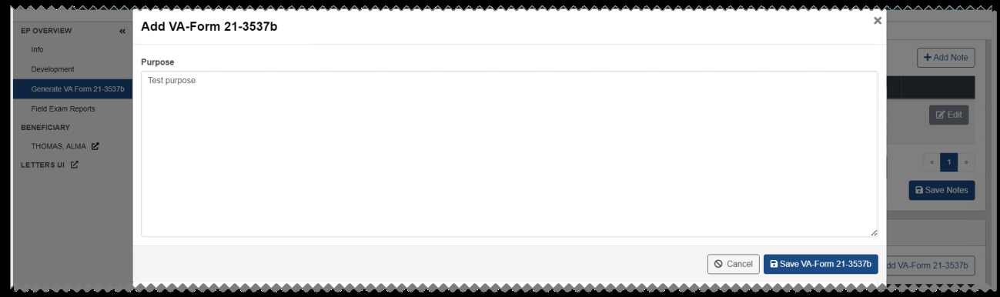
*Screenshot — page 80 (1299×386 px)*

Select Generate Letter. Then from the dialog, preview the letter and select Generate

#### Letter.

A success message is shown, indicating that the letter was generated. The letter is added to the Veteran's eFolder in Claim Evidence for the Veteran associated with the beneficiary.

Letters addressed to a fiduciary are automatically added to a package in Package Manager, and the package is finalized. A distribution is also created for the package, and its status is set to In Progress.

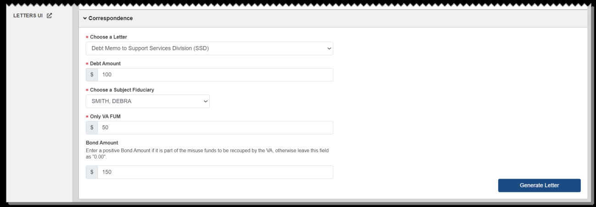
*Screenshot — page 81, figure 1 of 2 (1299×453 px)*

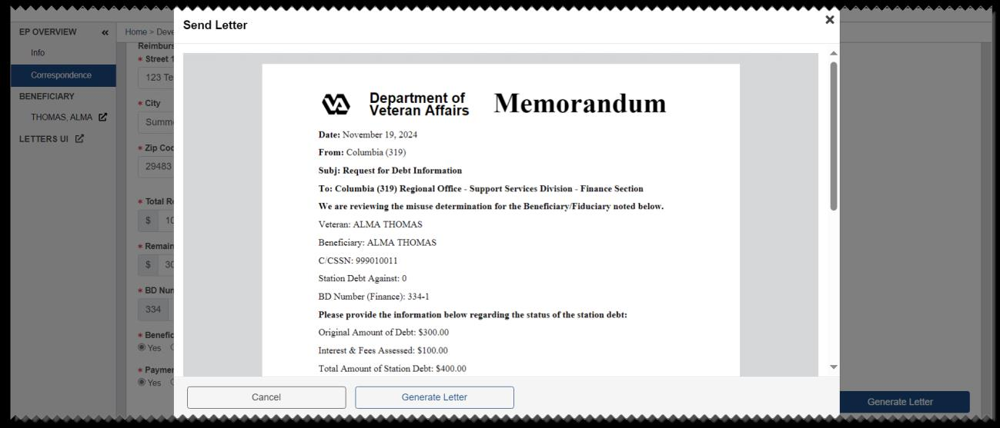
*Screenshot — page 81, figure 2 of 2 (1299×557 px)*

---

*[← Back to README](./README.md)*