# Field Exams

From the Field Exam Report page, you can enter information for a field exam associated with an EP590 claim. You can access this page by selecting Go To Field Exam from the Field Exam Reports section of the EP Overview page for an EP590 claim. You can also select View in the Field Exam Reports list on the home page, or the Field Exam Reports section of the beneficiary profile.

The left pane includes links to each section, with the current section name highlighted as you scroll up or down. To view the history of changes, select View Audit History in the Admin section of the left pane. See Audit History for more information. To view the EP associated with the report, select the link to the EP in the Admin section. See EP Overview for more information.

For an open report, the button bar at the bottom of the page includes Complete Report,

#### Export, Delete Exam, Cancel, and Save Changes buttons. To delete a report, users with

permissions can select Delete Exam.

To indicate a report assigned to you is completed, select Complete Report. Then from the dialog, select the check box for each value you want to update in the beneficiary profile, and select Finish.

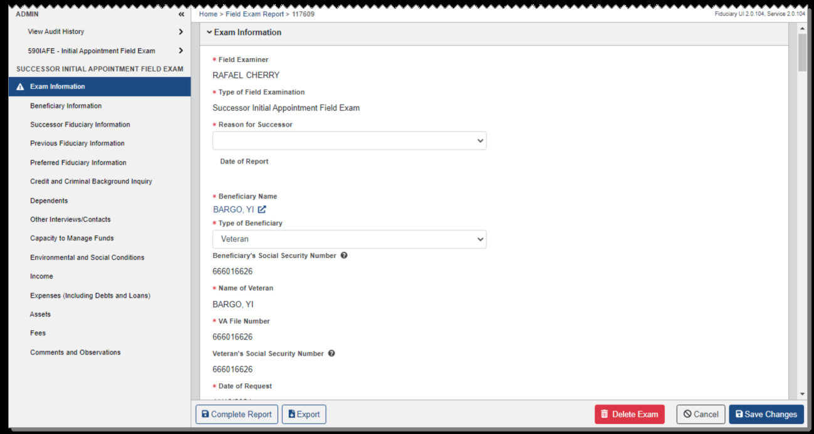
*Screenshot — page 82 (1299×693 px)*

<details>
<summary>Screenshot text content (visible UI elements, labels, and data)</summary>

```
‘ADMIN ‘| Home > Field Exam Report > 117609, Fada U2. 104, Save 20104
View Aust History > ¥ Exam Information *
SOOIAFE -Intial Appointment Field Exam ==>
+ Field Examiner
SUCCESSOR INITIAL APPOINTMENT FIELD EXAM
RAFAEL CHERRY
xam information
6 er + Type of Field Examination
Beneficiary Information ‘Successor Initial Appointment Field Exam
Successor Fiduciary Information + Reason for Successor
Previous Fiduciary information v
Preferred Fiduciary information Date of Report
‘Credit and Criminal Background Inquiry
ependents + Beneficiary Name
BARGO, YI
‘other Inerviews/Contacts Type of Benetciany
‘Capacity to Manage Funds Veteran v
Environmental and Social Conditions Beneficiary’s Social Security Number @
income 666016626
+ Name of Veteran
Expenses (Including Debis and Loans)
BARGO, YI
Assets
* VA File Number
Fees 666016626
‘Comments and Observations Veteran's Social Security Number ©
666016626
+ Date of Request
@ Complete Report Bi Delete Exam CY] Save Changes
```

</details>

For a completed report, users with permissions can select Reopen Report or Lock

#### Report. A locked report cannot be edited or deleted.

To export a report in any status, select Export.

From the export view, select Download to save a PDF of the report.

For a locked report that is assigned to you, select Upload to upload the report to the eFolder.

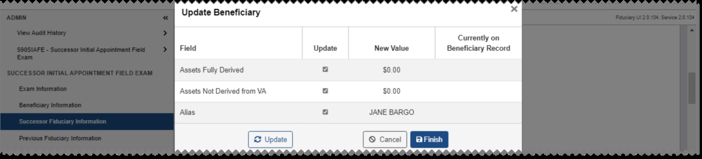
*Screenshot — page 83, figure 1 of 3 (1299×295 px)*

<details>
<summary>Screenshot text content (visible UI elements, labels, and data)</summary>

```
Update Beneficiary x
Currently on
Field Update New Value Beneficiary Record
Assets Fully Derived $0.00
Assets Not Derived from VA $0.00
Alias JANE BARGO
[9 Cancel
```

</details>

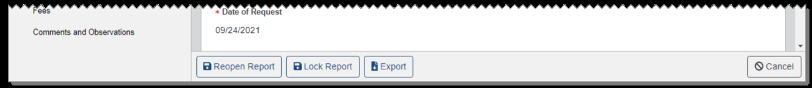
*Screenshot — page 83, figure 2 of 3 (1299×142 px)*

<details>
<summary>Screenshot text content (visible UI elements, labels, and data)</summary>

```
o4 Date of Request
Comments and Observations os2aiz021
Reopen Report } BlLock Report | Bexport | © Cancel |
```

</details>

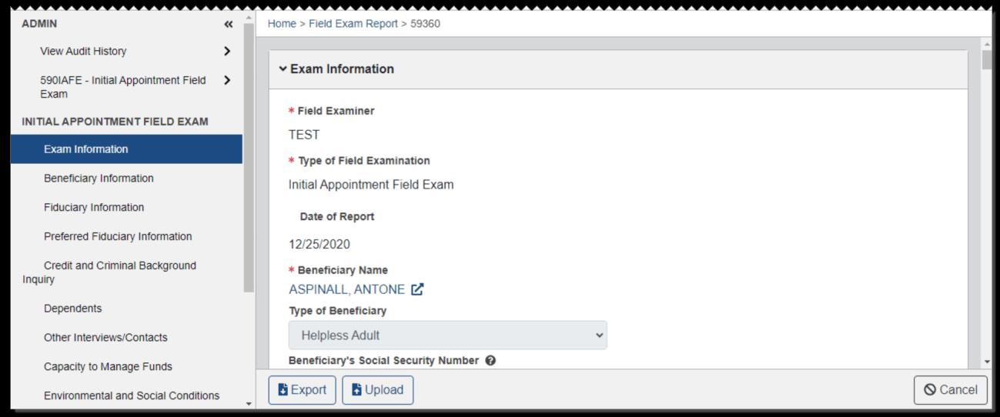
*Screenshot — page 83, figure 3 of 3 (1299×542 px)*

<details>
<summary>Screenshot text content (visible UI elements, labels, and data)</summary>

```
ADMIN & GB) Home > Field Exam Report > 59966
View Audit History >
¥ Exam Information
S90IAFE - Initial Appointment Field >
Exam
* Field Examiner
INITIAL APPOINTMENT FIELD EXAM
TEST
Exam Information
* Type of Field Examination
Gate hadetibadd Initial Appointment Field Exam
Fiduciary Information
Date of Report
Preferred Fiduciary Information
12/25/2020
Credit and Criminal Background * Beneficiary Name
Inquiry : :
ASPINALL, ANTONE
Dependents ‘Type of Beneficiary
Other Interviews/Contacts Helpless Adult Sol
Cipachy w hemage Finds Beneficiary's Social Security Number @ +
Environmental and Social Conditions | BExport || BUpioad | 8 Cancel }
```

</details>

### Processing Field Examination Reports

The Field Exam Report page opens to the Exam Information section at first, and includes the following sections. The available sections may vary based on field exam type.

#### Exam Information

This section shows the assigned Field Examiner and type of exam, as well as basic information on the beneficiary and associated Veteran. Beneficiary Name includes a link to the person or Veteran profile.

Date of Report is filled in with the current date when Complete Report is selected.

If the beneficiary's Social Security number (SSN) is unavailable, you cannot edit it from the Field Exam Report page. You can edit the beneficiary's SSN from the associated Veteran Profile.

#### Beneficiary Information

This section includes additional beneficiary information, including a link to the beneficiary profile.

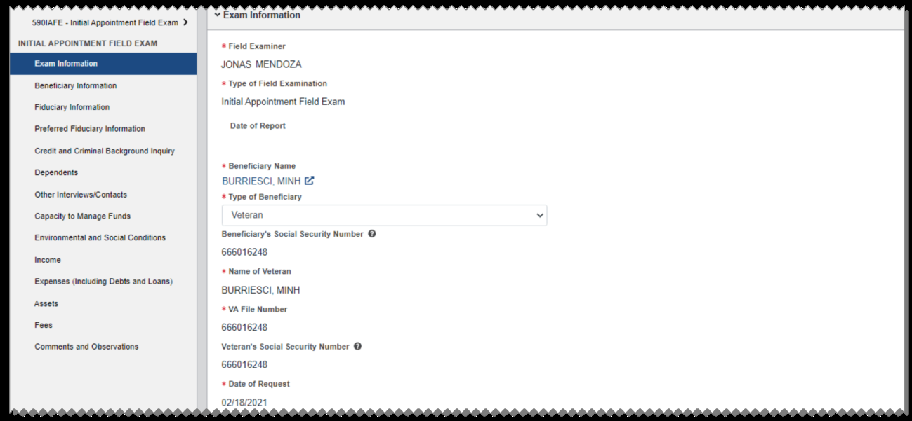
*Screenshot — page 84 (1299×601 px)*

<details>
<summary>Screenshot text content (visible UI elements, labels, and data)</summary>

```
¥ Exam Information
‘S90IAFE - Initial Appointment Field Exam >
INITIAL APPOINTMENT FIELD EXAM * Field Examiner
Exam Information JONAS MENDOZA
Reena ene + Type of Field Examination
ee Initial Appointment Field Exam
Preferred Fiduciary Information Date of Report
Credit and Criminal Background Inquiry
* Beneficiary Name
Dependents
BURRIESCI, MINH &
Other Interviews/Contacts + Type of Beneficiary
‘Capacity to Manage Funds Veteran v
Envcnmnental and Social Condiices Beneficiary’s Social Security Number ©
\ 666016248
+ Name of Veteran
Expenses (Including Debts and Loans)
BURRIESCI, MINH
Assets * VAFile Number
Fees 666016248
‘Comments and Observations Veteran's Social Security Number ©
666016248
* Date of Request
02/18/2021
```

</details>

Some beneficiary information is automatically filled in, while other information for the report can be entered here.

#### Fiduciary Information

This section shows information about the fiduciary associated with the beneficiary, including a link to the fiduciary profile.

You can select the search icon to search for a fiduciary. From the search results, you can choose an active fiduciary and select Accept to associate the fiduciary to the field exam.

Some fiduciary information is automatically filled in, while other information for the report can be entered here.

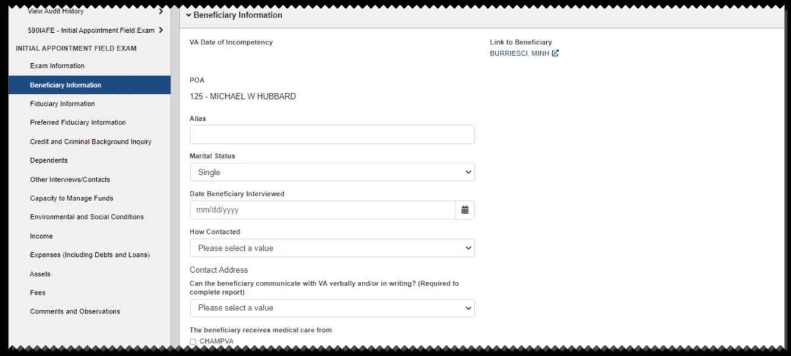
*Screenshot — page 85, figure 1 of 2 (1299×586 px)*

<details>
<summary>Screenshot text content (visible UI elements, labels, and data)</summary>

```
io Aust History ? | y Beneficiary Information
SBOIAFE - Initial Appointment Field Exam >
ee eeeiabatiteaans VA Date of incompetency Link to Beneficiary
INITIAL APPOINTMENT FIELD EXA\ senor
Exam information
POA
Beneficiary information
125 - MICHAEL W HUBBARD
Fiduciary information
Preferred Fiduciary Information pe
Credit and Crminal Background Inquiry
panna Marital Status
Other Interviews/Contacts —
Cee Manan reer Date Beneficiary Interviewed
Environmental and Social Conditions
How Contacted
Income
Please select a value ©
Expenses (Including Debts and Loans
As Contact Address
Can the beneficiary communicate with VA verbally andlor in writing? (Required to
Fees complete report)
Comments and Observations Please select « valve a
The beneficiary receives medical care from
HAMEV,
```

</details>

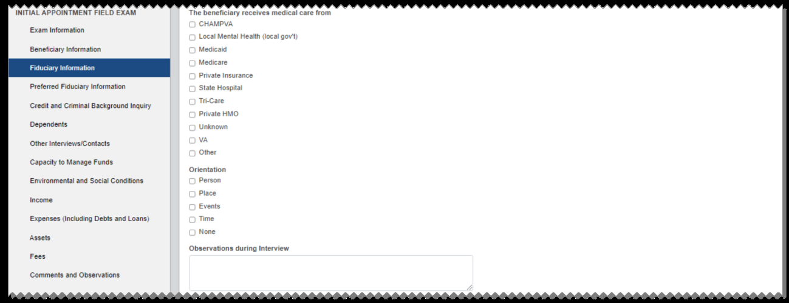
*Screenshot — page 85, figure 2 of 2 (1299×500 px)*

<details>
<summary>Screenshot text content (visible UI elements, labels, and data)</summary>

```
INITIAL APPOINTMENT FIELD EXAM The beneficiary receives medical care from
CHAMPVA
Exam information
Local Mental Health (local gov")
Beneficiary Information Medicaid
Medicare
Fiduciary Information
Private Insurance
Preferred Fiduciary information State Hospital
Tricare
Credit and Criminal Background Inquiry
Private HMO
Dependents Unknown
Other Interviews/Contacts va
Other
‘Capacity to Manage Funds
Orientation
Environmental and Social Conditions Person
Place
Income
Events
Expenses (Including Debts and Loans) Time
None
Assets
‘Observations during Interview
Fees
‘Comments and Observations
```

</details>

For successor field exam reports, Previous Fiduciary Information and Successor Fiduciary Information sections are shown instead of a single section for fiduciary information.

You can select the Supervised Direct Payment check box to indicate the beneficiary is in the Supervised Direct Payment program. When this is selected, a fiduciary cannot be added and the questions in the Credit and Criminal Background Inquiry section are auto- populated as N/A.

#### Fiduciary Performance

For scheduled and unscheduled follow-up field exam reports, the Fiduciary Performance section is shown. You can provide information about evidence indicating whether the fiduciary is meeting their responsibilities.

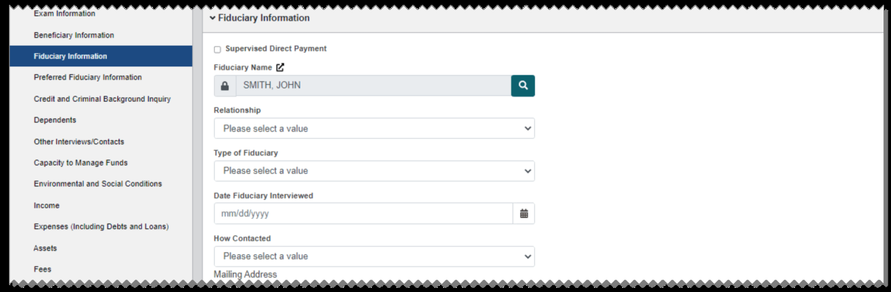
*Screenshot — page 86, figure 1 of 2 (1299×427 px)*

<details>
<summary>Screenshot text content (visible UI elements, labels, and data)</summary>

```
ae ¥ Fiduciary Information
Beneficiary Information
Supervised Direct Payment
Fiduciary Information
Fiduciary Name %
Preferred Fiduciary Information
@ == SMITH, JOHN 8g
Credit ane Criminal Background Inquiry
Relationship
Dependents
Please select a value
Other Interviews/Contacts
Type of Fiduciary
‘Capacity to Manage Funds
Please select a value v
Environmental ang Social Conditions
Date Fiduciary Interviewed
Income
uniddiyy &
Expenses (Including Debts and Loans)
How Contacted
Assets
Please select a value v
re
ees Mailing Address
```

</details>

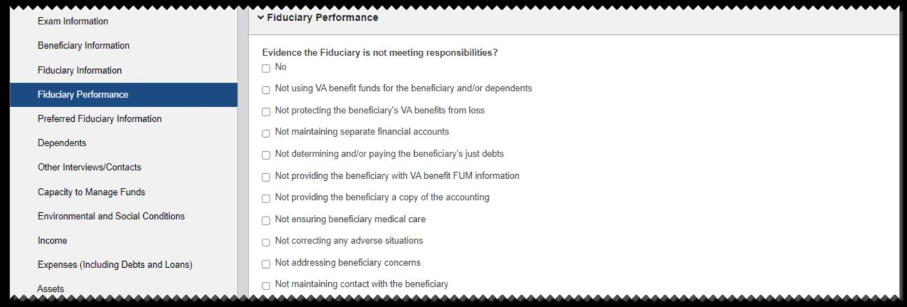
*Screenshot — page 86, figure 2 of 2 (1299×441 px)*

<details>
<summary>Screenshot text content (visible UI elements, labels, and data)</summary>

```
orem v Fiduciary Performance
Beneficiary Information
Y Evidence the Fiduciary is not meeting responsibilities?
Fiduciary Information No
Not using VA benefit funds for the beneficiary andlor dependents
Ra RES ing VA benefit funds for the beneficiary andlor depend
Not protecting the beneficiary's VA benefits from loss
Preferred Fiduciary Information
Not maintaining separate financial accounts
Dependents
Not determining andior paying the beneficiary's just debts
Other Interviews/Contacts
Not providing the beneficiary with VA benefit FUM information
eo Not providing the beneficiary a copy of the accounting
Environmental and Social Conditions Not ensuring beneficiary medical care
Income Not correcting any adverse situations
Expenses (Including Debts and Loans) Not addressing beneficiary concems
pm Not maintaining contact with the beneficiary
```

</details>

#### Preferred Fiduciary Information

From this section, you can enter the beneficiary's fiduciary preference information. If you select No for Does the beneficiary have the capacity to state their fiduciary preference, you must enter a reason why the fiduciary preference was not indicated.

#### Credit and Criminal Background Inquiry

This section includes questions on credit information review and criminal background check.

If you select Yes for Was credit information reviewed for the proposed fiduciaries, enter a name in the Name of Proposed Fiduciary field.

If you select Credit report contained negative information from the Credit Results field, the Additional Comments Credit Review field is shown.

If you select Yes for Criminal background check completed, select the check box for the bars to service that were identified. Then select Low, Moderate, or High from the

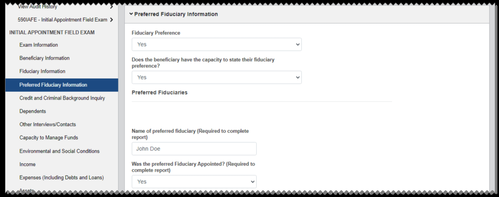
*Screenshot — page 87, figure 1 of 2 (1299×514 px)*

<details>
<summary>Screenshot text content (visible UI elements, labels, and data)</summary>

```
ew Audit Fiisto
¥ Preferred Fiduciary Information
S9OIAFE - Initial Appointment Field Exam >
INITIAL APPOINTMENT FIELD EXAM Fiduciary Preference
Exam Information Yes v
Beneficiary Information Does the beneficiary have the capacity to state their fiduciary
preference?
Fiduciary Information
Yes v
Preferred Fiduciary Information
Preferred Fiduciaries
Credit and Criminal Background Inquiry
Dependents
Other Interviews/Contacts
Name of preferred fiduciary (Required to complete
Capacity to Manage Funds report)
Environmental and Social Conditions John Doe
Income Was the preferred Fiduciary Appointed? (Required to
‘complete report)
Expenses (Including Debts and Loans) Ves
```

</details>

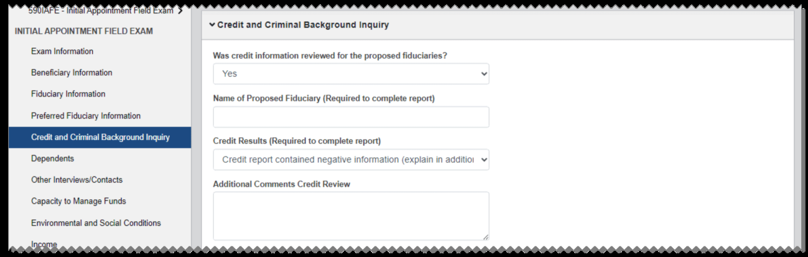
*Screenshot — page 87, figure 2 of 2 (1299×415 px)*

<details>
<summary>Screenshot text content (visible UI elements, labels, and data)</summary>

```
SUINFE inital Rppointment Frets Exam
INTIAL APPONVTMENT FELD ExAN ¥ Credit and Criminal Background Inquiry
Exam Information Was credit information reviewed for the proposed fiduciaries?
Beneficiary Information Yes
Fiduciary Information Name of Proposed Fiduciary (Required to complete report)
Preferred Fiduciary Information
Credit and Criminal Background Inquiry Credit Results (Required to complete report)
Dependents Credit report contained negative information (explain in additio. v
CDA TEED Additional Comments Credit Review
‘Capacity to Manage Funds
Environmental and Social Conditions
Ue
```

</details>

Calculated Risk Result field. The Additional Comments Criminal Background Investigation field is shown.

If Supervised Direct Payment is selected in the Fiduciary Information section, the questions in this section are auto-populated as N/A.

#### Dependents

This section lists dependents and allows you to confirm each one and answer additional questions about them. The read-only Is on award check box will be selected for each dependent on the award.

For Are there additional dependents not listed above, select Yes to enter information for an additional dependent. If there are already dependents listed in the report, a message is shown alerting the user to not duplicate the information. Select OK to continue.

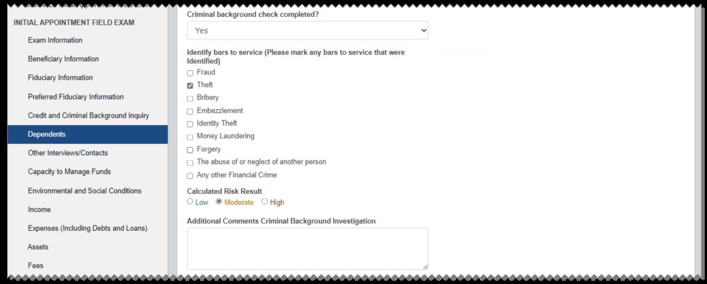
*Screenshot — page 88, figure 1 of 2 (1299×523 px)*

<details>
<summary>Screenshot text content (visible UI elements, labels, and data)</summary>

```
Criminal background check completed?
INITIAL APPOINTMENT FIELD EXAM
Yes ¥
Exam Information
Identify bars to service (Please mark any bars to service that were
Beneficiary Information Identified)
Fraud
Fiduciary Information ‘a
Theft
Preferred Fiduciary Information Bribery
a . Embezzik it
Credit and Criminal Background Inquiry mbezziemen
Identity Theft
Dependents Money Laundering
Other Interviews/Contacts O Forgery
‘The abuse of or neglect of another person
Capacity to Manage Funds Any other Financial Crime
Environmental and Social Conditions Calculated Risk Result
Low Moderate O High
Income
Additional Comments Criminal Background Investigation
Expenses (Including Debts and Loans)
Assets
Fees
```

</details>

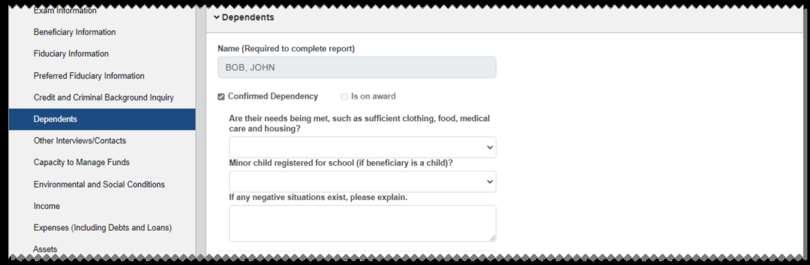
*Screenshot — page 88, figure 2 of 2 (1299×427 px)*

<details>
<summary>Screenshot text content (visible UI elements, labels, and data)</summary>

```
formate
¥ Dependents
Beneficiary Information
Fiduclery information Name (Required to complete report)
BOB, JOHN
Preferred Fiduciary Information
Credit and Criminal Background Inquiry Confirmed Dependency Is on award
Dependents Are their needs being met, such as sufficient clothing, food, medical
care and housing?
Other Interviews/Contacts
Capacity to Manage Funds Minor child registered for school (if beneficiary is a child)?
Environmental and Social Conditions a
Hf any negative situations exist, please explain.
Income
Expenses (Including Debts and Loans)
Assets
```

</details>

Enter the required information and any additional information, as needed.

Repeat if you need to add more dependents.

#### Other Interviews/Contacts

From this section, you can enter any additional interviews or contacts that were completed. To add an interview or contact, select Add Interview/Contact. You can also select the delete icon to remove an interview or contact.


*Screenshot — page 89, figure 1 of 2 (1299×233 px)*

<details>
<summary>Screenshot text content (visible UI elements, labels, and data)</summary>

```
Duplicate Warning
Reminder! There are dependents already listed in the report, please do not duplicate the information.
```

</details>

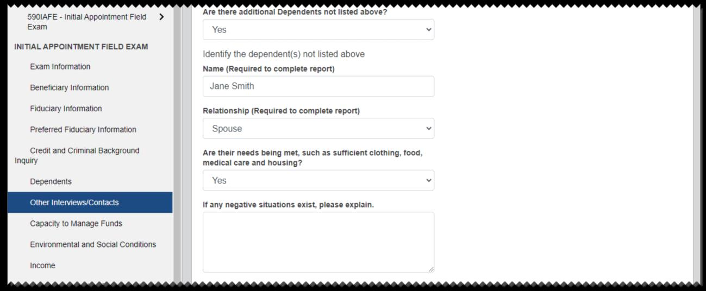
*Screenshot — page 89, figure 2 of 2 (1299×536 px)*

<details>
<summary>Screenshot text content (visible UI elements, labels, and data)</summary>

```
f ?
S9OIAFE -Inliat Appointment Field > Are there additional Dependents not listed above
Exam Yes v
INITIAL APPOINTMENT FIELD EXAM
Identify the dependent(s) not listed above
Exam Information Name (Required to complete report)
Beneficiary Information Jane Smith
Fiduciary Information Relationship (Required to complete report)
Preferred Fiduciary Information Spouse .
Credit and Criminal Background Are their needs being met, such as sufficient clothing, food,
Inquiry medical care and housing?
Dependents Yes
Other Interviews/Contacts if any negative situations exist, please explain.
Capacity to Manage Funds
Environmental and Social Conditions
Income
```

</details>

#### Capacity to Manage Funds

This section includes questions on the beneficiary's capacity to manage funds.

#### Environmental and Social Conditions

This section includes questions on the beneficiary's environmental and social conditions.

If you select Licensed for If beneficiary resides in a facility, please indicate licensing status, additional fields are shown.

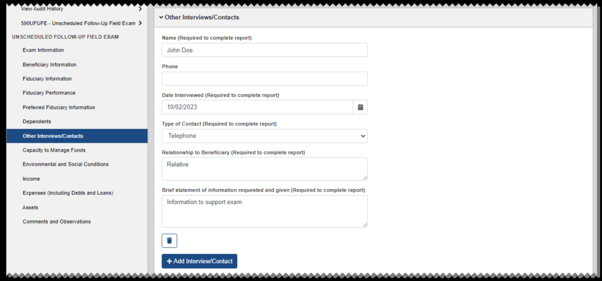
*Screenshot — page 90, figure 1 of 2 (1299×607 px)*

<details>
<summary>Screenshot text content (visible UI elements, labels, and data)</summary>

```
few Audit History >
¥ Other Interviews/Contacts
S90UFUFE - Unscheduled Follow-Up Field Exam >
UNSCHEDULED FOLLOW-UP FIELD EXAM Name (Required to complete report)
Exam Information John Doe
Beneficiary Information Phone
Fiduciary Information
Fiduciary Performance Date Interviewed (Required to complete report)
Preferred Fiduciary Information 10/02/2023 é
te Type of Contact (Required to complete report)
Other Interviews/Contacts Telephone
So Relationship to Beneficiary (Required to complete report)
Environmental and Social Conditions Relative
Income
Eee) Brief statement of information requested and given (Required to complete report)
Information to support exam
Assets
‘Comments and Observations
[)
+ Add Interview/Contact
```

</details>

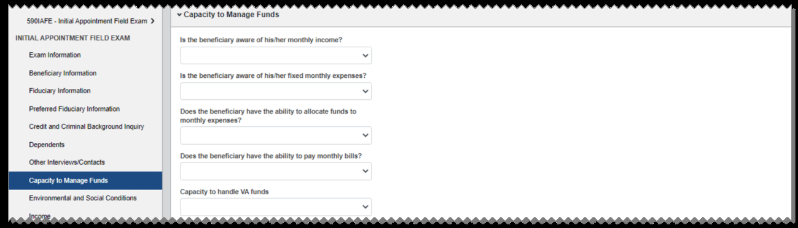
*Screenshot — page 90, figure 2 of 2 (1299×372 px)*

<details>
<summary>Screenshot text content (visible UI elements, labels, and data)</summary>

```
¥ Capacity to Manage Funds
SQOIAFE - Iniial Appointment Fis Exam > J a
INITIAL APPOINTMENT FIELD EXAM ts the beneficiary aware of hiather monthly income?
Exam Information v
Beneficiary Information ts the beneniciary aware of hisher fixed month expenses?
Fiduciary Information v
Preferres Fouciary Information ‘Does the beneficiary have the ability to allocate funds to
monthly expenses?
‘creat and Criminal Background inquiry
Dependents
Does the beneficiary have the ability to pay monthly bis?
‘ther nteviews/Contacts
Capacity to Manage Funds
Capacity to handle VA funds
Environmental and Social Conditions
bony
```

</details>

For other questions, if you answer Yes, additional fields are shown.

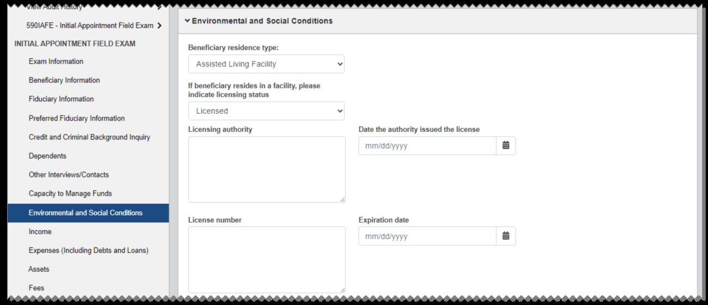
*Screenshot — page 91, figure 1 of 2 (1299×560 px)*

<details>
<summary>Screenshot text content (visible UI elements, labels, and data)</summary>

```
SOOIAFE-Intal Appointment Field Exam > Y Efvironmental and Social Conditions
INITIAL APPOINTMENT FIELD EXAM Beneficiary residence type:
Exam Information Assisted Living Facility J
Beneficiary Informati
enencrary Emormenon If beneficiary resides in a facility, please
Pane indicate licensing status
Licensed J
Preferred Fiduciary Information
Licensing authority Date the authority issued the license
Credit and Criminal Background Inquiry —
mmiddiyyyy &
Dependents
Other Interviews/Contacts
Capacity to Manage Funds
Environmental and Social Conditions
License number Expiration date
Income .
mmvddiyyyy a
Expenses (Including Debts and Loans)
Assets
Fees
```

</details>

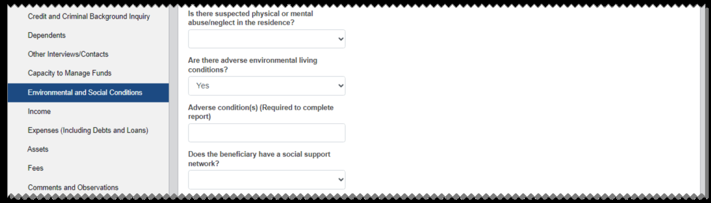
*Screenshot — page 91, figure 2 of 2 (1299×372 px)*

<details>
<summary>Screenshot text content (visible UI elements, labels, and data)</summary>

```
Credit and Criminal Background Inquiry Is there suspected physical or mental
abuse/neglect in the residence?
Dependents 7
Other interviews/Contacts ; 7
Are there adverse environmental living
Capacity to Manage Funds conditions?
Yes ’
Environmental and Social Conditions
= Adverse condition(s) (Required to complete
report)
Expenses (Including Debts and Loans)
—— Does the beneficiary have a social support
Fees network?
Comments and Observations
```

</details>

#### Income

This section includes rows for the beneficiary's sources of income. VA, VA Other, and Social Security Gross/Net Amount Received are shown at first. To edit the information in any income row, select Edit. To add a row for Other income, select Add Other Income. You can also select Delete ro remove a row for Other income. Subtotals are shown for Amount and Dependent's Amount, and the Grand Total shows the sum of the subtotals.

#### Expenses (Including Debts and Loans)

From this section, you can enter the beneficiary's expenses. To add another row, select

#### Add Expense. To delete an additional row, select the delete icon. The total of all expenses

is shown at the bottom of the list.

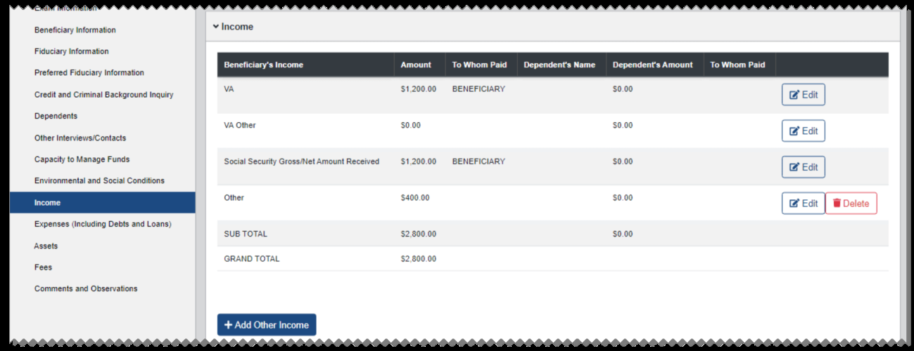
*Screenshot — page 92, figure 1 of 2 (1299×500 px)*

<details>
<summary>Screenshot text content (visible UI elements, labels, and data)</summary>

```
Beneficiary Information v Income
ucla nfermation
emaclarys income ‘Amount ToWhom Paid Dependents Name Dependents Amount To Whom Paid
Pretred Fideiary infomation
A x NEFICIARY
Creat and Criminal Background inuity v Baan sm edt
Dependents
VA other $000 $0.00
[ wrest |
(ther nteriws'Contacts ——
Capacity to Manage Funds: ‘Social Security Gross/Net Amount Received $1,200.00 BENEFICIARY 30.00 Edit
Enveonmental and Socal Conditions —
omer 00.00 500
Income “ ° (rest | woatce |
Expenses (Including Debs and Loans)
SUB TOTAL $2800.00 $0.00
om
GRAND TOTAL $2800.00
Foes
Comments and Obeervatons
‘+ Add Other income
```

</details>

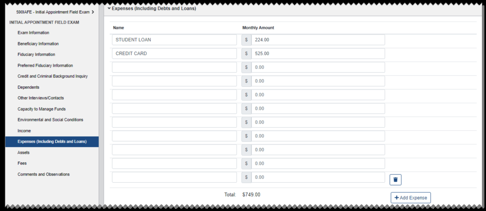
*Screenshot — page 92, figure 2 of 2 (1299×565 px)*

<details>
<summary>Screenshot text content (visible UI elements, labels, and data)</summary>

```
Expenses (Including Debts and Loans)
SOLAFE - Intial Appointment Field Exam >
INTIAL APPOINTMENT FIELD EXAM
Name Monthly Amount
Exam information
STUDENT LOAN $ | 224.00
Benefcary Information
Fiduciary information CREDIT CARD $ | 525.00
Preferred Fiduciary Information io
(Cred and Criminal Background Inquiry
slo
Dependents
‘other intervews/Contacts s|o
‘Capacity to Manage Funds s\o
EEmorenmental and Secial Conasbons lo
Income
Expenses (Incuding Debts and Loans)
Assets §|°
Fees s|o.
‘Comments and Observations To fa]
Total: $749.00 Py ay
```

</details>

#### Assets

From this section, you can enter the beneficiary's assets. Totals are shown for Assets Fully Derived, Assets Partially Derived, and Assets Not Derived. A Last Updated On date is shown for each total, based on the most recent Balance Date for an asset in the category.

To add an asset, select Add Asset. Then from the dialog, enter the asset information and select OK.

To edit an asset, select Edit. Then from the dialog, edit information as needed and select

#### OK. To delete an asset, select Delete.

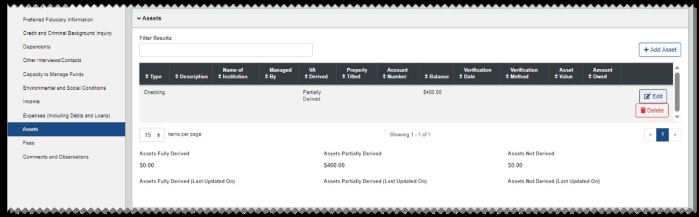
*Screenshot — page 93, figure 1 of 2 (1299×404 px)*

<details>
<summary>Screenshot text content (visible UI elements, labels, and data)</summary>

```
Peters FissryIntrmaton wv Assets
Crest and Crimi! Background ng
vs af Filter Results:
Devendents [+ AcaAsset ]
Coe nerves. Contets
Mame of Managed VA Propetly Account Verfeston _Werifeation Asset Amount -
Capesty to Menage Funds ¢ Type ‘$Description ¢ Institution By Derived Titled = Number $ Balance ¢ Date + Method 2 Value Owed
Envtonmental and Social Condons ee = =
. Deed “ West
Woeiete |
Expenses (netng Debts a Loa { e
15 ¢ | temsperpage Showing 1-1 oft | + |
scommants and Obsenatons Assets Fully Derived Assets Partly Deve Assets Not Derived
$0.00 400.00 $0.00
Assets Fully Derived (Last Updated On) Assets Partly Derived (Last Updated On) ‘Assets Not Derived (Last Updated On
```

</details>

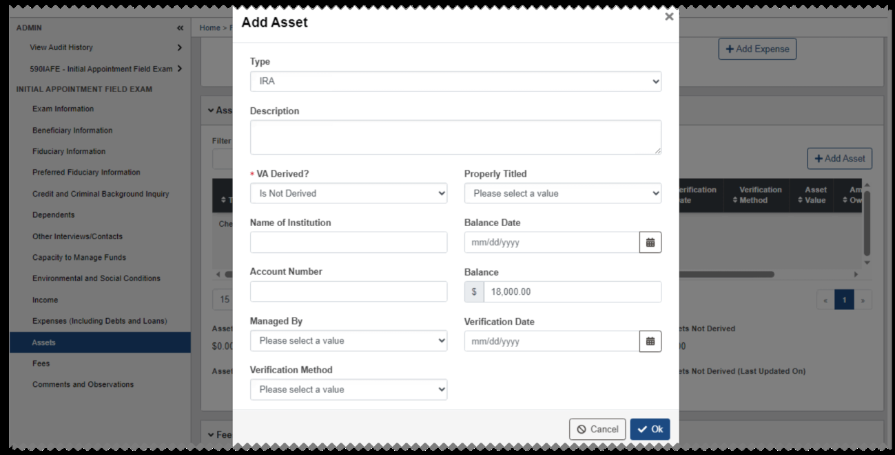
*Screenshot — page 93, figure 2 of 2 (1299×662 px)*

<details>
<summary>Screenshot text content (visible UI elements, labels, and data)</summary>

```
Add Asset
Type
IRA v
Description
VA Derived? Properly Titled
Is Not Derived |_| Please select a value
Name of Institution Balance Date
Account Number Balance
$ | 18,000.00
Managed By Verification Date
Please select a value ’ mmvddiyyyy &
Verification Method
Please select a value v
[oem]
```

</details>

#### Fees

This section includes questions about the recommended fiduciary percentage fee, if any.

#### Comments and Observations

From this section, you can enter additional comments and observations.

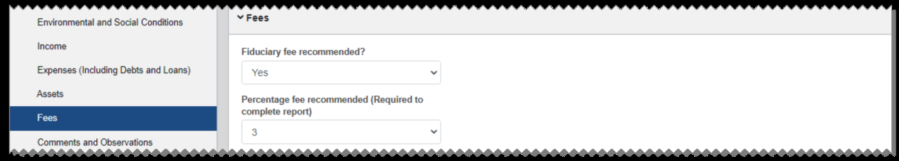
*Screenshot — page 94, figure 1 of 2 (1299×235 px)*

<details>
<summary>Screenshot text content (visible UI elements, labels, and data)</summary>

```
Environmental and Social Conditions ECS
income Fiduciary fee recommended?
Expenses (Including Debts and Loans) yes ¥
KE Percentage fee recommended (Required to
Fees complete report)
Comments and Observations
```

</details>

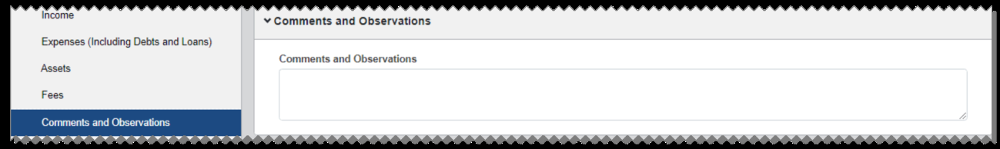
*Screenshot — page 94, figure 2 of 2 (1299×194 px)*

<details>
<summary>Screenshot text content (visible UI elements, labels, and data)</summary>

```
oT ¥ Comments and Observations
Expenses (Including Debts and Loans)
Comments and Observations
Assets
Fees
Comments and Observations
```

</details>

---

*[← Back to README](./README.md)*