# Misuse Records

From the Misuse Records page, you can view and edit the misuse record information. You can access this page by selecting the link on the EP Overview page for an EP290 FID- Misuse claim. You can also select View Record in the Misuse Records section of the beneficiary profile or the fiduciary profile.

The navigation bar above the main area of the page includes breadcrumb links to the home page.

The left pane includes links to each section of the misuse record. To view the history of changes, select View Audit History in the Admin section of the left pane. See Audit History for more information.

The button bar at the bottom of the page includes Cancel and Save buttons.

You can also establish an EP930 misuse or negligence determination claim from the Misuse Record for a closed or cancelled EP290 FID Misuse claim. Select +EP930-REV

#### Misuse or +EP930-REV Negligence Determination, depending on the type of EP930

claim you want to establish. See Establishing EP930 FID-Rev Claims for more information.

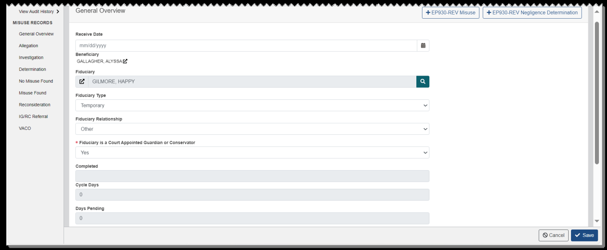
*Screenshot — page 95 (1299×536 px)*

### Negligence Determinations

If misuse is found and a negligence determination is required, you can establish an EP290 FID-Negligence Determination claim by selecting Yes for Negligence Determ Required in the VACO section. If the misuse record does not meet all criteria required to establish this type of claim, a message is shown to indicate the reason. You can also establish an EP290 FID-Negligence Determination claim from the EP Overview page for an EP290 FID-Misuse claim. See EP Overview for more information.

The following selections in the misuse record relate to establishing EP290 FID- Negligence Determination claims:

•

#### Determination: Dates must be entered for Determination Complete, Date

Determination Signed by Approval Authority, and Determination Sent. The sent date is used to calculate the Date of Claim for the EP290 FID-Negligence Determination claim and must be greater than 30 days in the past. •

#### No Misuse Found: This section must not include any information. Negligence

determinations are only needed when misuse is found. •

#### Misuse Found: Misuse Found must have one of the Yes selections. Amount of

Misuse VA Funds must be greater than $0. Automatic Reissuance Required must not have Yes selected. •

#### VACO: Selecting Yes for Negligence Determ Required will establish an EP290 FID-

Negligence Determination claim.

You may need to make additional selections in the misuse record to advance the EP290 FID-Negligence Determination claim through the workflow on the EP Overview page. If an action requires information to be entered in the misuse record, a message is shown to indicate the reason. The EP Overview page includes a link to the Misuse Records page so that you can make changes.

It is possible to establish an additional EP290 FID-Negligence Determination claim if all previous EP290 FID-Negligence Determination claims associated with the misuse record have been closed or cancelled.

### Processing Misuse Records

The Misuse Records page opens to the General Overview section at first, and includes the following sections.

#### General Overview

This section shows the Received Date and other basic information for the misuse record, including links to the associated beneficiary profile and fiduciary profile. Received Date is populated from the EP290 FID-Misuse Date of Claim, but you can edit it if needed.

You can select the search icon to search for a fiduciary. From the search results, you can choose an active fiduciary and select Accept to associate the fiduciary to the misuse record.

Choose Yes or No in the Fiduciary is a Court Appointed Guardian or Conservator required field.

Several read-only fields are populated from the EP290 FID-Misuse claim or the associated beneficiary:

• Completed shows the date when the claim is cleared. • Cycle Days shows the number of days the claim has had the current suspense reason. • Days Pending shows the number of days the claim has been pending. • Veteran File Number is populated from the Veteran associated with the beneficiary. • Territory and Hub are populated based on the physical address of the associated beneficiary.

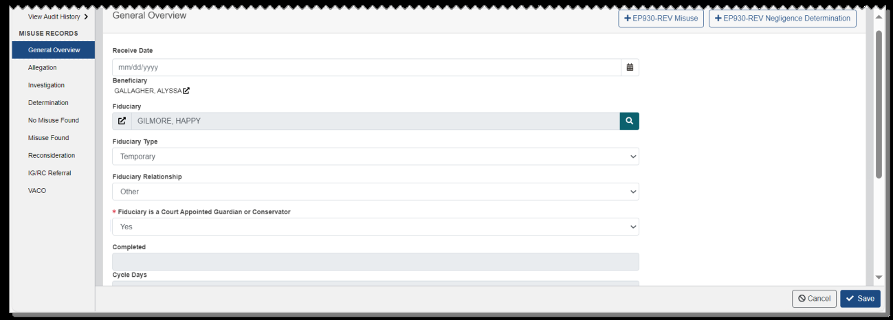
*Screenshot — page 97 (1299×466 px)*

#### Allegation

This section shows the allegation details and information on the associated fiduciary. Allegation Date is populated from the EP290 FID-Misuse Date of Claim, but you can edit it if needed.

You can also generate and manage VA-Form 21-3537a - Report of Field Examination from this section.

To generate the VA Form 21-3537a, select Add VA-Form 21-3537a. From the dialog, enter the date and text you wish to appear in the report in the Facts to be Established field, and select Save VA-Form 21-3537a.

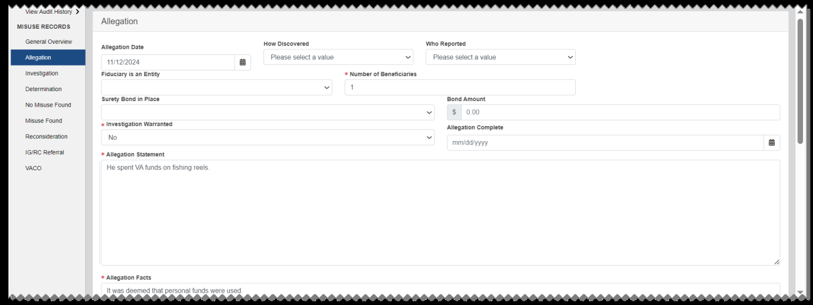
*Screenshot — page 98, figure 1 of 2 (1299×489 px)*

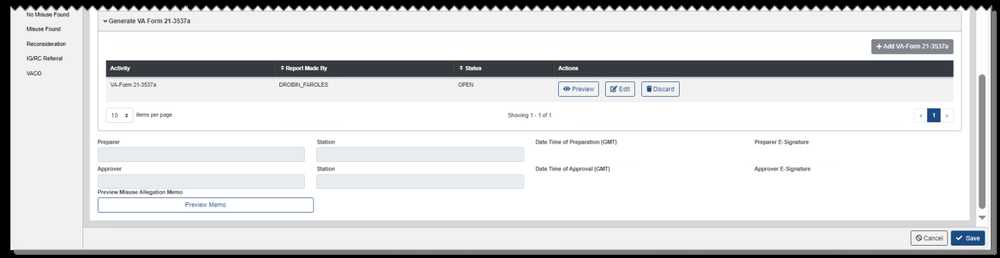
*Screenshot — page 98, figure 2 of 2 (1299×336 px)*

Once you have generated the report, the form is listed in the table. The Add VA-Form 21- 3537a button becomes inactive because only one form can be in an open status at a time.

The Actions column includes buttons to Preview, Edit, and Discard the form. These buttons are only available to the user assigned to the EP who generated the report.

To delete the report, select Discard. From the dialog, select Discard. The report is removed from the table. To edit the report, select Edit. From the dialog, edit the Facts to be Established field and select Save VA-Form 21-3537a.

To preview and finalize the report, select Preview. From the dialog, you can review the report and select Generate Letter. The report is placed in a Completed status. To view the report, select View.

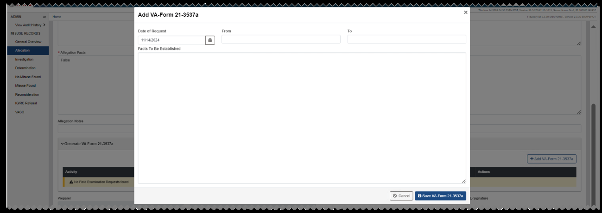
*Screenshot — page 99 (1299×461 px)*

#### Investigation

This section shows the dates when the investigation was established and when it was completed. You can also generate and manage VA-Form 21-3537b - Report of Field Examination from this section. See Generate VA Form 21-3537b for more information.

#### Determination

This section shows dates, evidence, and signatures associated with the determination.

Preparers, reviewers, and approvers can electronically sign the Misuse Determination Memo, add and view associated evidence, and preview the memo. See Misuse Determination and Allegation Memos for more information.

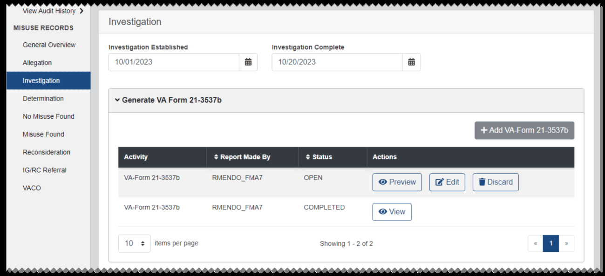
*Screenshot — page 100, figure 1 of 2 (1299×593 px)*

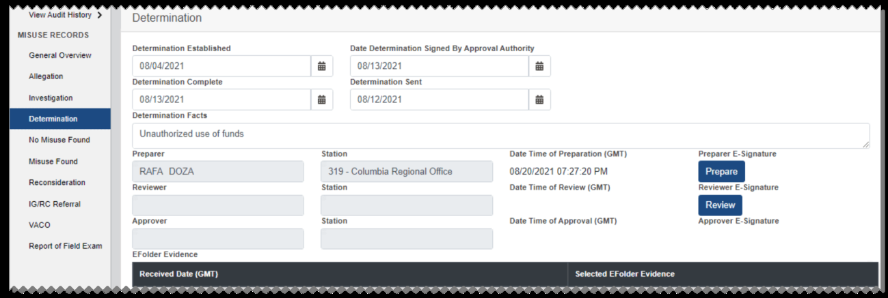
*Screenshot — page 100, figure 2 of 2 (1299×437 px)*

#### No Misuse Found

This section shows notes and the date for No Misuse Found.

#### Misuse Found

This section shows the Misuse Found details. Required fields may vary based on the Misuse Found selection. Additionally, if you select Yes (Revised Debt Amount), the required Date Revised field and the optional VACO Concur field are shown.

To indicate Reissuance Completed for an EP290 FID-Negligence Determination claim, a value must be entered for BD Number (Finance).

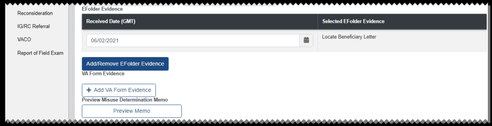
*Screenshot — page 101, figure 1 of 3 (1299×334 px)*

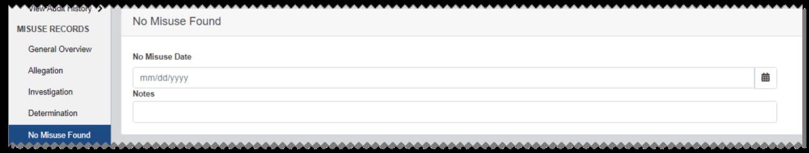
*Screenshot — page 101, figure 2 of 3 (1299×246 px)*

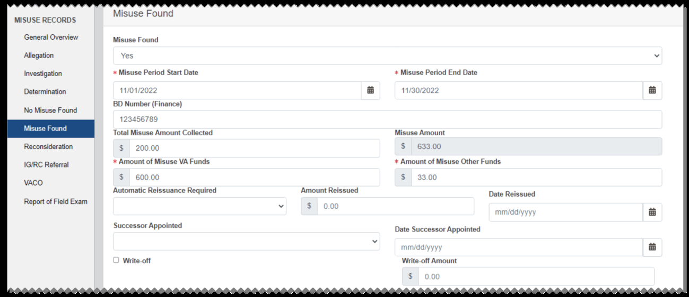
*Screenshot — page 101, figure 3 of 3 (1299×562 px)*

#### Reconsideration

This section shows the dates when the reconsideration was established and when it was completed. Preparers, reviewers, and approvers can electronically sign the Misuse Determination Reconsideration Memo, add and view associated evidence, and preview the memo. See Misuse Determination and Allegation Memos for more information.

#### IG/RC Referral

This section shows dates and other information associated with the Inspector General (IG) or Regional Counsel (RC) referral.

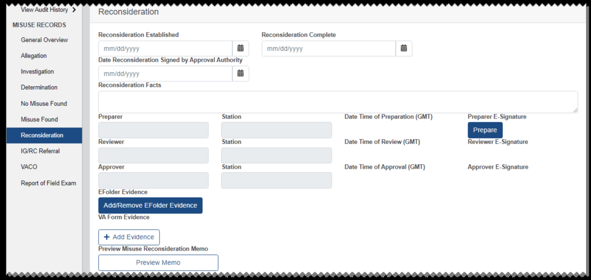
*Screenshot — page 102, figure 1 of 2 (1299×617 px)*

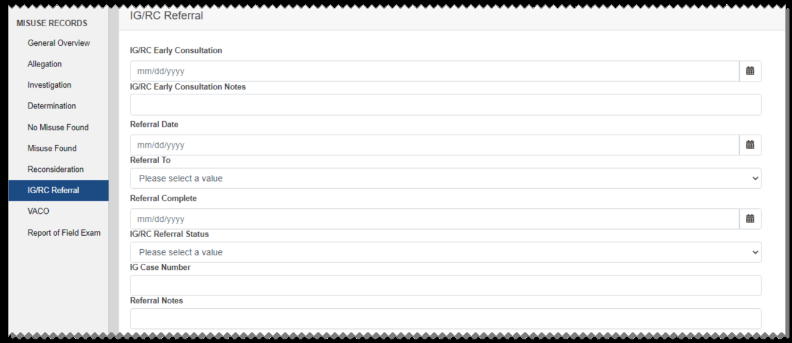
*Screenshot — page 102, figure 2 of 2 (1299×563 px)*

#### VACO

This section shows dates and other information associated with the negligence determination and Additional Action Memo (AAM). You can select Yes for Negligence Determ Required to establish an EP290 FID-Negligence Determination claim. See Negligence Determinations for more information.

To indicate Reissuance Required for an EP290 FID-Negligence Determination claim, Yes must be selected for Negligence Determined. and a date must be entered for Date of Negligence Determination. Likewise, No must be selected to allow indicating Reissuance Not Required.

If you enter an AAM Requested date, the AAM Due field is populated with the request date plus 15 days. ZIP Code is populated based on the beneficiary's physical address, but you can edit it if needed.

#### Report of Field Exam

From this section, you can generate and manage VA-Form 21-3537b - Report of Field Examination.

To generate the Report of Field Exam, select Add VA-Form 21-3537b. The Purpose field is pre-populated with the contents of the Allegation Statement from the Allegation section. Enter any additional text you wish to appear in the report in the Purpose field, and select Save VA-Form 21-3537b.

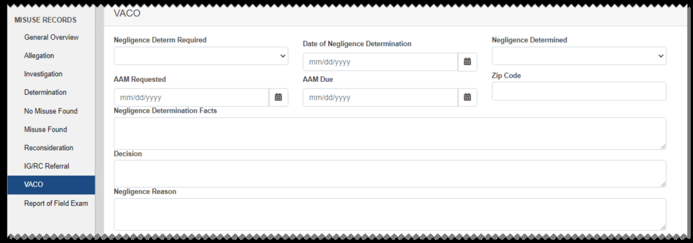
*Screenshot — page 103, figure 1 of 2 (1299×456 px)*

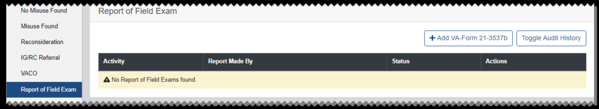
*Screenshot — page 103, figure 2 of 2 (1299×238 px)*

You can generate and manage the Report of Field Exam using the same processes as you would from the EP Overview page of some EP590s and EP930s. See Generate VA Form 21-3537b for more information.

### Misuse Determination and Misuse Allegation Memos

The Misuse Determination Memo, the Misuse Determination Reconsideration Memo, and the Misuse Allegation Memo are documents of record for the misuse investigation associated with an EP290 FID-Misuse or EP290 FID-Negligence Determination claim.

Before preparing the memo, users are required to enter data into the following sections of the misuse record:

•

#### General Overview: Yes or No must be selected for Fiduciary is a Court

Appointment Guardian or Conservator. •

#### Allegation: A number must be entered for Number of Beneficiaries. Notes must be

entered into the Allegation Statement free text field. •

#### Determination: Information must be entered into the Determination Facts field.

At least one form of evidence and an Approver signature must be added before the memo can be generated. •

#### Misuse Found: A value must be selected from the Misuse Found list. Dates must be

entered for Misuse Period Start Date and Misuse Period End Date. •

#### Reconsideration: (required for the Misuse Determination Reconsideration Memo

only) Information must be entered into the Reconsideration Facts field. At least one form of evidence and an Approver signature must be added before the memo can be generated.

#### Preparing the Memo

This section describes the process for preparing the Misuse Determination Memo from the Determination section of the misuse record. Preparing the Misuse Determination Reconsideration Memo is similar, but from the Reconsideration section. Preparing the Misuse Allegation Memo is similar, but from the Allegation section.

If data is required for an action, such as adding a signature, a message opens to indicate the data that must be entered before you can proceed.

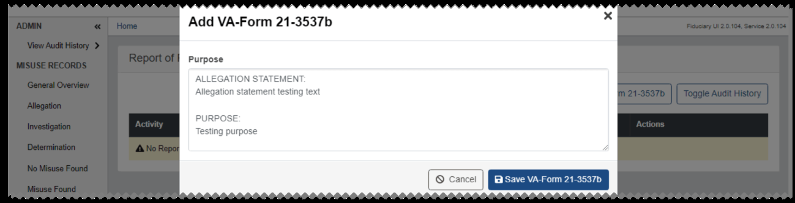
*Screenshot — page 104 (1299×333 px)*

To add evidence, select Add/Remove EFolder Evidence or + Add VA Form Evidence. Then from the dialog, select the evidence to be included in the memo. The added evidence will be listed under EFolder Evidence or VA Form Evidence. Select Save.

Depending on your role, select the Prepare, Review, or Approve button to electronically sign the memo.

Select Save to ensure that your signature is saved to the misuse record.

Select Preview Memo to view a preview of the memo.

After signatures have been added, if you attempt to save the misuse record after editing any data required for the memo, a dialog opens stating that saving will clear the signatures.

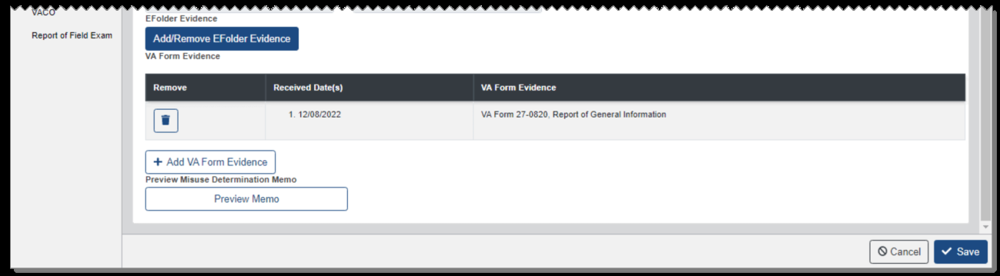
*Screenshot — page 105, figure 1 of 2 (1299×359 px)*

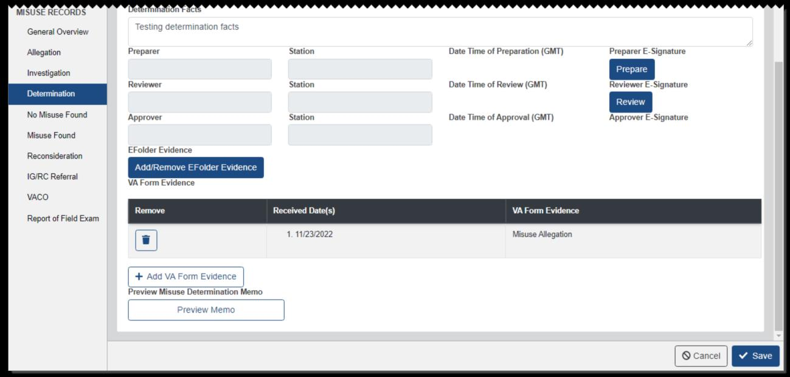
*Screenshot — page 105, figure 2 of 2 (1299×620 px)*

#### Reviewing and Approving the Memo

This section describes the process for reviewing and approving the Misuse Determination Memo. Reviewing and approving the Misuse Determination Reconsideration Memo and the Misuse Allegation Memo is similar, but button names and suspense reasons on the EP Overview page are specific to Reconsideration, and evidence and signatures will be added to the Reconsideration section of the misuse record.

For all review and approval actions, the claim associated to the memo must be assigned to you.

If you signed the memo as the preparer, you can select Misuse Determination Ready to

#### Review from the EP Overview page. This button is available for the following EPs and

suspense reasons:

• EP290 FID-Misuse: Investigation Complete for a Misuse Determination Memo, or Reconsideration Received for a Misuse Determination Reconsideration Memo • EP290 FID-Negligence Determination: In Development

From the dialog, you can edit the suspense date or accept the default. The suspense reason updates to Determination Pending Concur.

If you signed the memo as a reviewer, you can approve the memo, disapprove it, or submit it for Fiduciary Hub Manager concurrence.

To approve the memo, select Approve Misuse Determination Memo. The suspense reason updates to Determination Signed.

To disapprove the memo, select Disapprove Misuse Determination Memo and enter a reason for disapproval. The suspense reason updates to Returned by Other User and the claim is returned to the preparer of the memo for corrections.

To submit the memo for Fiduciary Hub Manager concurrence, select Misuse

#### Determination Memo is Ready for Approval. The suspense reason updates to

Determination Pending Concur HUBMGR.

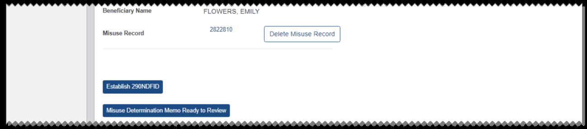
*Screenshot — page 106 (1299×287 px)*

From this suspense reason, users with permissions who signed the memo as an approver can select Approve Misuse Determination Memo. The suspense reason updates to Determination Signed.

#### Generating the Memo

From the Correspondence section of the EP Overview page, select Misuse Determination Memo or Misuse Determination Reconsideration Memo from the list and select Generate

#### Letter.

A preview of the memo is shown. Select Generate Letter. A message is shown indicating that the memo has been successfully generated and uploaded to the eFolder.

*Screenshot — page 107 (1299×199 px)*

---

*[← Back to README](./README.md)*