# Accounting Audit Tools

From the Accounting Audit Tools page, you can view detailed information on an accounting audit tool. You can access this page by selecting the link on the EP Overview page for an EP290 FID-Accounting Court or FID-Accounting Federal claim. You can also select View in the Accounting Audit Tools list on the home page, or the Accounting Audit Tools section of the beneficiary profile.

The navigation bar above the main area of the page includes breadcrumb links to the home page.

The left pane includes links to each section, with the current section name highlighted as you scroll up or down. To view the history of changes, select View Audit History in the Admin section of the left pane. See Audit History for more information. To view the EP associated with the accounting audit tool, select the link to the EP in the Admin section. See EP Overview for more information.

The button bar at the bottom of the page includes Download Excel, Cancel, Inactivate, and Save Accounting Audit buttons. Other buttons may be shown based on the selections in the Approval section.

To download the audit tool data as a CSV file, select Download Excel.

To update the accounting audit tool to Inactive status and remove the link to it on the EP Overview page, select Inactivate. Users will be able to view a read-only version of

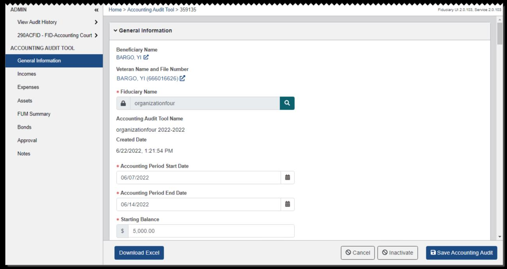
*Screenshot — page 108 (1299×690 px)*

inactive accounting audit tools from the Accounting Audit Tools tab on the Beneficiary Profile page, and from the Accounting Audit Tools tab on the Home page.

### Creating Accounting Audit Tools

You can create an accounting audit tool from the EP Overview page for an EP290 FID- Accounting Court or FID-Accounting Federal claim that is assigned to you by selecting

#### Create Accounting Audit Tool.

To begin from a copy of another accounting audit tool associated with the beneficiary, select the Copy Accounting Audit option from the dialog. Then select an accounting audit tool from the list. For this option, data from the Approval section will not be included in the new copy.

To begin from a completely new accounting audit tool, select the Create Accounting

#### Audit option. Enter the start date, end date, and starting balance. If you enter a negative

starting balance amount, a justification is required.

For either option, select Submit. Select the link to open the Accounting Audit Tools page.

### Processing Accounting Audit Tools

It is recommended to complete an accounting audit tool in order from beginning to end, because many fields involve calculations using the values entered in previous fields. Skipping a field may cause the calculations in later fields to be inaccurate.

The Accounting Audit Tools page opens to the General Information section at first, and includes the following sections.

#### General Information

This section lists the details of the accounting audit tool, including the beneficiary and a link to their Veteran Profile or Person Profile page; the associated Veteran, their File Number, and a link to their Veteran Profile page; the fiduciary; and the accounting audit tool name and created date. The accounting audit tool name is comprised of the fiduciary name, start date year, and end date year.

You can select the search icon to search for a fiduciary. From the search results, you can choose an active fiduciary and select Accept to associate the fiduciary to the accounting audit tool.

The Accounting Period Start Date, Accounting Period End Date, and Starting Balance are required. If the fiduciary is a successor, you can enter the VA FUM Transferred from Previous Fiduciary and Other FUM Transferred from Previous Fiduciary amounts. Total Funds shows the total of these amounts.

#### Incomes

From this section, you can enter the beneficiary's sources of income for the accounting period. To filter the list, enter a keyword in Filter Results.

Two VA rows and two Social Security (SS) rows are shown at first and cannot be deleted. To edit the information in any income row, select Edit. For these income types, the number of months is multiplied by the amount to calculate the total. For income types other than VA and SS, N/A is shown in the Month column, indicating that these are one- time amounts. You can select Delete to remove an income type other than VA or SS.

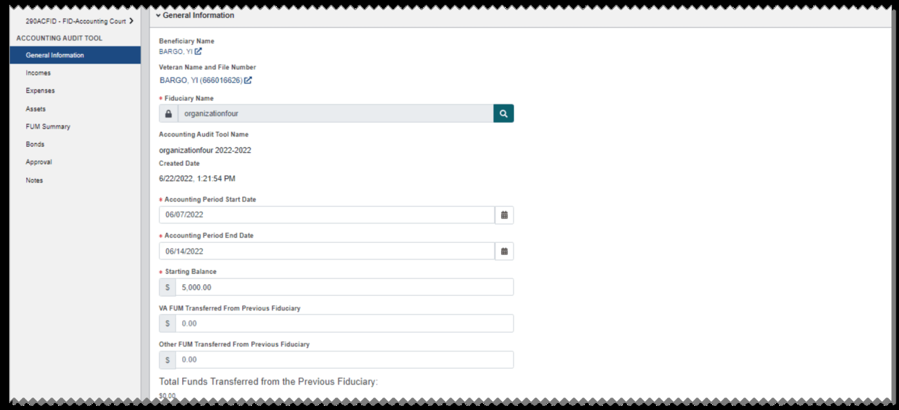
*Screenshot — page 111 (1299×593 px)*

Totals for the accounting period are shown for VA, Social Security, and Other Income. Total Income This Period shows the sum of these amounts. Total Income + Starting Balance shows the sum of the total income for the accounting period plus the starting balance.

To add a row, select Add Income. Then from the dialog, select an income type and enter the amount. If you select VA or SS, enter the number of months. If you select any other income type, enter the name of the income type.

#### Expenses

From this section, you can enter the beneficiary's expenses for the accounting period. Expense amounts that include fields for months, such as Room and Board, are multiplied by the number of months entered to show a total. If there is no months field for the expense, it is included as a one-time amount.

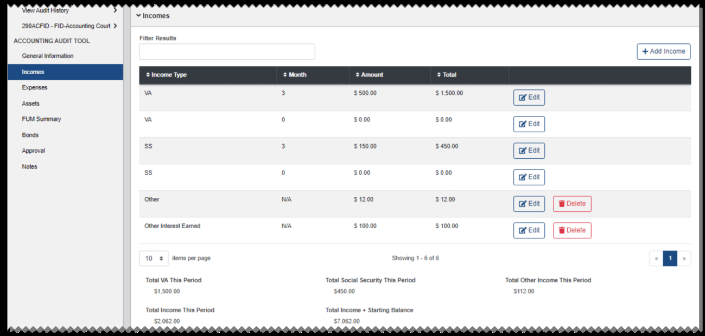
*Screenshot — page 112, figure 1 of 2 (1299×620 px)*

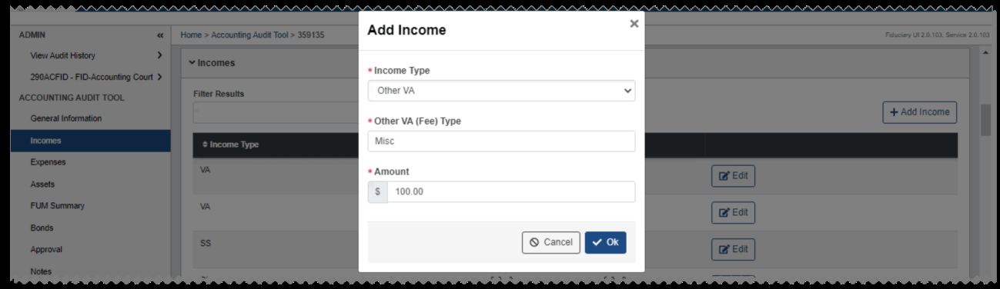
*Screenshot — page 112, figure 2 of 2 (1299×376 px)*

Fid Fee Authorized is read only, as it is calculated from the Incomes section. If you select a Fid Fee Percent and the Fid Fee Taken is greater than the Fid Fee Authorized, resulting in a negative amount for Fid Fee Difference, this field is highlighted in yellow. You must enter a justification for the difference. If the amount is positive, the field is highlighted in green.

To filter the Other Expenses list, enter a keyword in Filter Results.

To add an other expense to the list, select Add Other Expense. From the dialog, enter a name and amount for the other expense and select OK.

To edit an other expense, select Edit. From the dialog, make changes as needed and select

#### OK.

To delete an other expense, select Delete.

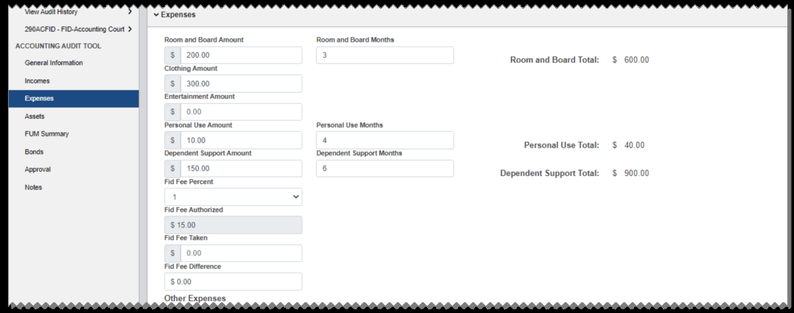
*Screenshot — page 113, figure 1 of 2 (1299×514 px)*

*Screenshot — page 113, figure 2 of 2 (1299×256 px)*

Total Other Expense This Period shows the sum of all Other Expense rows. Total Expense This Period shows the sum of all expenses.

#### Assets

From this section, you can enter the beneficiary's assets for the accounting period. To filter the list, enter a keyword in Filter Results.

Three Account rows, one Cashed Bonds Amount row, and two CD Amount rows are shown at first and cannot be deleted. To clear the Description and Amount for a default row, select Clear.

To edit the information in any row, select Edit. To indicate if assets within an account are VA derived, partially VA derived, or non-VA derived, you can select Yes, No, or Partial from the list in the VA Derived column. Select the question mark icon in the column header for more information.

To add a row, select Add Asset. Then from the dialog, select an asset type and enter the description and amount. To delete an additional row, select Delete.

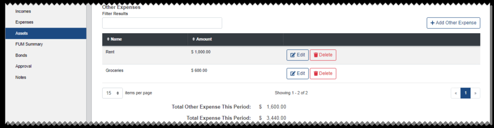
*Screenshot — page 114, figure 1 of 2 (1299×339 px)*

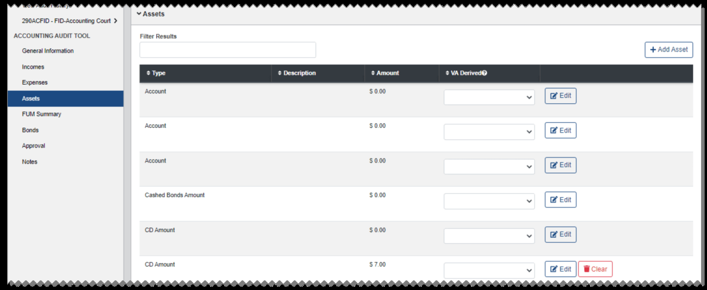
*Screenshot — page 114, figure 2 of 2 (1299×534 px)*

You can also enter the Cash On Hand Amount, Outstanding Checks Amount, and Outstanding Deposits Amount. Total Assets at End of Accounting Period shows the sum of all assets minus the Outstanding Checks Amount.

#### FUM Summary

This section shows a summary of Funds Under Management (FUM) for the accounting period. Most fields in this section are read-only and are calculated from amounts in other sections.

You can enter amounts for Previous VA FUM Received, if applicable and Previous Other FUM. Amounts entered in these fields will be  subtracted from Previous FUM Discrepancy. If Previous FUM Discrepancy shows a positive amount, it is highlighted in yellow.

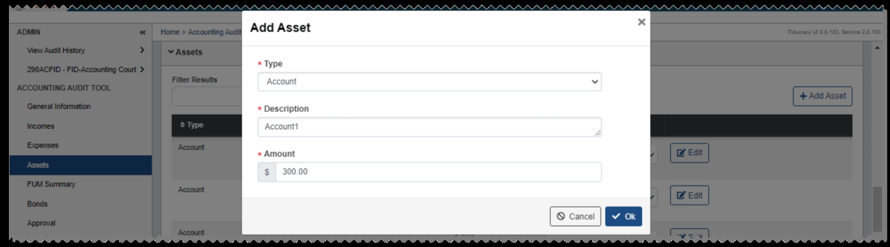
*Screenshot — page 115, figure 1 of 2 (1299×362 px)*

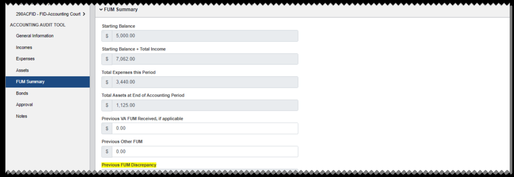
*Screenshot — page 115, figure 2 of 2 (1299×449 px)*

#### Bonds

This section shows the Bond Recommendation, and includes options for you to override the Bond Recommendation and enter information on the current bond in place, if any.

For Funds Under Management amounts under $25,000, the recommendation is No Bond Needed. For amounts of $25,000 or greater, the recommendation is Bond Needed, and the Recommended Amount for the bond is the Current VA FUM amount rounded up to the nearest $1,000.

If you select a Bond Recommended option that would override the automatically generated Bond Recommendation, you must enter a justification.

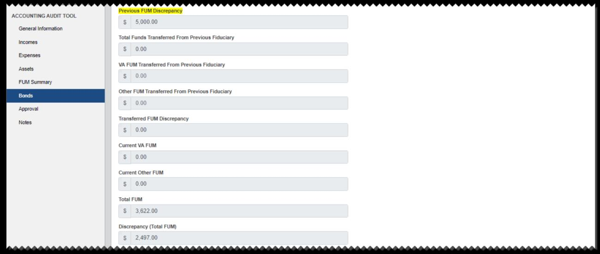
*Screenshot — page 116, figure 1 of 2 (1299×552 px)*

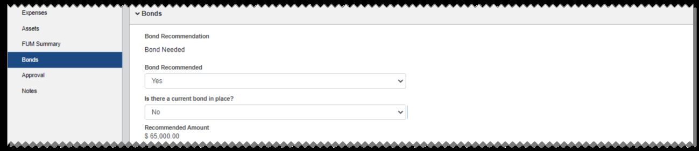
*Screenshot — page 116, figure 2 of 2 (1299×282 px)*

If you indicate that a current bond is in place, additional fields are available for the current bond details.

#### Approval

From this section, you can indicate whether the accounting is approved. If you select Yes, the Accounting Diary and Approval Date fields are required and the Approve

#### Accounting Audit button is shown. Other optional fields are also available.

If you select No, the Disapproval Date and Disapproval Reason fields are required and the

#### Disapprove Accounting Audit button is shown.

When you select Approve Accounting Audit or Disapprove Accounting Audit, the Update Beneficiary dialog opens.

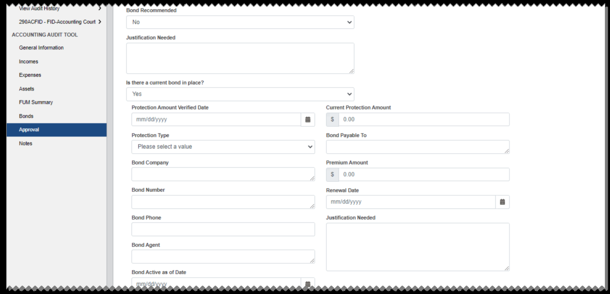
*Screenshot — page 117, figure 1 of 2 (1299×627 px)*

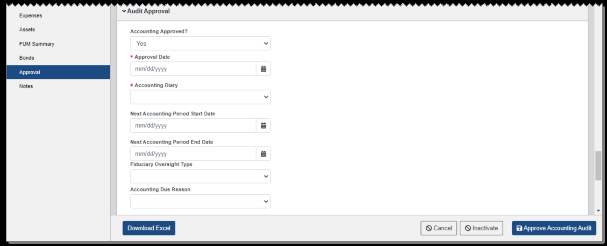
*Screenshot — page 117, figure 2 of 2 (1299×528 px)*

Select the check box for each field you want to update in the Beneficiary Profile when the Accounting Audit Tool is finalized, then select Finish.

#### Notes

From this section, you can add notes for the accounting audit tool.

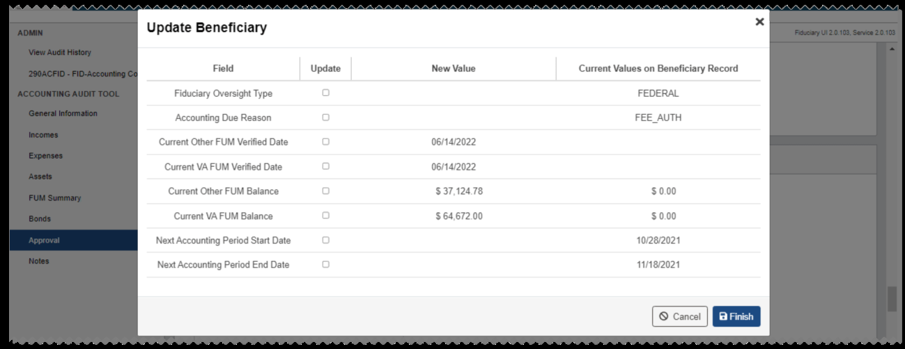
*Screenshot — page 118, figure 1 of 2 (1299×502 px)*

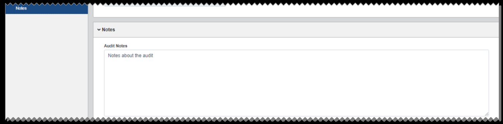
*Screenshot — page 118, figure 2 of 2 (1299×323 px)*

---

*[← Back to README](./README.md)*