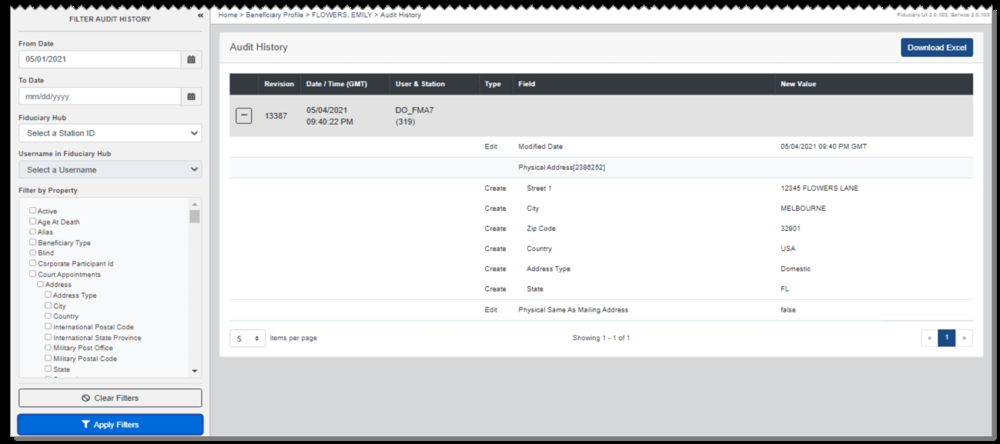
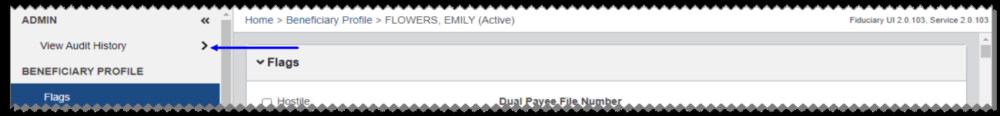
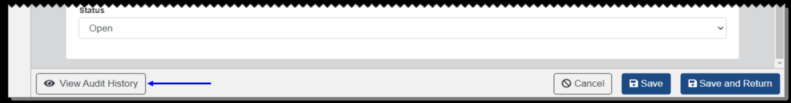

# Audit History

From the Audit History page, you can view the history of changes made to a beneficiary profile, fiduciary profile, field exam report, accounting audit tool, admin task, or ZIP code or country team and user assignment configuration.

You can use the expand collapse link, shown as a plus sign, to expand or collapse detail about a revision. You can also filter the audit history from the left pane. To download the audit history as a CSV file, select Download Excel.

To access this page, select View Audit History from the Admin section of the left pane from the Beneficiary Profile, Fiduciary Profile, Field Exam Report, or Accounting Audit Tool page.

From the Admin Task, ZIP Code Information, or Country Information page, select View

#### Audit History from the button bar.

To view the audit history of an admin task assigned to another user, first go to Fiduciary Hub Tasks Queue and select the link to the admin task. Then from the Admin Task page, select View Audit History.

*Screenshot — page 119, figure 1 of 3 (1299×577 px)*

*Screenshot — page 119, figure 2 of 3 (1299×151 px)*

*Screenshot — page 119, figure 3 of 3 (1299×171 px)*

---

*[← Back to README](./README.md)*